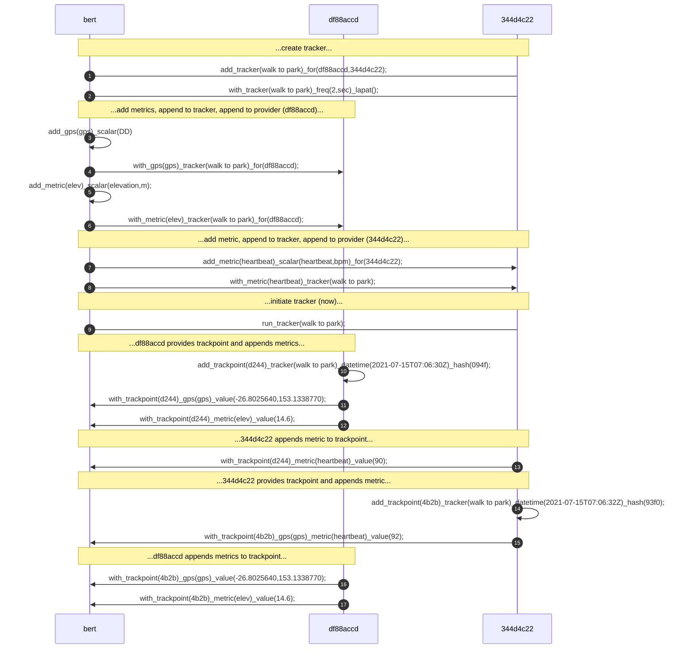

*[GNSS]: Global Navigation Satellite System


# tracker/pulse

```Diego
3e86d0be-08bd-493d-9ecb-ecfcef3c91c8 Beatrice (Luke's old phone)

189510f2-6050-49db-9f5b-82d121d245c2 Rapunzel (Tav's new phone)

2f92326d-1294-4529-afcd-2ce0676a8dd0 Nicola (Tav's old phone)

52793991-8a85-46ee-967d-99d4e5660117 EAFE02127 (E-Bike)

fe92f2cc-ec36-47a2-865f-8afc176f5341 Galaxy Watch (Tav's)

10bb3e28-be00-48e5-97ce-55d920f266ac Raspberyy Pi


tracker
	trackpoint
	
pulse	
	pulsepoint
	


27db61e5-2ab4-4d45-ada2-d9d800c31748


marker
https://www.qrcode-monkey.com/?ut_source=google_c&ut_medium=cpc&ut_campaign=&ut_content=&ut_term=create%20qr%20code%20free_p&gclid=CjwKCAjwi9-HBhACEiwAPzUhHA7HC_ZnhP0I9dAtfigt2NMOfESFpJCHNGeWsldoTajODV0aDDsi4hoCkqYQAvD_BwE#text
Foreground Colour:#000000
Background Colour: #FCF414


```


```Diego
add_pulse({name/uuid})
	_freq({frequency})
	_
	
add_stat({name/uuid})
	_scalar({scalar}[, {unit}])
	_vector({vector}[, {unit}])
	_array({array}[, {unit}])
	_type({type}[, {unit}])
	_unit({unit})
	_for({name/uuid_1}[, ...{name/uuid_n}])
	_pulse()
	_tracker()
	
add_metric({name/uuid})
	_scalar({scalar}[, {unit}])
	_unit({unit})
	_for({name/uuid_1}[, ...{name/uuid_n}])
	_pulse()
	_tracker()

```

### Prepositions

```Diego
with
```

```Diego
(roll)call ↔ here, pong
ping ↔ pong
ask ↔ tell
rem(meber) ↔ recall
fetch ↔ back
set ↔ get
where ↔ here
poll ↔ result
req(uest) ↔ resp(onse)
go ↔ stop
add ↔ minus
look ↔ see
listen ↔ h

```

### Nouns

```Diego
tracker
pulse
point
snapshot
vidshot
gnss
battery
sensor
actuat(or)
trackpoint
pulsepoint
metric
stat
route
path
marker


```


### Postpositions

```Diego
_for({name/uuid_1}[, ...{name/uuid_n}])
_on({map}, {coordinates}[, unit}])
_at({datetime})
_au({point_coordinates})
_between({scalar_1})_and({scalar_n})
_greaterthan({scalar})
_lessthan({scalar})
_equalto({scalar}))
_like({like_string})
_regexp({regexpression})
```

### Genera

```Diego
human
ai
robot
mobot
organic
thing
console
object
subject
```


### Creation:

```Diego
add_tracker({name/uuid});
with_tracker({name/uuid});
```

### Options:

```Diego
	_freq({frequency}[, {unit}])
	_lapat()		_lapat({lap_value}[, {unit}])
```

### Setup:

```Diego
add_metric({name/uuid});
with_metric({name/uuid});

add_metric({name/uuid}[, {unit}])
	_scalar({name/uuid}[, {unit}])
	_tracker({name/uuid});
	_to({name/uuid})
	_for({name/uuid_1}[, ...{name/uuid_n}])
	_between({name/uuid_1})_and({name/uuid})

```

#### Metric Scalar

```Diego
{metric}_scalar({name/uuid}[, {unit}])
```

| Scalar            | Units                                                        |
| ----------------- | ------------------------------------------------------------ |
| `Area`            | `square metre` | `square decametre` | `square hectometre` | `square kilometre` |`square megametre` | `square gigametre |
| `Data Transfer `  |                                                              |
| `Digital Storage` |                                                              |
| `Energy`          |                                                              |
| `Frequency`       |                                                              |
| `Fuel Economy`    |                                                              |
| `Length`          |                                                              |
| `Mass`            |                                                              |
| `Plane Angle`     |                                                              |
| `Pressure`        |                                                              |
| `Speed`           |                                                              |
| `Temperature`     |                                                              |
| `Time`            |                                                              |
| `Volume`          |                                                              |


### Run:

```Diego
run_tracker({name/uuid});		pause_tracker({name/uuid});		end_tracker({name/uuid});
start_tracker({name/uuid});		halt_tracker({name/uuid});		stop_tracker({name/uuid});
go_tracker({name/uuid});		hold_tracker({name/uuid});		stop_tracker({name/uuid});
```


### Pause:

### End:

### Example:

In this example two things (`df88accd-dd43-4ff1-820e-82f75be13013`, shortened 64-bit: `df88accd`; and, `344d4c22-546c-4940-bdc4-c2a4371a29ac`, `344d4c22`) are in the same universe, both things know each other, and are up-to-date with each other. Thing `df88accd` has a GPS sensor called `df_gps`, thing `344d4c22` has a heartbeat monitor attached to a human called `bert` (`73e4f567-952c-463a-a3d7-bc26c8053e54`). `Bert` is accessing the `mist` using a console (not shown in this example)...

In this example `bert` is going to set up a tracker to be shared by `df88accd` and `344d4c22`, `df88accd` will provide GPS coordinates & elevation and `344d4c22` will provide `bert`s heartbeat.

&#9312; `bert` creates the tracker, called `walk to park` with command: `add_tracker(walk to park)_for(df88accd,344d4c22);`.  As default everyone in the `mist` will pick up and remember, however, things `df88accd` and `344d4c22` are targeted, so they will be the only things to act upon tracker,

&#9313; `Bert` now sets up the tracker with a frequency of track-points set to every `2` `sec`'onds to publish and no laps, with command: `with_tracker(walk to park)_freq(2,sec)_lapat();`.

Now the tracker has been created, `bert` now sets up the metrics for the tracker to use&#9314;. With the command, `add_gps(gps)_scalar(DD);`, the GPS metric (called `gps`) is created.  The GPS metric is a predefined metric.  The scalar (measurement system) is specified as decimal degrees (`DD`).  Everyone in the `mist` will pick up the command, including `df88accd` and `344d4c22`.

Since `df88accd` has a GPS sensor it will be responsible for tracking its coordinates, so `bert` assigns the GPS metric (`gps`) to the `walk to park` tracker and `df88accd` in the same command: `add_tracker(walk to park)_for(df88accd,344d4c22);`&#9315;.

Another metric, elevation, is created &#9316;, measured in metres (`m`).  The elevation metric is then assigned to the `walk to park` tracker and thing `df88accd`&#9317;,

. 
	bert->>344d4c22: add_metric(heartbeat)_scalar(heartbeat,bpm)_for(344d4c22)#59;
	bert->>344d4c22: with_metric(heartbeat)_tracker(walk to park)#59;
	Note over bert,344d4c22: ...add metric, append to tracker, append to provider (344d4c22)... 
	bert->344d4c22: run_tracker(walk to park)#59;
	Note over bert,df88accd: ...df88accd provides trackpoint and appends metrics... 
	df88accd->>df88accd: add_trackpoint(d244)_tracker(walk to park)_hash(094f)#59;
	df88accd->>bert: with_trackpoint(d244)_gps(gps)_value(-26.7937,153.0848)#59;
	df88accd->>bert: with_trackpoint(d244)_metric(elev)_value(10.1)#59;
	Note over bert,344d4c22: ...344d4c22 appends metric to trackpoint... 
	344d4c22->>bert: with_trackpoint(d244)_metric(heartbeat)_value(90)#59;
	Note over bert,344d4c22: ...344d4c22 provides trackpoint and appends metric... 
	344d4c22->>344d4c22: add_trackpoint(4b2b)_tracker(walk to park)_hash(93f0)#59;
	344d4c22->>bert: with_trackpoint(4b2b)_gps(gps)_metric(heartbeat)_value(92)#59;
	Note over bert,df88accd: ...df88accd appends metrics to trackpoint... 
	df88accd->>bert: with_trackpoint(4b2b)_gps(gps)_value(-26.7937,153.0848)#59;
	df88accd->>bert: with_trackpoint(4b2b)_metric(elev)_value(10.1)#59;


```xml
<?xml version="1.0" encoding="UTF-8"?>
<gpx creator="StravaGPX Android" xmlns:xsi="http://www.w3.org/2001/XMLSchema-instance" xsi:schemaLocation="http://www.topografix.com/GPX/1/1 http://www.topografix.com/GPX/1/1/gpx.xsd" version="1.1" xmlns="http://www.topografix.com/GPX/1/1">
 <metadata>
  <time>2021-07-15T07:05:44Z</time>
 </metadata>
 <trk>
  <name>Afternoon Activity</name>
  <type>18</type>
  <trkseg>
   <trkpt lat="-26.8025640" lon="153.1338770">
    <ele>14.6</ele>
    <time>2021-07-15T07:06:30Z</time>
   </trkpt>
   <trkpt lat="-26.8025640" lon="153.1338770">
    <ele>14.6</ele>
    <time>2021-07-15T07:06:32Z</time>
   </trkpt>
   <trkpt lat="-26.8025640" lon="153.1338770">
    <ele>14.6</ele>
    <time>2021-07-15T07:06:34Z</time>
   </trkpt>
   <trkpt lat="-26.8025640" lon="153.1338770">
    <ele>14.6</ele>
    <time>2021-07-15T07:06:36Z</time>
   </trkpt>
  </trkseg>
 </trk>
</gpx>
```

```Diego
add_tracker(Afternoon Activity)_dict(type,18)_datetime(2021-07-15T07:05:44Z);
add_gps(trkpt)_unt(DD)_tracker(Afternoon Activity);
add_metric(ele)_scalar(elevat)_unit(m)_tracker(Afternoon Activity);
with_tracker(Afternoon Activity)_freq(2,sec);
run_tracker(Afternoon Activity);
add_lap(4693)_tracker(Afternoon Activity);
add_trackpoint(9b4a)_hash(4693);
with_trackpoint(9b4a)_gps(trkpt)_value(-26.8025640,153.1338770);
with_trackpoint(9b4a)_metric(ele)_value(14.6);
with_trackpoint(9b4a)_datetime(2021-07-15T07:06:30Z);
add_trackpoint(a059)_hash(9b4a);
with_trackpoint(a059)_gps(trkpt)_value(-26.8025640,153.1338770);
with_trackpoint(a059)_metric(ele)_value(14.6);
with_trackpoint(a059)_datetime(2021-07-15T07:06:32Z);
add_trackpoint(1c8b)_hash(a059);
with_trackpoint()_gps(trkpt)_value(-26.8025640,153.1338770);
with_trackpoint()_metric(ele)_value(14.6);
with_trackpoint()_datetime(2021-07-15T07:06:34Z);
add_trackpoint(eb64)_hash(1c8b);
with_trackpoint()_gps(trkpt)_value(-26.8025640,153.1338770);
with_trackpoint()_metric(ele)_value(14.6);
with_trackpoint()_datetime(2021-07-15T07:06:36Z);
end_tracker(Afternoon Activity);

```


## Implicit Call

The implicit [roll]call is a request for existence of other types in its known universe, 

### Syntax:

```Diego
call_human();
call_ai();
call_robot();
call_organic();
call_thing();
call_console();
```

## Explicit Call

### Syntax:

```Diego
call({uuid});
call_human({human_uuid});		call_human()_for({human_uuid});
call_ai({ai_uuid});				call_ai()_for({ai_uuid});
call_robot({robot_uuid});		call_robot()_for({robot_uuid});
call_thing({thing_uuid});		call_thing()_for({thing_uuid});
call_console({console_uuid});	call_console()_for({console_uuid});

call({moniker});
call_human({human_moniker});		call_human()_for({human_moniker});
call_ai({ai_moniker});				call_ai()_for({ai_moniker});
call_robot({robot_moniker});		call_robot()_for({robot_moniker});
call_thing({thing_moniker});		call_thing()_for({thing_moniker});
call_console({console_moniker});	call_console()_for({console_moniker});

call()_as({label})
```

## Collection Call

Syntax:

```Diego
call()_in({uuid1/moniker1},{uuid2/moniker2},...);
call_human()_in({human_uuid1/human_moniker1},{human_uuid2/human_moniker2},...);
call_ai()_in({ai_uuid1/ai_moniker1},{ai_uuid2/ai_moniker2},...);
call_robot()_in({robot_uuid1/robot_moniker1},{robot_uuid2/robot_moniker2},...);
call_thing()_in({thing_uuid1/thing_moniker1},{thing_uuid2/thing_moniker2},...);
call_console()_in({console_uuid1/console_moniker1},{console_uuid2/console_moniker2},...);

call()_asin({label1},{label2});
```


---b8da-59c35467963b

57e7-3869--a16f-97cad6b4e14c


68937890----63dc25646e30


35dccb9d

9543ebae


call()_what();
call()_only();


(rolll)call ↔ pong, here
ping ↔ pong
ask ↔ tell
rem(meber) ↔ recall
fetch ↔ back
set ↔ get

df88: call();
344d: here();
df88: ask(344d);
344d: tell_name();

df88: prog_name(344d)_name(Hoshiko Kawasaki)_withtest();
344d: tell_name(Hoshiko Kawasaki);


344d: tell_name(Hoshiko Kawasaki);
344d: tell_what(Thing);
344d: tell_comm(Bluetooth 5.2)_device(anko BT Speaker)_address(86:14:B8:ED:BB:34);
344d: tell_why(BT Speaker);
344d: tell_why(Desk Lamp);
344d: tell_why(Ambient Light);
344d: tell_why(Wireless Charger);

prog_name()


call_human();
call_ai();
call_robot();
call_thing();
call_console();
call_human({human_uuid);
call_robot({robot_uuid});
call_thing({thing_uuid});
```


​```Diego
{from_uuid}|{command}|{to_uuid}
```


# GNSS

### **Global Positioning System (United States)**

### **GLONASS (Russia)**

### **Galileo (EU)**

### **BeiDou (China)**

### **QZSS (Japan)**

### **IRNSS ― NAVIC (India)**


A **spatial reference system** (**SRS**) or **coordinate reference system** (**CRS**) is a [coordinate-based](https://en.wikipedia.org/wiki/Coordinate_system) local, regional or global system used to locate geographical entities.

- [Universal Transverse Mercator coordinate system](https://en.wikipedia.org/wiki/Universal_Transverse_Mercator_coordinate_system)
- [British national grid reference system](https://en.wikipedia.org/wiki/British_national_grid_reference_system)
- [Chinese Global Navigation Grid Code](https://en.wikipedia.org/wiki/Global_Navigation_Grid_Code)
- [Hellenic Geodetic Reference System 1987](https://en.wikipedia.org/wiki/Hellenic_Geodetic_Reference_System_1987)
- [Irish grid reference system](https://en.wikipedia.org/wiki/Irish_grid_reference_system)
- [Irish Transverse Mercator](https://en.wikipedia.org/wiki/Irish_Transverse_Mercator)
- [Israeli Transverse Mercator](https://en.wikipedia.org/wiki/Israeli_Transverse_Mercator)
- [Israeli Cassini Soldner](https://en.wikipedia.org/wiki/Israeli_Cassini_Soldner)
- [Jordan Transverse Mercator](https://en.wikipedia.org/wiki/Jordan_Transverse_Mercator)
- [Lambert conformal conic projection](https://en.wikipedia.org/wiki/Lambert_conformal_conic_projection)
- [International mapcode system](https://en.wikipedia.org/wiki/MapCode)
- [Military Grid Reference System](https://en.wikipedia.org/wiki/Military_Grid_Reference_System)
- [United States National Grid](https://en.wikipedia.org/wiki/United_States_National_Grid)
