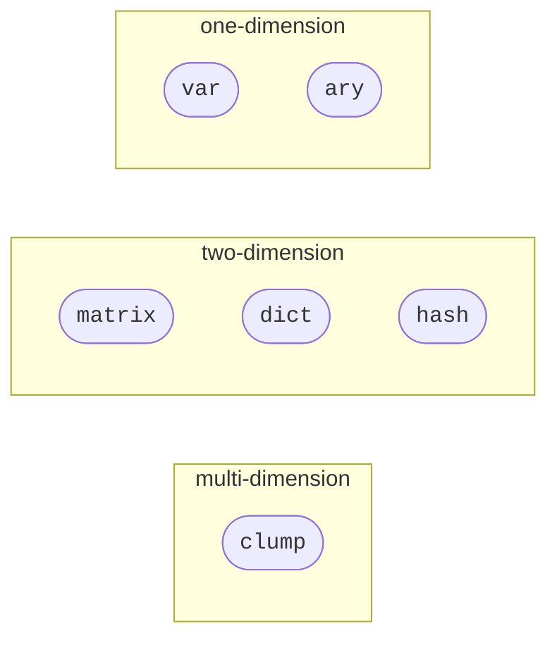
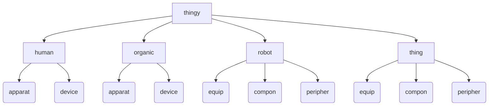

# Abstract
The term **abstract** is used to define statements in ***diego*** that represent abstract objects, usually used in a programming environment.

##  Self
As with most object-orientated programming langauges, the idea of self is used in **Diego**. However, since there are multiple intelects that are interpreting ***Diego*** code, there needs to be several levels of self. The differing level of self are usful for discernment, discrimination, and, swarming.

All four *self* objects are metaphysical, however, `me` is considered to be also abstract as this is associated with '*this*' in other programming languages.  However, the four *self* objects are:

| self | description | API |
| --- | --- | --- |
|  `me_`*`<object>`* `_me()` | A representation of the self thingy, similar to '*this*' in other programming languages | [me](./special/me.md) |
|  `_we()` | A representation of a group of thingys, through the viewpoint of a `spox` | [we](../metaphysic/special/we.md) [spox](../metaphysic/obj/spox.md) |
|  `_us()` | Declaration of a group of thingys | [us](../metaphysic/special/us.md) |
|  `_them()` | A representation of a group of thingys from the viewpoint of `me` | [them](../metaphysic/special/them.md) |
|  `_you()` | A assignment member of the a group of thingys from the viewpoint of the `spox` of the group | [you](../metaphysic/special/you.md) |

##  Declarable Data

| data | description | API |
| --- | --- | --- |
|  `_deed(`*`moniker`*`)`  | A basic one-dimensional data storage object called *moniker*, immutable except for *deed owner* |  [deed](./obj/deed.md) |
|  `_indent(`*`moniker`*`)` `indenture(`*`moniker`*`)`  | A basic one-dimensional data storage object called *moniker*, immutable except for *indenture owners* |  [indent](./obj/indent.md) |
|  `val(`*`moniker`*`)` `valuable(`*`moniker`*`)`  | A basic one-dimensional immutable data storage object called *moniker* |  [val](./obj/val.md) |
|  `var(`*`moniker`*`)` `variable(`*`moniker`*`)`  | A basic one-dimensional mutable data storage object called *moniker* |  [var](./obj/var.md) |

##  Primitive Data

| data | description | API |
| --- | --- | --- |
|  `tempor(`*`moniker`*`)` `temporal(`*`moniker`*`)` `_tempor(`*`moniker`*`)` `_temporal(`*`moniker`*`)` `{tempor}` `{temporal}` | A primitive data object representing a date off a calendar monikered *moniker* | [tempor](./obj/tempor.md) |

##  Collections

| collection | description | API |
| --- | --- | --- |
|  `array(`*`moniker`*`)` `ary(`*`moniker`*`)` | A collection of multiple mutable elements under a single *object* called *moniker* | [array](./obj/ary.md) |
|  `list(`*`moniker`*`)` | A database-assigned collection *object* called *moniker* | [list](./obj/list.md) |
|  `arran(`*`moniker`*`)` `arn(`*`moniker`*`)` `arrangem(`*`moniker`*`)` `arrangement(`*`moniker`*`)` | A collection of multiple mutable elements under a single variable name of *moniker* | [arran](./obj/ary.md) |
|  `matrix(`*`moniker`*`)` `_matrix(`*`moniker`*`)`| A two-dimensional collection data storage *object* called *moniker* | [matrix](./obj/matrix.md) |
|  `clump(`*`moniker`*`)` | A multi-dimensional  collection of data storage *object* called *moniker* | [clump](./obj/clump.md) |
|  `dict(`*`moniker`*`)` `_dict(`*`moniker`*`)` `dictionary(`*`moniker`*`)` `_dictionary(`*`moniker`*`)` | A keyed collection, with key-value pairs, data storage *object* called *moniker* | [dict](./obj/dict.md) |
|  `hash(`*`moniker`*`)` | A two-dimensional collection data storage *object* called *moniker*, with hashed keys | [hash](./obj/hash.md) | 
|  `lexi(`*`moniker`*`)` `lexikon(`*`moniker`*`)` | A two-dimensional collection data storage *object* called *moniker*, with unique keys | [lexi](./obj/lexi.md) |

##  Function Properties

##  Functional Objects

##  Error Objects

| err | description | API |
| --- | --- | --- |
| `err` | | |

##  Numerics

##  Dates

##  Text Processing

##  Control Flow

##  Declarations

##  Functions & Classes

##  Iterations

##  Primary Expressions
## Collection Dimensions
Data storage can be achieved in ***diego*** 

Dimensions of collections
 

All *physic*al objects in ***diego*** are detrived from the `thingy` object, which represents all *physic*al objects.  There are only four[^morethingies] types of `thingies`: `human`, human beings interacting with ***diego*** through a `console`; `organic`, organic non-human beings, such as a dog, a cat, a flower, a bush, etc.; `robot`, a self-propelled thingy in the physical world; and a, `thing`, an object in the physical world represented in **diego**.

There are other sub-types of thingies. A `sobot` is a stationary `robot`, that although can be self-propelled, does not neccesarily interact physically in the physical world outside its own environment, such as a *robot arm*. A `thing` can be sub-typed as: `mobot`, a conveyed smart device, such as a smart watch, smart doorbel, etc.; and a, `ject`, a traditional physical object that is not smart enough to think.  There are two variants of a `ject`: an `object` (ob ject), an immoveable ject such as a rock, a chair; and, a `subject` (sub ject), a self-propelled or moveable ject such as a trolley, wheeled tool cabinet, etc.

## Physic Composition Hierarchy (Organs / Components / Devices)
Each of the four `thingies` has associated *components* that are further categorised, as such:

Physic Hierarchy (by component)
 

There are effectively three *components* that come with each `thingy`.  The `apparat`us/`equip`ment are non-smart *components* that are carried or attached to the thingy, so, for `human`s this could be a traditional watch or a jacket. For `organic`s this could be a collar on a dog or cat.  For `robot`s this is a *component* like wheels, or the chassis.  For a `thing` this could be the door of a fridge, or a cushion on a chair.

Each of the four `thingies` also have a `compon`ent. A `compon` is a *component* that moves in the physical world, so for `human`s and `organic`s this would be a limb or an organ.  Since **diego** is not, yet, concerned with controlling human and organic anotomy, they are not represented here.  However, `compon`s for `robots` and `things` include actuators, projectile launchers, encoders, motors, switches, etc.

Then there are `device`s and `peripher`als, which are smart components that are carried or attached to the thingy, so for `human`s this could be a smart watch or a cellphone[^devicesobot].  For `organic`s this could be a microchip implanted in a dog.  For `robot`s and `thing`s this is termed a `peripher` and includes hygrometers, proximity sensors, sensors, cameras, etc. 

## Notes
[^morethingies]: There are some *fringe* `thingy` types such as `mech`, `applian`, `mach`, and, `vehicle`.
[^devicesobot]: Smart devices are can also be treated a `sobot`s.

---

## References

