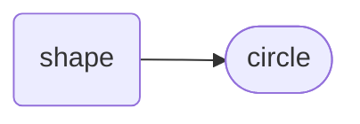

# Circle (property)
A `circ` is a property to represent the two-dimensional geometric circle shape.  It has a lengthened syntax of `circle`.


<div style="text-align: right"><sub>Circle Hierarchy</sub></div>

<a name="declare"></a>
## Declaration
The default declaration of the `circ` (or lengthened `circle`) *object* is to use the `add_` verb and provide a *moniker*. Multiple `circle`s are declared using a coma-separated list of *`moniker`* s. The `circ` object can also be declared by casting `shape` with `{circ}` (or `{circle}` *type*).

&nbsp;&nbsp;&nbsp;&nbsp;&nbsp;&nbsp; `add_circ(`*`moniker`*`);`<br>
&nbsp;&nbsp;&nbsp;&nbsp;&nbsp;&nbsp; `add_circle(`*`moniker`*`);`<br>
&nbsp;&nbsp;&nbsp;&nbsp;&nbsp;&nbsp; `add_circ(`*`moniker1`*`,`*`moniker2`*`,`*`...`*`);`<br>
&nbsp;&nbsp;&nbsp;&nbsp;&nbsp;&nbsp; `add_shape({circ},`*`moniker`*`);`

It is common with the `circ` *object* to provide a *`radius`* at declaration. When providing a radius inside the declaration of a `circ`, providing the unit is optional. If the unit declaration is omitted, the caller and callee will revert to their friendship (mutual understanding) with each other. A radius can also be assigned by appending with a proceeding `_radius` posit.

&nbsp;&nbsp;&nbsp;&nbsp;&nbsp;&nbsp; `add_circ(`*`moniker`*`,`*`radius`*`);`<br>
&nbsp;&nbsp;&nbsp;&nbsp;&nbsp;&nbsp; `add_circ(`*`moniker`*`,❬`*`unit`*`❭,`*`radius`*`);`<br>
&nbsp;&nbsp;&nbsp;&nbsp;&nbsp;&nbsp; `add_circ(`*`moniker`*`,❬`*`unit`*`❭,[`*`radius_variable_moniker`*`]);`<br>
&nbsp;&nbsp;&nbsp;&nbsp;&nbsp;&nbsp; `add_circ(`*`moniker`*`)_radius(`*`radius`*`);`

<a name="reference"></a>
## Referencing
Referencing a `circ` *object* is achieved with the `with` verb, or the shortened `(`*`circle_moniker`*`)` syntax. 

&nbsp;&nbsp;&nbsp;&nbsp;&nbsp;&nbsp; `with_circ(`*`moniker`*`);`<br>
&nbsp;&nbsp;&nbsp;&nbsp;&nbsp;&nbsp; `with_circle(`*`moniker`*`);`<br>
&nbsp;&nbsp;&nbsp;&nbsp;&nbsp;&nbsp; `with_circ(`*`moniker1`*`,`*`moniker2`*`,`*`...`*`);`<br>
&nbsp;&nbsp;&nbsp;&nbsp;&nbsp;&nbsp; `(`*`circle_moniker`*`);`<br>

<a name="assign"></a>
## Assignment
Assignments to the `circ` *object* are achieved by using proceeding posits.

&nbsp;&nbsp;&nbsp;&nbsp;&nbsp;&nbsp; `with_circle(`*`moniker`*`)_`*`<posit>`*`(`*`...`*`);`<br>
&nbsp;&nbsp;&nbsp;&nbsp;&nbsp;&nbsp; `(`*`circle_moniker`*`)_`*`<posit>`*`(`*`...`*`);`

<a name="posit"></a>
## Posits


### Location

| posit | description | API |
| --- | -------- | --- |
| <a name="at"></a> `_at(`*`x_lat`*`,`*`y_long`*`);` &nbsp; `_at({`*`map_moniker`*`,`*`x_lat`*`,`*`y_long`*`);`  | Provides a cartesian coordinate location in the frame of the preceding *object* (or declared *`map_moniker`*) of the centre of the circle. | [at](../condit/at.md#circ) |


### Plications
| posit | description | API |
| --- | -------- | --- |
| <a name="plication"></a> `_plicat({`*`type`*`},???) ` &nbsp; ` `  | . | [plicat](plicat.md#circ) |
| <a name="fold"></a> `_fold(`*`theta_from_x_plane`*`);` | Provides a diameter fold along the preceding `circ` *object*, through the centre. | [fold](../funct/fold.md#circ) |
| <a name="pleat"></a> `_pleat ` &nbsp; ` `  | Provides a tangent fold along the preceding `circ` *object*, not through the centre. | [pleat](pleat.md#circ) |
| <a name="crimp"></a> `_crimp` &nbsp; ` `  | Provides a radius fold along the preceding `circ` *object*, to the centre. | [crimp](crimp.md#circ) |
| <a name="pucker"></a> `_pucker` &nbsp; ` `  | Provides a fold from a point on the circumference to any point within the preceding `circ` *object*. | [pucker](pucker.md#circ) |
| <a name=""></a> ` ` &nbsp; ` `  | . | [](.md#circ) |
| <a name=""></a> ` ` &nbsp; ` `  | . | [](.md#circ) |


&nbsp;&nbsp;&nbsp;&nbsp;&nbsp;&nbsp; *`<object>`*`_second(`*`second_value`*`);`<br>
&nbsp;&nbsp;&nbsp;&nbsp;&nbsp;&nbsp; *`<object>`*`_sec(`*`second_value`*`);`

Some *objects* allow for an array of seconds. To set an array of seconds, use multiple `second` posits. Alternatively an array can be used to set seconds in one `second` posit.

&nbsp;&nbsp;&nbsp;&nbsp;&nbsp;&nbsp; *`<object>`*`_second(`*`{second_value1}`*`)_sec(`*`{second_value2}`*`)_`*`...`*<br>
&nbsp;&nbsp;&nbsp;&nbsp;&nbsp;&nbsp; *`<object>`*`_second([`*`second_array_moniker`*`]);`<br>
&nbsp;&nbsp;&nbsp;&nbsp;&nbsp;&nbsp; *`<object>`*`_sec([`*`second_array_moniker`*`]);`

<a name="get"></a>
## Getting
To get the reference to the circle *object(s)* from the proceeding object, use the `circ` (or lengthened `circle`) posit.

&nbsp;&nbsp;&nbsp;&nbsp;&nbsp;&nbsp; *`<object>`*`_circ();`<br>
&nbsp;&nbsp;&nbsp;&nbsp;&nbsp;&nbsp; *`<object>`*`_circle();`

For an *object* with an array of circles, use the `index` (or shortened, `i`) posit to determine which circle in the array you are getting.

&nbsp;&nbsp;&nbsp;&nbsp;&nbsp;&nbsp; *`<object>`*`_circ()_i(`*`index_integer`*`);`<br>
&nbsp;&nbsp;&nbsp;&nbsp;&nbsp;&nbsp; *`<object>`*`_circle()_i(`*`index_integer`*`);`


`_fold(`)


`_circ(`*`moniker`*`)
`_circ(`*`moniker`*`)


```diego
with_map(map1)
    _circ(poi1)_at(4,3)_r(❬m❭,0.332)
    _square(sq1)_cnr(5,7)_cnr(6,8)
;


log_console()_(map1)_shape();
// poi1,poi1.sq1

with_map(map2)
    _circ(poi2)_at(4,3)_r(❬m❭,0.332)
    ()_square(sq2)_cnr(5,7)_cnr(6,8);
;


log_console()_(map2)_shapes();
// poi2,sq2


with_map(map3)
    ()_circ(poi3)_at(4,3)_r(❬m❭,0.332);
    ()_square(sq3)_cnr(5,7)_cnr(6,8);
;


log_console()_(map3)_shapes();
// poi3,sq3


add_wp(wp1)_at({map1},)