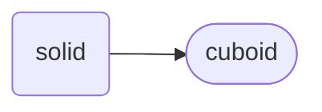

# Cuboid (shape)

A `cuboid` is a property to represent the three-dimensional geometric hexahedron, six-faced solid.

```mermaid
    flowchart LR
    solid(solid) --> cuboid([cuboid])
```

Cuboid Hierarchy

# Declaration

