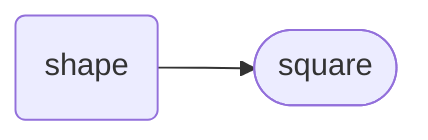

# Square (shape)
A `sqr` is a property to represent the two-dimensional geometric square shape.  It has a lengthened syntax of `square`.

Circle Hierarchy

## Declaration
The default declaration of the `circ` (or lengthened `circle`) *object* is to use the `add_` verb and provide a *moniker*. Multiple `circle`s are declared using a coma-separated list of *`moniker`* s. The `circ` object can also be declared by casting `shape` with `{circ}` (or `{circle}` *type*).

&nbsp;&nbsp;&nbsp;&nbsp;&nbsp;&nbsp; `add_circ(`*`moniker`*`);` 
&nbsp;&nbsp;&nbsp;&nbsp;&nbsp;&nbsp; `add_circle(`*`moniker`*`);` 
&nbsp;&nbsp;&nbsp;&nbsp;&nbsp;&nbsp; `add_circ(`*`moniker1`*`,`*`moniker2`*`,`*`...`*`);` 
&nbsp;&nbsp;&nbsp;&nbsp;&nbsp;&nbsp; `add_shape({circ},`*`moniker`*`);`

It is common with the `circ` *object* to provide a *`radius`* at declaration. When providing a radius inside the declaration of a `circ`, providing the unit is optional. If the unit declaration is omitted, the caller and callee will revert to their friendship (mutual understanding) with each other. A radius can also be assigned by appending with a proceeding `_radius` posit.

&nbsp;&nbsp;&nbsp;&nbsp;&nbsp;&nbsp; `add_circ(`*`moniker`*`,`*`radius`*`);` 
&nbsp;&nbsp;&nbsp;&nbsp;&nbsp;&nbsp; `add_circ(`*`moniker`*`,❬`*`unit`*`❭,`*`radius`*`);` 
&nbsp;&nbsp;&nbsp;&nbsp;&nbsp;&nbsp; `add_circ(`*`moniker`*`,❬`*`unit`*`❭,[`*`radius_variable_moniker`*`]);` 
&nbsp;&nbsp;&nbsp;&nbsp;&nbsp;&nbsp; `add_circ(`*`moniker`*`)_radius(`*`radius`*`);`

`sqr` - square shape
`sq` - exponent of 2
`sqrt` - square root