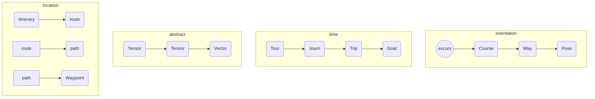

# Tensor (object)

Time-Space Hierarchy

<!-- Abstract-Location-Orientation-Time -->

## Declaration

&nbsp;&nbsp;&nbsp;&nbsp;&nbsp;&nbsp; `add_(`*`moniker`*`);` 

## Declaration & Assignment

## Initialisation

&nbsp;&nbsp;&nbsp;&nbsp;&nbsp;&nbsp; `add_(`*`moniker`*`);` 

## Assignment

## Referencing
Referencing a ` ` *object* is achieved with the `with` verb, or the shortened `(`*` `*`)` syntax. 

&nbsp;&nbsp;&nbsp;&nbsp;&nbsp;&nbsp; `with_(`*`moniker`*`);` 
&nbsp;&nbsp;&nbsp;&nbsp;&nbsp;&nbsp; `>_(`*`moniker`*`);` 
&nbsp;&nbsp;&nbsp;&nbsp;&nbsp;&nbsp; `with_(`*`moniker1`*`,`*`moniker2`*`,`*`…`*`);` 
&nbsp;&nbsp;&nbsp;&nbsp;&nbsp;&nbsp; `(`*`_moniker`*`);`

## Typing

## Getting

## Setting

## Casting

## Properties

## Examples