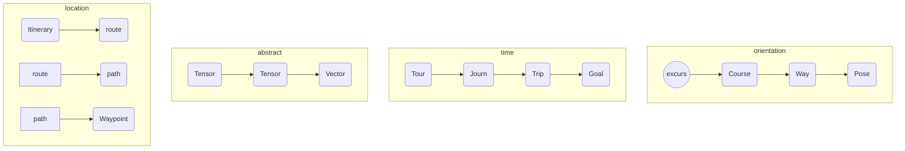

# Tensor (object)

```mermaid
    flowchart TB
        subgraph orientation
            Excurs((excurs)) --> course(Course)
            course --> way(Way)
            way --> pose(Pose)

        end
        subgraph time
            tour(Tour) --> journ(Journ)
            journ --> trip(Trip)
            trip --> goal(Goal)
            
        end
        subgraph abstract
            tensor1(Tensor) --> tensor2(Tensor)
            tensor2 --> Vector(Vector)
        end
        subgraph location
            intiner(Itinerary) --> Route(route)
            route --> Path(path)
            path --> wp(Waypoint)
        end
        
```

Time-Space Hierarchy

<!-- Abstract-Location-Orientation-Time -->