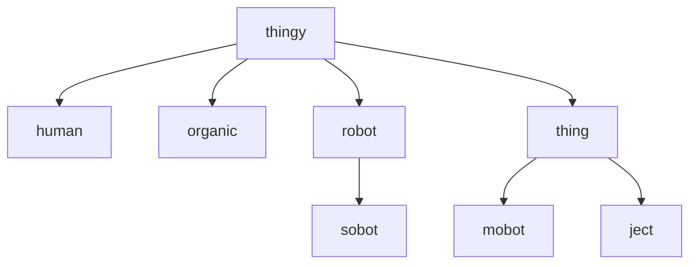

# Diego Introduction

## What is Diego?

Diego is a popular instruction language. It was created by Tavis Pitt, and released in 2020.

It is used for:

* robot communication,
* thing (of the Internet of Things) (IoT) communication,
* controlling robots,
* controlling things

## What can Diego do?


## Why Diego?
+ Diego has a structured syntax with mostly English language words.


## Good to know


## Hello World

The atypical 'hello world' example can easily be performed on a `console` as:

```Diego
with_me()_msg(Hello, World!);
```


| sensor type | definition |
| --- | --- |
| <a name="accelero"></a>`{accelero}`<br>`_type(accelero)` | **Accelerometer**<br>A tool that measures proper acceleration. |
| <a name="amblight"></a>`{amblight}`<br>`_type(amblight)` | **Ambient Light Sensor**<br>A type of photoelectric sensor that is used to sense the amount of ambient light present, and appropriately dim.<br>See modules [oplight](#oplight). |
| <a name="amp"></a>`{amp}`<br>`_type(amp)` | **Amplifier**<br>An electronic component for increasing the amplitude of electrical signals, used chiefly in sound reproduction. |

## Physic Type Hierarchy
All physic reprentations in ***diego*** follow a structured hierarchy as can be dipicted as such:

<div style="text-align: right"><sub>Physic Hierarchy (by thingy type)</sub></div><br>


