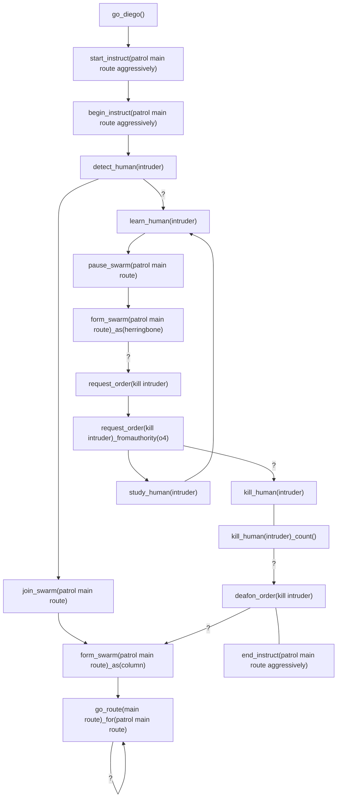

# Lexicon

The lexicon of ***Diego*** is the full syntactical vocabulary of all statement compositions:

| lexicon | domain | type |description |
| --- | --- | --- | --- |
| `_after(`*`date\|datetime\|time`*`)` | abstract | *condit* | Preceeding *object* [after](../abstract/condit/after.md) [date](../abstract/dt/date.md) \| [datetime](../abstract/dt/datetime.md) \| [time](../abstract/dt/time.md) for proceeding *object* to do proceeding *action* |
| `_at(`*`date\|datetime\|time`*`)` | abstract | *condit* | Preceeding *object* [at](../abstract/condit/at.md) [date](../abstract/dt/date.md) \| [datetime](../abstract/dt/datetime.md) \| [time](../abstract/dt/time.md) for proceeding *object* to do proceeding *action* |
| `_before(`*`date\|datetime\|time`*`)` | abstract | *condit* | Preceeding *object* [before](../abstract/condit/before.md) [date](../abstract/dt/date.md) \| [datetime](../abstract/dt/datetime.md) \| [time](../abstract/dt/time.md) for proceeding *object* to do proceeding *action* |
| `_calc(`*`expression`*`)` |  abstract | *method* | Use [calculation](../abstract/meth/calc.md) of *expression* for preceeding *object*, with proceeding *object* |
| `_decpl(`*`numericvalue`*`)`<br>`_decplaces(`*`numericvalue`*`)` | abstract | *setter* | [decpl](abstract/decpl.md)<br/>See also [`fix`](../abstract/meth/fix.md) *method* |
| `_distan(`*`distancevalue`*`)`<br>`_distance(`*`distancevalue`*`)`<br>`_distan({unit},`*`distancevalue`*`)`<br>`_distance({unit},`*`distancevalue`*`)`<br> | metaphysic | *posit*<br/>*property* | Preceeding *object* of [distance](../metaphysic/prop/distan.md) of proceeding *object* |
| `_durat(`*`durationvalue`*`)`<br>`_duration(`*`durationvalue`*`)`<br>`_durat({unit},`*`durationvalue`*`)`<br>`_duration({unit},`*`durationvalue`*`)`<br> | metaphysic | *posit_variable* | Preceeding *object* of [duration](metaphysic/durat.md) of proceeding *object* |
| `_during(`*`date`*`)` | abstract | *condit* | Preceeding *object* [during](abstract/to.md) [date](abstract/date.md) for proceeding *object* to do proceeding *action* |
| `_e()`<br>`_e(`*`decplaces`*`)` |  abstract | *constant* | Use [Euler's number](abstract/e.md) for preceeding *object*, with proceeding *object* |
| `_ergcon(`*`ergconvalue`*`)`<br>`_ergcon({unit},`*`ergconvalue`*`)` | metaphysic | *posit_variable* | Preceeding *object* of [energy consumption](metaphysic/ergcon.md) of proceeding *object* |
| `_fix(`*`decplaces`*`)`<br/>`_tofix(`*`decplaces`*`)` | abstract | *method* | Converts preceeding *object-value* in to *decplaces* number of [fixed decimal places](../abstract/meth/fix.md) |
| `_for([`*`loopername`*`])` | abstract | *looper* |  |
| `_for(`*`startexpression`*`,`*`condition`*`,`*`repeatexpression`*`)` | abstract | *looper* |  |
| `_foreach(`*`startexpression`*`,`*`condition`*`,`*`repeatexpression`*`)` | abstract | *looper* |  |
| `_forin(`*`startexpression`*`,`*`condition`*`,`*`repeatexpression`*`)` |abstract | *looper* |  |
| `_forof(`*`startexpression`*`,`*`condition`*`,`*`repeatexpression`*`)` |  abstract | *looper* |  |
| `_goto()` | metaphysic | *operator* |  Preceeding *object(s)* [goto](metaphysic/goto.md) to proceeding *object(s)* |
| `_if_(`*`expression`*`)` | abstract | *operator* |  |
| `_ln(`*`numericvalue`*`)`<br>`_log(`*`numericvalue`*`)`<br>`_ln([`*`numericvariablename`*`])`<br>`_log([`*`numericvariablename`*`])`  |  abstract | *constant* | Use [natural logarithm](abstract/ln.md) (base [e](abstract/e.md])) for preceeding *object*, with proceeding *object*<br>See also: [ln2](abstract/ln2.md); [ln10](abstract/ln10.md) |
| `_ln10()`<br>`_ln10(`*`decplaces`*`)`<br>`_ln(10)`<br>`_ln(10)_decpl(`*`decplaces`*`)` |  abstract | *constant* | Use [natural logarithm of 10](abstract/ln10.md) for preceeding *object*, with proceeding *object*<br>See also: [ln](abstract/ln.md) |
| `_ln2()`<br>`_ln2(`*`decplaces`*`)`<br>`_ln(2)`<br>`_ln(2)_decpl(`*`decplaces`*`)` |  abstract | *constant* | Use [natural logarithm of 2](abstract/ln2.md) for preceeding *object*, with proceeding *object*<br>See also: [ln](abstract/ln.md) |
| `_mapprovider(`*`mapprovider`*`)` | metaphysic | *setter* | [mapprovider](/metaphysic/setter/mapprovider.md) |
| `_msg(`*`message`*`)`<br>`_message(`*`message`*`)` | metaphysic | *posit-action* | Proceed with *[message](metaphysic/msg.md)* *moniker* |
| `_orientat(`*`variablename`*`)`<br>`_orientation(`*`variablename`*`)` | metaphysic | *posit-variable* |  |
| `_orientat(`*`x`*`,`*`y`*`,`*`j`*`,`*`k`*`)`<br>`_orientat(`*`x`*`,`*`y`*`,`*`z`*`,`*`w`*`)`<br>`_orientation(`*`x`*`,`*`y`*`,`*`j`*`,`*`k`*`)`<br>`_orientation(`*`x`*`,`*`y`*`,`*`z`*`,`*`w`*`)` | metaphysic | *posit-action* |  |
| `_orientat(`*`x`*`,`*`y`*`,`*`z`*`)`<br>`_orientation(`*`x`*`,`*`y`*`,`*`z`*`)` | metaphysic | *posit-action* |  |
| `_pi()`<br>`_pi(`*`decplaces`*`)` |  abstract | *constant* |  |
| `_pose(`*`moniker`*`)` | metaphysic | *posit-object* | Proceed with *[pose](metaphysic/pose.md)* *moniker* |
| `_scalar(`*`variablename`*`)` | metaphysic | *posit-variable* | Proceed with *[scalar](metaphysic/scalar.md)* *variablename* |
| `_sqrt2()`<br>`_sqrt2(`*`decplaces`*`)` |  abstract | *constant* |  |
| `_to()` | abstract | *operator* | Preceeding from *object(s)* [to](abstract/to.md) proceeding *object(s)* |
| `_to()` | metaphysic | *operator* | Preceeding *object(s)* *action* [to](metaphysic/to.md) proceeding *object(s)* |
| `_tour(`*`moniker`*`)` | metaphysic | *posit-object* | Proceed with *[tour](metaphysic/tour.md)* *moniker* |
| `_txt(`*`text`*`)`<br>`_text(`*`text`*`)` | abstract | *posit* | Proceed with *test* of *[text](abstract/txt.md)* *moniker* |
| `_unit(`*`unit`*`)` | metaphysic | *posit-datatype* |  |
| `_using(`*`moniker`*`)`<br/>`_using([`*`variablename`*`])` | metaphysic | *condit* | [using](/metaphysic/condit/using.md) |
| `;` | abstract | *statement-operator* | [Termination](abstract/semicolon.md) of preceeding *statement* |
| `:` | abstract | *statement-operator* | Termination of preceeding *statement* and the negative outcome [beginning](abstract/elvish.md) of proceeding *statement* |
| `?` | abstract | *statement-operator* | Termination of preceeding *statement* and the positive outcome [beginning](abstract/elvish.md) of proceeding *statement* |
| `(())` | abstract<br>metaphysic<br>physic | *object*<br>*action* | Refer to last referenced oldest generation *object* or refer to oldest generation nested *object*|
| `()` | abstract<br>metaphysic<br>physic | *object*<br>*action* | Refer to last referenced youngest generation *object* or refer to youngest generation nested *object* |
| `([`*`robotvariablename`*`])` | abstract<br>metaphysic<br>physic | *object* |  Refer to *[robot](physic/robot.md)* of value of *robotvariablename* [variable](abstract/variable.md) of datatype *[robot](physic/robot.md)* |
| `([`*`waypointvariablename`*`])` | physic | *object*<br>*variable* | Refer to *[waypoint](metaphysic/waypoint.md)* of value of *robotvariablename* [variable](abstract/variable.md) of datatype *[waypoint](metaphysic/waypoint.md)* |
| `({robot},[`*`variablename`*`])` | physic | *object*<br>*datatype*<br>*variable* | Refer to [robot-type](physic/robot.md) [robot](physic/robot.md) of value *variablename* [variable](abstract/variable.md) |
| `({waypoint},[`*`variablename`*`])` | metaphysic | *object*<br>*datatype*<br>*variable* | Refer to [waypoint-type](metaphysic/waypoint.md) [waypoint](metaphysic/waypoint.md) of value *variablename* variable |
| `(`*`moniker`*`)` | abstract<br>metaphysic<br>physic | *object*<br>*action* |  Refer to last referenced eldest generation *object* monikered *moniker* |
| `(`*`robotmoniker`*`)` | physic | *object* | Refer to [robot](physic/robot.md) *robotmoniker* |
| `(`*`waypointmoniker`*`)` | metaphysic | *object* | Refer to [waypoint](metaphysic/waypoint.md) *waypointmoniker* |
| `[]` | abstract<br>metaphysic<br>physic | *object*<br>*variable* | Refer to last referenced *object*/*variable* or 'this' parent scoped *object* |
| `[`*`moniker`*`]` | abstract<br>metaphysic<br>physic | *object*<br>*variable* | Refer to last referenced *object* |
| `[`*`variablename`*`]` | abstract<br>metaphysic<br>physic | *variable* | Refer to last referenced *[variable](abstract/variable.md)* monikered *moniker* |
| `{}` | abstract | *datatype* | Declaration or convert / cast of a [variant](../abstract/dt/variant.md) datatype. |
| `{`*`datatype`*`}` | abstract | *datatype* | Declaration or convert / cast of a [datatype](../abstract/dt/declar.md) |
| `{`*`objtype`*`}` | abstract | *datatype* | Declaration or convert / cast of an [object-type](../abstract/dt/declar.md) |
| `+` | abstract | *operator* | |
| `++` | abstract | *operator* | |
| `+=` | abstract | *operator* | |
| `add_`*`<object\|action>`* | abstract<br>metaphysic<br>physic | *verb* | Declare *object* |
| `alert_`*`<thingy>`*`(`*`moniker`*`)` | physic | *verb* | [alert](../physic/verb/alert.md) |
| `ask_` | metaphysic | *verb* | Requests information, to be returned with `tell` *verb*<br/>`ask_drone(drone1)_stat(avg_altitude);`<br/>`tell_drone(drone1)_stat(avg_altitude)_value(22.893);` | [ask](/ask.md)<br />_see also:_ [tell](/end/md) |
| `ask_`*`<thingy>`* | physic | *verb* | *[Ask](../metaphysic/verb/ask.md)* proceeding *thingy* |
| `begin_`*`<object\|action>`* | abstract<br>metaphysic | *verb* | [Begin](metaphysic/begin.md) *action* on proceeding *object* |
| `calc_`*`<object>`*`(`*`objmoniker`*`)`<br/>`calc_`*`<object>`*`(`*`ofmoniker`*`)` | abstract<br/>metaphysic | *verb* | [calc](../metaphysic/verb/calc.md) |
| `call_`*`<object>`* | metaphysic | *verb* | [call](/metaphysic/verb/call.md) |
| `computer(`*`moniker`*`)`<br>`comput(`*`moniker`*`)` | metaphysic | *object* | *Action* on *[computer](metaphysic/computer.md)* *moniker* |
| `concord(`*`settings`*`)` | abstract<br>metaphysic | *setter* |  |
| `consens(`*`settings`*`)`<br>`consensus(`*`settings`*`)` | abstract<br>metaphysic | *setter* | [consens](metaphysic/consens.md) |
| `counter(`*`variablename`*`)` | abstract | *object* | [counter](../abstract/obj/counter.md) |
| `decisiven(`*`settings`*`)`<br>`decisiveness(`*`settings`*`)` | metaphysic | *setter* |  |
| `distan(`*`objectname`*`)`<br/>`distance(`*`objectname`*`)` | metaphysic | *object* | [distan](../metaphysic/obj/distan.md) |
| `follow_`*`<object>`* | metaphysic | *verb* | *[Follow](metaphysic/follow.md)* proceeding *object* |
| `funct(`*`moniker`*`)`<br>`_funct(`*`moniker`*`)`<br>`function(`*`moniker`*`)`<br>`_function(`*`moniker`*`)` | abstract | *action* | [funct](../abstract/obj/funct.md) |
| `go_`*`<object>`* | physic | *verb* | Manouve Proceeding *object* to [go](physic/go.md) proceeding *action* on *object* |
| `goto_`*`<object>`* | physic | *verb* | Manouve Proceeding *object* to [goto](physic/goto.md) proceeding *object* |
| `goal(`*`moniker`*`)`<br>`_goal(`*`moniker`*`)` | metaphysic | *posit-object* | *Action* on *[goal](../metaphysic/obj/goal.md)* *moniker*<br>Proceed with *[goal](../metaphysic/goal.md)* *moniker* |
| `instruct(`*`moniker`*`)`<br>`instruction(`*`moniker`*`)` | abstract<br>metaphysic | *action* | [instruct](metaphysic/instruct.md) |
| `kill_`*`<human\|organic>`* | physic | *verb* | *[Kill](../metaphysic/verb/kill.md)* proceeding *human*/*organic* |
| `kill_`*`<object>`* | physic | *verb* | *[De-commission](../metaphysic/verb/kill.md)* proceeding *object* |
| `kill_`*`<variable>`* | abstract | *verb* | *[Kill](../abstract/verb/kill.md)* proceeding *variable* |
| `lead_`*`<object>`* | metaphysic | *verb* | *[lead](../metaphysic/verb/lead.md) proceeding *object* |
| `load_`*`<object>`* | metaphysic | *verb* | *[load](../metaphysic/verb/load.md)* proceeding *object* |
| `me_`*`<object\|action>`* | abstract | *special* | *[me](../abstract/me.md)* (or this) does *action* or my *object*... |
| `msg_`*`<object>`* | metaphysic | *verb* | *[message](metaphysic/msg.md)* proceeding *object* |
| `msg(`*`moniker`*`)`<br>`message(`*`moniker`*`)` | metaphysic | *object* | *Action* on *[message](metaphysic/msg.md)* *moniker* |
| `namespace(`*`moniker`*`)`<br>`ns(`*`moniker`*`)` | abstract | object | [namespace](../abstract/obj/namespace.md) |
| `ns[]` | abstract | object | [namespace](../abstract/obj/namespace.md) |
| `payload(`*`moniker`*`)`<br>`pload(`*`moniker`*`)` | metaphysic | *object* | *Action* on *[payload](/metaphysic/obj/payload.md)* *moniker* |
| `point(`*`moniker`*`)` | abstract | *object* | [point](../abstract/obj/point.md) |
| `poll_`*`<object>`*`(`*`objmoniker`*`)`<br/>`poll_`*`<object>`*`(`*`ofmoniker`*`)` | metaphysic | *verb* | [poll](../metaphysic/verb/poll.md)  |
| `printer(`*`moniker`*`)`<br>`ptr(`*`moniker`*`)` | metaphysic | *object* | *Action* on *[printer](metaphysic/printer.md)* *moniker* |
| `process(`*`moniker`*`)`<br>`process(`*`moniker`*`)` | metaphysic | *object* |  |
| `robot(`*`moniker`*`)`<br>`_robot(`*`moniker`*`)` | physic | *object* | *Action* on *[robot](physic/robot.md)* *moniker* |
| `route(`*`moniker`*`)`<br/>`_route(`*`moniker`*`)` | metaphysic | *object* | *Action* on *[route](/metaphysic/obj/route.md)* *moniker*<br/>Proceed with *[route](../metaphysic/obj/route.md)* *moniker* |
| `sensor(`*`moniker`*`)`<br>`_sensor(`*`moniker`*`)` | metaphysic | *object* | *Action* on *[sensor](../metaphysic/obj/sensor.md)* *moniker*<br>Proceed with *[sensor](../metaphysic/obj/sensor.md)* *moniker* |
| `set_`*`<setter>`*`(`*`settings`*`)` | abstract<br>metaphysic | *verb* | [Set](../metaphysic/verb/set.md) the *setter* to *settings* settings |
| `study_`*`<object>`* | physic | *verb* | *[Study](../metaphysic/verb/study.md)* proceeding *object* |
| `tail_`*`<object>`* | metaphysic | *verb* | *[Tail](../metaphysic/verb/tail.md)* behind proceeding *object* |
| `thingy({robot},`*`moniker`*`)`<br>`add_thingy(`*`moniker`*`)_type(robot)` | physic | *verb-object*<br>*datatype* | *Action* on *[thingy](physic/thingy.md)* *moniker* of datatype [robot](physic/robot.md) |
| `unload_`*`<object>`* | metaphysic | *verb* | *[Unload](../metaphysic/verb/unload.md)* proceeding *object* |
| `vector(`*`moniker`*`)`<br>`_vector(`*`moniker`*`)` | metaphysic | *object*<br>*posit-object* | *Action* on *[vector](../abstract/obj/vector.md)* *moniker*<br>Proceed with *[way](metaphysic/way.md)* *moniker* |
| `verb(`*`moniker`*`)` | meta-abstract | *object* | *Action* on *[verb](metaabstract/verb.md)* *moniker* |
| `way(`*`moniker`*`)`<br>`_way(`*`moniker`*`)` | metaphysic | *object*<br>*posit-object* | *Action* on *[way](../metaphysic/obj/way.mdd)* *moniker*<br>Proceed with *[way](metaphysic/way.md)* *moniker* |
| `waypoint(`*`moniker`*`)`<br>`wp(`*`moniker`*`)`<br>`_waypoint(`*`moniker`*`)`<br>`_wp(`*`moniker`*`)` | metaphysic | *object*<br>*posit-object* | *Action* on *[waypoint](../metaphysic/obj/waypoint.mdd)* *moniker*<br>Proceed with *[waypoint](../metaphysic/obj/waypoint.md)* *moniker* |
| `with_`*`<object>`*`(`*`moniker`*`)` | abstract<br>metaphysic<br>physic | *verb* | Refer to *object* of *moniker* |
| `world(`*`verbmoniker`*`)` | physic | *special* | *Action* of *verbmoniker* on *[world](../physic/special/world.md)* |

```diego
kill_human(Will)_upon()_cmd(Fire at Will);
```

`with_robot(`*`moniker`*`)`<br>
&nbsp;&nbsp;&nbsp;&nbsp;&nbsp;&nbsp;&nbsp; `goto_wp(`*`waypointmoniker`*`);`<br>
`;`

`with_robot(`*`moniker`*`)_goto()_wp(`*`waypointmoniker`*`);`

`with_robot(`*`moniker`*`)_goto()_wp([`*`variablename`*`]);`

`with_robot([`*`variablename`*`])_goto()_wp([`*`variablename`*`]);`

`go_robot(`*`moniker`*`)_to(`*`waypointmoniker`*`);`

`go_robot(`*`moniker`*`)_to()_wp(`*`waypointmoniker`*`);`

`(`*`robotmoniker`*`)_goto()_wp(`*`waypointmoniker`*`);`

`({robot},[`*`variablename`*`])_goto()_({waypoint},[`*`variablename`*`]);`

`([`*`robotvariablename`*`])_goto()_([`*`waypointvariablename`*`]);`

`[]_goto()_wp(`*`waypointmoniker`*`);`


## <a name="go_diego"></a>go_diego
Sets up '*deigo*' program with global defaults.

Every  diego program must start with the ```go_diego``` command.

The ```go_diego``` command accepts no sub commands.

The ```go_diego``` command can be parameter-less, but it is recommended, for easily identification (especially under  development), to provide a '*diego_moniker*'.
#### go_diego()
Sets up '*deigo*' program with global defaults.
#### go_diego(*diego_moniker*)

### Linking & Events
| | do_diego | hey_diego | oh_diego |
|--|:--:|:--:|:--:|
| link | ```go_diego``` | ❌ | ❌ |
| event | ❌ | ❌ | *(bubble up errors from ```instruct```s)*<br>```err_instruct``` |
The `go_diego` command accepts no sub commands.

The _do_diego_ event covers the declaration of global variables.  There are no _hey_diego_ nor  _oh_diego_ events.
### Events
The _do_diego_ event covers the declaration of global variables.  There are no _hey_diego_ nor  _oh_diego_ events.
# Setters


## set_decisiveness
Sets the decisiveness in milliseconds to be making decisions, particularly of polls.

The scope of the ```set_decisiveness```  settings is determined by the ```set_decisiveness``` command location in the diego code.  If the ```set_decisiveness``` command is placed after the ```go_diego``` command but before any ```instruct``` the decisiveness setting will be applied to the whole diego, unless overridden by the next ```set_decisiveness``` command in the diego code flow.

If the ```set_decisiveness``` command is placed after a ```begin_instruct``` command, the scope of decisiveness will be applied to the ```instruct```, unless overridden by the next ```set_decisiveness``` command (in the same ```instruct``` or a nested ```instruct```) in the diego code flow.

The lowest level of override occurs with the ```_with_decisiveness``` sub command, available on most decision commands.

The ```set_decisiveness``` command has privilege definition ability using both and each of the ```_for``` and  ```_not``` sub commands.

If the  ```set_decisiveness``` command is never used, the consensus is defaulted to *unanimous*.

The ```set_decisiveness``` command does **not** set consensus on elections, only on polls and robot decisions.

#### set_decisiveness(*time_period*)
Sets the decisiveness is a *time_period* (*in milliseconds*) given to robot(s) when making decisions.  When a robot polls other robots the decisiveness timer will start.  While collecting results the decisiveness timer will trigger when the *time_period* (*in milliseconds*) has expired.  For decisions with  ```decisive```  consensus the majority result will be chosen upon the decisiveness timer triggered.
#### set_decisiveness(*time_period*)_for(*moniker1*, *n...*)
Decisiveness of *time_period* will apply only to the whitelist of (*moniker1*, *n...*) of monikers (robots, swarms, labels of).
#### set_decisiveness(*time_period*)_not((*moniker1*, *n...*)
Decisiveness of *time_period* will **not** apply to the blacklist of (*moniker1*, *n...*) of monikers (robots, swarms, labels of).  The defaulted or last known consensus will apply to those blacklist monikers.
#### set_decisiveness(*time_period*)_for(*moniker1*, *n...*)_not(*moniker1*, *n...*)
An apply-list with a no-apply-list of monikers (robots, swarms, labels of) for decisiveness of *time_period*.
## set_ranking
Sets the ranking calculation to use when analysing results of polls and statistics for decisions.
#### set_ranking(*rank_type*)
| ```rank_type``` | Description |
|:--:|--|
| ```std_comp``` | Uses *standard competition ranking*, also known as "1224" ranking. |
| ```mod_comp``` | Uses *modified competition ranking*, also known as "1334" ranking. |
| ```dense``` | Uses *dense ranking*, also known as "1223" ranking. |
| ```ordinal``` | Uses *ordinal ranking*, also known as "1234" ranking. |
| ```fract``` | Uses *fractional ranking*, also known as "1 2.5 2.5 4" ranking. |
^See^ ^https://en.wikipedia.org/wiki/Ranking^ ^for^ ^more^ ^information.^
#### set_ranking(*rank_type*)_to(*moniker1*, *n...*)


## set_distancecalc


## listen_human
## detect_human
#### detect_human()
#### detect_human(*human_moniker*)
: definition1
## label_human
## learn_human
## study_human

## keep_killcount

## kill_human
The ```kill_human``` is a command for a robot(s) to end the life of an identified human in the physical world using purpose-build tools (i.e. weaponry).  If a robot(s)/swarm has no weaponry the ```kill_human``` command cannot be executed, and in this case the ```murder_human``` command should be used.

The ```kill_human``` command cannot be param-less.

### kill_human(*human_moniker*)
The human identified as *human_moniker* will be killed using the weaponry of the robot(s)/swarm.

Note: The *human_moniker* used in the ```kill_human``` command is only an identified human in the physical world and **not** a human(s) within the diego.  A human identified in the physical world who is also moniker-ed in the diego, will not killed by the robot, and an ````err(*human_moniker* is in the diego)``` will be returned in the _oh_diego_ event and '*bubbled up*'.
### Sub Commands
### kill_human(*human_moniker*)_count()
With the ```_count``` sub command the robot will keep a kill count of 
### Example
https://www.globalsecurity.org/wmd/library/policy/army/fm/3-19/Ch7.htm
In this example a robot(s) will join the '*patrol main route*' swarm and the swarm will go along route '*main_route*' in a _column_ formation.  The swarm will continue along '*main_route*' indefinitely[^kill_human_eg] until a human is detected and subsequently labelled as '*intruder*'. 

Upon detecting the  '*intruder*' the swarm will transform into a '*herringbone*' formation, then request for a '*kill intruder*' order. 

The swarm will continually  ```learn - study``` the '*intruder*' until a ```call_order(kill intruder)```  is executed from an authority of *o4* ('*robotenant*') or above.  Upon the ```call_order``` all robot(s) in the swarm able to kill (i.e. have weaponry) will kill the human (in the physical world) until the human is confirmed dead.

The killing robots will keep a count of the '*intruder*'s killed.  When the kill is completed all robots will no longer react to a ```call_order(kill intruder)```.  The swarm will re-form into a _column_ formation and  go along route '*main_route*', entering the first loop.
```diego
go_diego();

begin_instruct(patrol main route aggressively);
  
  detect_human(intruder) ? learn_human(intruder);

  join_swarm(patrol main route);

  form_swarm(patrol main route)_as(column);
 
    go_route(main route)_for(patrol main route) ? go_route(main route);

  learn_human(intruder) : form_swarm(patrol main route)_as(column);	

    pause_swarm(patrol main route) ? form_swarm(patrol main route)_as(herringbone);
 
    form_swarm(patrol main route)_as(herringbone) ? request_order(kill intruder);

    request_order(kill intruder)_fromauthority(o4) ? kill_human(intruder);

  study_human(intruder);

  kill_human(intruder)_count() ? deafon_order(kill intruder);

  deafon_order(kill intruder) ? form_swarm(patrol main route)_as(column);
  
end_instruct(patrol main route aggressively);

start_instruct(patrol main route aggressively);
```

[^kill_human_eg]: In the ```kill_human``` example, in order for the ```go_route(main route)``` to link its own _hey_diego_ event it must be a loop-able route.
## murder_human

# Learn, Discover & Study
## learn_object
## learn_animate
## learn_inanimate
## learn_organic
## learn_human
## learn_mech
## learn_robot

## discover_human()
## identify_human()

## discover_gait()
## discover_behav()


## join_swarm(*swarm_moniker*)

## form_swarm(*swarm_moniker*)
The ```form_swarm``` command 
#### form_swarm(*formation_type*) &nbsp; &nbsp; &nbsp; &nbsp; &nbsp; transform_swarm(*formation_type*)
#### form_swarm(*formation_type*)_for(*swarm_moniker1*, *n...*)&nbsp; &nbsp; &nbsp; &nbsp; &nbsp; transform_swarm(*formation_type*)_for(*swarm_moniker1*, *n...*)
#### form_swarm(*formation_type*)_not(*swarm_moniker1*, *n...*)&nbsp; &nbsp; &nbsp; &nbsp; &nbsp; transform_swarm(*formation_type*)_not(*swarm_moniker1*, *n...*)
|```formation_type```| Moveable | Description  |
|--|:--:|--|
| ```geometric``` | ✅ |  |
| ```shortdiamond``` | ✅ |  |
| ```pyramid``` | ✅ |   |
| ```typhoon``` | ✅ |   |
| ```Lightning``` | ✅ |   |
| ```phoenix``` | ✅ |   |
| ```tornado``` | ✅ |   |
| ```mirror``` | ✅ |   |
| ```vee``` | ✅ |   |
| ```echelon``` | ✅ |   |
| ```column``` | ✅ |   |
| ```line``` | ✅ |   |
| ```svinfylking``` |  ✅ |  |
| ```pacman``` | ✅ |   |
| ```wedge``` | ✅ |   |
| ```zee``` | ✅ |   |
| ```alpha``` | ✅ |   |
| ```herringbone``` | ❌ |   |
| ```coil``` | ❌ | |
| ```cluster``` | ✅ |  |
| ```finger``` | ✅ |  |


**Stigmergy**

https://en.wikipedia.org/wiki/Tactical_formation
## pause_swarm(*swarm_moniker*)
####  pause_swarm(*swarm_moniker*)
####  pause_swarm(*swarm_moniker*)_into(*stance_type*)
https://www.globalsecurity.org/wmd/library/policy/army/fm/3-19/Ch7.htm

https://en.wikipedia.org/wiki/Satellite_formation_flying


<sub>https://www.raf.mod.uk/display-teams/red-arrows/displays/<br>http://thesis.univ-biskra.dz/3859/1/01_thesis_khaldi.pdf</sub>
## addto_swarm(*swarm_moniker*)
##  stop_swarm(*swarm_moniker*)
## removefrom_swarm(*swarm_moniker*)
## begin_formation(*swarm_moniker*)
## start_formation(*formation_moniker*)
#### start_formation(*formation*)_for(*moniker1*, *n...*)

## tail_robot(*robot_moniker*)
#### tail_robot(*robot_moniker*)
#### tail_robot(*robot_moniker*)_on(*route moniker*)
#### tail_robot(*robot_moniker*)_by(*trail_type*)
|```trail_type```|Description  |
|--|--|
| ```follow``` |  |
| ```trail``` | |
| ```snake``` | |
| ```leapfrog``` | |

## drop_breadcrumbs(*route_moniker*)
#### drop_breadcrumbs(*route_moniker*)

## listen_robot(*robot_moniker*)

# Labelers
Labeler commands are used to attach a label to an '*object(s)*' for a limited scope.  Labelling is useful for robot segregation and compartisation.

## label_robot
#### label_robot(*label_moniker*)_for(*robot_moniker1*, *n...*)
## label_winner
## label_ranker
## label_human
## label_inanimate(*animate_moniker*)
## label_winner()
#### label_winner(*label_moniker*)
## label_ranker()
#### label_ranker(*label_moniker*)_for(rank1, n...)
#### label_ranker(*label_moniker*)_for(rank1, n...)

#### label_ranker(rank1, n...)_
## label_authority
Labels list of monikers (or all) with authorization ranks.  Authorization ranks are used in make decisions upon ```authority``` consensus.
#### label_authority(*rank*) &nbsp; &nbsp; &nbsp; &nbsp; &nbsp; label_authority(*rank_moniker*)
Sets all robots (robots, swarms, labels of) under the scope of ```instruct``` then ``go_diego``` with authorization rank '*rank*'.

A '*rank_moniker*' (shown in table below) can be used in place (or interchangably) with '*rank*'.
> Warning:
> Using the ```label_authority``` command with no privilege sub commands will set **all** robots/swarms to the *rank* which could result in delays/warnings/errors in achieving consensus.

Ranks and rank monikers available are shown below:
| ```rank``` | Ensignia | Rank Moniker | Example Human Equivalent[^human_ranks]<br>Army / Navy / Air Force / Police (Feds) |
|--|:--:|--|--|
| o11 | | robomiral | Field Marshal / Admiral of the Fleet / Marshal of the air force / Commissioner |
| o10 | | robommisssioner | General / Admiral / Air Chief Marshal /  Deputy Commissioner / Director |
| o9 | | roborshal | Lieutenant General / Vice Admiral / Air Marshal /  Assistant Commissioner |
| o8 | | roboneral | Major General / Rear Admiral / Air Vice-Marshal / Commander / Chief od Staff |
| o7 | | robomodore | Brigadier / Commodore / Air Commodore / Superintendent |
| o6 | | robolonel | Colonel / Captain / Group Captain / Deputy Director |
| o7 | | robommander | Lieutenant Colonel / Commander / Wing Commander |
| o6 | | robojor| Major / Lieutenant Commander / Squadron Leader |
| o5 | | roboptain | Captain / Lieutenant / Flight Lieutenant |
| o4 | | robotenant | Lieutenant / Sub Lieutenant / Flying Officer / Inspector |
| o3 | | roboilot | 2nd Lieutenant / Midshipman / Pilot / Sergeant |
| o2 | | roborector | Officer / Officer / Flight Cadet / Leading Senior Constable |
| o1 | | robofficer | Officer / Officer / Flight Cadet / Leading Senior Constable |
| e4 | | robonstable | Sergeant Major / Chief Petty Officer / Warrant Officer / Senior Constable |
| e3 | | robergeant | Sergeant /  Petty Officer / Sergeant / Constable First Class |
| e2 | | roborporal | Bombardier / Leading Seaman / Corporal / Constable / Special Agent |
| e1 | | roboagent | Private / Seaman / Airman / Recruit / Trainee |
[^human_ranks]: Australian military and a mix of state and federal Australian and US FBI police force ranks were used for equivalence.
#### label_authority(*rank*)_to(*moniker1*, *n...*) &nbsp; &nbsp; &nbsp; &nbsp; &nbsp; label_authority(*rank_moniker*)_to(*moniker1*, *n...*) 
Sets monikers (robots, swarms, labels of) in the whitelist under the scope of ```instruct``` then ``go_diego``` with authorization rank '*rank*'.
#### label_authority(++)

#### label_authority(*rank*)_to(*moniker1*, *n...*)

####  label_authority(++)_to(*moniker1*, *n...*) &nbsp; &nbsp;authority_promote(*moniker1*, *n...*)

#### set_authority(*rank*)_to(*moniker1*, *n...*)
#### set_authority(*rank*)_not(*moniker1*, *n...*)

## alert_human(*moniker*)

## find_human(*human_moniker*)
## listen_find(*moniker*)


## ask_point(*point_moniker*)

## report_energy(*route_moniker*)


# Listeners
Listener commands instruct the robot to 'listen out' for a type of object that match specific criteria and then trigger the _hey_diego_ event.  Listener commands can have an _oh_diego_ command which is triggered (the _oh_diego_ event) when the cursor (focus) leaves an ``instruct`` without any _hey_diego_ event triggered.

All listener commands 'leak', meaning that the _hey_diego_ and _oh_diego_ events are disassociated to the listener command.  To prevent the leakage seeping into the rest of your instructions use the listener keep command ``keep_listening()``.

## listen_point
Listens for a point  from ``call_point`` with matching *```point_moniker```*; ``call_point`` matching a _focal(s)_ (``_around``, ``_in``, ``_within``) with/without a matching *```point_moniker```*; ``found_point`` matching a _focal(s)_ (``_around``, ``_in``, ``_within``) with/without a matching *```point_moniker```*; and, ``at_point`` matching a _focal(s)_ (``_around``, ``_in``, ``_within``) with/without a matching *```point_moniker```*
### Linking & Events
| | do_diego | hey_diego | oh_diego |
|--|:--:|:--:|:--:|
| events: | ``keep_listening`` |  ``call_point``<br>``found_point``<br>``detect_point``<br>*matching criteria* | *non-event leaving the ``instruct``* |
| cmds: | ``listen_point`` | ✅ required | ✅ optional |
The _go_diego_ event of the ```listen_point``` command begins on a matching _call_ ( ```call_point(```*```point_moniker```*```)```*```...```*); _find_ ```fall_point(```*```point_moniker```*```)```*```...```*).  There is no _nogo_diego_ event.
### Commands
There are only two ``listen_point`` commands: parameter-less (``listen_point()``) and using the *``point_moniker``* parameter ( ``listen_point(``*``point_moniker``*``)``).
#### listen_point()
The robot will remember a _listener_ for any point and update/add the point in its world memory.

The ``listen_point()`` command with no _focal sub commands_ is redundant, since the default is for a _diego_ to always listen for all points. However using `listen_point()` with a _focal sub command_ may be required in certain scenarios, such as, a '*discover-then-detect*' scenario.

When a ``listen_point()`` command with matching _focal sub commands_ is triggered, the point will be updated/added to the robot's world memory, even if the _point_moniker_ is unknown.  An unknown point_moniker will be given a temporary moniker by the robot.  A robot can use ``sync_point`` to collaborate with other robots/humans on the correct _point_moniker_.
#### listen_point(*point_moniker*)
The robot will remember a _listener_ for the *point_moniker*, and add the *point_moniker* as a _point_ in its world memory.  The robot will listen only for the lifetime of the ```instruct``` or if the command ```deafon_point(```*```point_moniker```*```)```  is instructed.  If the robot, leaves and then returns to the ```instruct```, the _listener_ will automatically be re-established.


### Sub Commands
The  ``listen_point()`` and ``listen_point(``*``point_moniker``*``)``commands have two categories of sub commands: _zonals_, which provide criteria for a match for a zonal as a shape (``_around``, ``_in``) or as an ploygon/area (``_within``); and _privileges_ (``_for`` and ``_not``). 
#### _around(*circle_moniker*)
A _zonal sub command_ using a known circle of *circle_moniker* (_zone_ of _circle_ type) as criteria for matching the *point_moniker* or any point's position ( *x_lat*, *y_lat*) on the x-y plane only (2D) against the encompassing ( *x_lat*, *y_lat*) of the  *circle_moniker* circle.  The circle can be: pre-defined in _zones_ of _circle_ type in _diego declarations_; or in executed in code using ``call_zone(``*``zone_moniker``*``, circle)_at``*``...``*.
#### _around(*map*, *x_lat*, *y_lat*, *radius*)
A _zonal sub command_ using a defined circle on map *``map``* at position *``x_lat``*, *``y_lat``* with radius *``radius``* as criteria for matching the *point_moniker* or any point's position ( *x_lat*, *y_lat*) on the x-y plane only (2D) against the positions ( *x_lat*, *y_lat*) of the  *circle_moniker* circle.
#### _around(*ring_moniker*)
A _zonal sub command_ using a known ring of *ring_moniker* (_zone_ of _ring_ type) as criteria for matching the *point_moniker* or any point's position ( *x_lat*, *y_lat*) on the x-y plane only (2D) against the encompassing ( *x_lat*, *y_lat*) of the  *ring_moniker* ring.  The ring can be: pre-defined in _zones_ of _ring_ type in _diego declarations_; or in executed in code using ``call_zone(``*``zone_moniker``*``, ring)_at``*``...``*.
#### _around(*map*, *x_lat*, *y_lat*, *z_alt*, *minor_radius*, *major_radius*)
A _zonal sub command_ using a defined ring on map *``map``* at position *``x_lat``*, *``y_lat``* with minor radius *``minor_radius``* and major radius *``major_radius``* as criteria for matching the *point_moniker* or any point's position ( *x_lat*, *y_lat*) on the x-y plane only (2D) against the positions ( *x_lat*, *y_lat*) of the  *ring_moniker* ring.
#### _around(*sphere_moniker*)
A _zonal sub command_ using a known sphere of *sphere_moniker* (_zone_ of _sphere_ type) as criteria for matching the *point_moniker* or any point's position ( *x_lat*, *y_lat*, *z_alt*) in 3D against the encompassing ( *x_lat*, *y_lat*, *z_lat*) of the  *sphere_moniker* sphere.  The sphere can be: pre-defined in _zones_ of _sphere_ type in _diego declarations_; or in executed in code using ``call_zone(``*``zone_moniker``*``, sphere)_at``*``...``*.
#### _around(*map*, *x_lat1*, *y_lat1*, *z_alt1*, *x_lat2*, *y_lat2*, *z_alt2*, *radius*)
A _zonal sub command_ using a defined circle on map *``map``* at position *``x_lat``*, *``y_lat``* with radius *``radius``* as criteria for matching the *point_moniker* or any point's position ( *x_lat*, *y_lat*) on the x-y plane only (2D) against the positions ( *x_lat*, *y_lat*) of the  *circle_moniker* circle.
#### _around(*torus_moniker*)
#### _around(*map*, *x_lat1*, *y_lat1*, *z_alt1*, *x_lat2*, *y_lat2*, *z_alt2*, *minor_radius*, *major_radius*, *roll*, *pitch*, *yaw*)
### Zonal (_in)
#### listen_point(*point_moniker*)_in(*rect_moniker*)
#### listen_point(*point_moniker*)_in(*map*, *x_lat1*, *y_lat1*, *z_alt1*, *x_lat2*, *y_lat2*, *z_alt2*, *x_lat3*, *y_lat3*, *z_alt3*)
#### listen_point(*point_moniker*)_in(*cubeoid_moniker*)
#### listen_point(*point_moniker*)_in(*map*, *x_lat1*, *y_lat1*, *z_alt1*, *x_lat2*, *y_lat2*, *z_alt2*, *x_lat3*, *y_lat3*, *z_alt3*)
### Zonal (_within)
#### listen_point(*point_moniker*)_within(*zone_moniker*)
### Privileges
#### listen_point(*point_moniker*)*[...]*_for(*moniker1*, *n...*)
A whitelist (*moniker1*, *n...*) of robots (and/or robots with labels) that should listen for the *point_moniker*.
#### listen_point(*point_moniker*)*[...]*_not((*moniker1*, *n...*)
A blacklist (*moniker1*, *n...*) of robots (and/or robots with labels) that are denied to listen for the *point_moniker*.
## listen_geofence


## listen_formation(*formation_moniker*)
## listen_robot
## listen_human
## listen_route
## listen_swarm(*swarm_moniker*)

## call_point(*point_moniker*)
#### call_point(*point_moniker*)
#### call_point(*point_moniker*)_at(*map*, *x_lat*, *y_long*, *z_alt*)
#### call_point(*point_moniker*)_at(*map_type*, *x_lat*, *y_long*, *z_alt*)
#### call_point(*point_moniker*)*[...]*_for(*moniker1*, *n...*)
#### call_point(*point_moniker*)*[...]*_not(*moniker1*, *n...*)

rallying point)_at(```*```map```*```, ```*```x```*```, ```*```y```*```, ```*```z```*```)```. When matched save point coordinates in memory, then run ```poll_distance(rallying point, unanimous__by(direct);```.

```diego

  poll_distance(intruder)_getrank(1) ? add_label(2nd);
  poll_distance(intruder)_getrank(2) ? add_label(2nd);
  
```


## listen_point(sentry point)
 Each robot will check all 'calls' for ```call_point(sentry point)_at(```*```map```*```, ```*```x```*```, ```*```y```*```, ```*```z```*```)```. When matched each robot will save the point coordinates, and then run ```go_point(sentry point)```.

## keep_listening()
### keep_listening()
All robots will not move pass this command until a ```listen``` command is run and matched.


# Goes
## go_point
## go_route
#### go_route(*route_moniker*)
#### go_route(*route_moniker*)_until(
#### goback_route(*route_moniker*)
#### go_route(*route_moniker*)_goback()
## go_detect
## goto_charge
## gointo_hiding
# Elections

# Messengers
## msg_robot(*msg*)
## msg_human(*msg*)


## alert_human(*alert_moniker*)
## alert_world
#### alert_world(*alert_moniker*)


## call_counter(*call*)

## ask_distance(*route_moniker*)

## study_route(*route_moniker*)
#### study_route(*route_moniker*)_
## study_point(*point_moniker*)
####


# A to Z Objects Index

An A to Z index of all objects used by **diego** instruction programming language.

## <a name="_"></a> {}:
| a | domain | type |description |
| --- | --- | --- | --- |
| `{}` | abstract | *datatype* | Declaration or convert / cast of a [variant](abstract/dt/variant.md) datatype. |
| `{`*`datatype`*`}` | abstract | *datatype* | Declaration or convert / cast of a [datatype](abstract/dt/declar.md) |
| `{`*`objtype`*`}` | abstract | *datatype* | Declaration or convert / cast of an [object-type](abstract/dt/declar.md) |
| `{float}` | abstract<br>datatype | Float abstract datatype | [float](abstract/dt/float.md) |
| `{int}` | abstract<br>datatype | Integer abstract datatype | [int](abstract/dt/int.md) |
| `{int32}` | abstract<br>datatype | Integer abstract datatype | [int](abstract/dt/int.md) |
| `{int64}` | abstract<br>datatype | Integer abstract datatype | [int](abstract/dt/int.md) |

## <a name="a"></a> A: [actuat](#actuat); [apparat](#apparat); [appliance](#appliance); [arena](#arena)

| a | domain<br>objtype |description<br>examples<br>`example` |  API |
|--|:--|:--|--|
| `action` <a name="action"></a> | abstract<br>action | | [action](/action.md) |
| `actuat`<br>`actuator` <a  name="actuat"></a> | physic<br>obj | [actuat](/actuat.md) |
| `ai`<br>`bot` | metaphysic<br>obj | A construct present in the metaphysical world only. (Artificial Intelligence)<br>Example: *cal*, *ChatBot* | [ai](/bot.md) |
| `apparat`<br>`apparatus` <a name="apparat"></a> | physic<br>obj | A technical *device* (`thingy`), carried/worm by a human, for use for a particular purpose or activity. The human version of a `sensor`.<br>Example: geiger counter, multi-meter; *a handheld device*<br>See also: [sensor](#sensor)| [apparat](/apparat.md) |
| `applian`<br>`applicance` |  physic<br>obj |A smart mobot that can safetly be classified as a *household applicance*.<br>Examples: washing machine, dishwasher.<br>`with_applian(dishWasher)_start(normalWash);` | [applian](applian.md) |
| `arena` <a name="arena"></a> | metaphysic<br>obj | A representation of a collection of physical 3d spactial objects in a defined 3d space for a `thingy` to move freely around inside. There should be an attempt to represent physical (real-world) borders.<br>Examples: atrium, open plan office floor | [arena](arena.md) |
| `attr`<br>`attribute` <a name="attr"></a> | abstract<br>obj | Lorem ipsum, lorem ipsum, lorem ipsum.<br>Example: <br>See also: [spec](#spec) | [attr](/attr.md) |

## <a name="b"></a> B: [border](#border); [box](#box)

| b | domain<br>objtype |description<br>examples<br>`example` |  API |
|--|:--|:--|--|
| `border` | physic<br>obj | Floor marking showing borders, created using paint, tape, or, decals.<br>Example:<br><br><sub>"<a href="https://commons.wikimedia.org/wiki/File:Floor_marking_5S_safety_Scanfil_Sieradz.jpg">Floor marking at the Scanfil Poland factory in Sieradz</a>"<br>by <a href="https://commons.wikimedia.org/wiki/User:Boston9">Adrian Grycuk</a> is licensed under <a href="https://creativecommons.org/licenses/by-sa/3.0/pl/">CC BY 2.0 Poland</a> </sub> | [border](border.md) |
| `box` <a name="box"></a> | metaphysic<br>obj | A representation of a meta-physical enclosed space. The thing / meta-physical version of a `room`.<br>Example: inside a pit<br>See also: [room](#room) | [box](/box.md) |
| `bot`<br>`ai` | metaphysic<br>obj | A construct present in the metaphysical world only. (Artificial Intelligence)<br>Example: *cal*, *ChatBot* | [bot](/bot.md) |

## <a name="c"></a> C: [ceiling](#ceiling); [corridor](#corridor)

| c | description<br>examples<br>`example` | API |
|--|:--|--|
| `canal` | Physical bar or continuous line of bars construction used to physically guide object along a pre-defined route.<br>Example:<br><br><sub>"<a href=""></a>"<br>by <a href=""></a> is licensed under <a href="">CC BY </a></sub> | [canal](canal.md) |
| `ceiling` <a name="ceiling"></a>| An identified top _side_ of a representation space in the physical world. | [ceiling](ceiling.md) |
| `channel` | An exclusive sub-section of a `workspace`, sometimes referred to as a _conversation_ | [channel](channel.md) |
| `cloud`   | A zone (`puff`) used for diego communication that utilises a cloud based platform like twitter, discord, slack, _etc._ | [cloud](cloud.md) |
| `console` | A metaphysical presence used to only provide an interface to all other *thingies* | [console](/console.md) |
| `corridor` <a name="corridor"></a> | A representation of a physically defined 3d space, designed for a human, to manoeuvre inside, predominately along a single plane.<br>There should be an attempt for physical (real-world) borders. | [corridor](corridor.md) |
| `commrelay` | https://www.autonodyne.com/AUTO_behaviors2.html | [comrelay](#comrelay) |
| `counter` | | [counter](counter.md)

## <a name="d"></a>D: [door](#door)

| d | description<br>examples<br>`example` | API |
|--|:--|--|
| `door` <a name="door"></a> | A `thing` representation of a physical doorway / gate, designed for a human.<br>See also: [portal](#portal); [gate](#gate) | [door](#door)

## <a name="e"></a>E: [equip](#equip)
| e | description<br>examples<br>`example` | API |
|--|:--|--|
| `equip`*[ment]* | <br>See also: `apparatus`; `instru`*[ment]*; `peripheral`;  `sensor` | [equip](equip.md) |

## <a name="f"></a>F: [fence](#fence); [firma](#firma)
| f | description<br>examples<br>`example` | API |
|--|:--|--|
| `geofence` <a name="fence"></a> | | [geofence](#geofence) |
| `firma` | An identified down _side_ of a representation space in the physical world. | [firma](firma.md) |
| `floor`<br>`level` | | [floor](#floor.md)<br>[level](#level) |
| `fog`     | A zone (`puff`) used for diego communication that relies on UDP | |
| `foreign`*[er]* | |
| `form`*[ation]* | |

## <a name="g"></a>G: [gait](#gait); [gate](#gate)

| G | Description | API |
|--|:--|--|
| `gait` | The thing version of `stride` |
| `gate` | |
| `ghost` |  |
| `guide` | |
| `gimbal` | | |

## <a name="h"></a>H: [human](#human)

| H | Description | API |
|--|:--|--|
| `human` | The human version of a `thing` / `robot`.  The non-human version of an `organic`.<br>See also: |
| `human`   | Representation of a human being, present and alive in the physical *'real'* world. The human version of a `thing` / `robot`.  The non-human version of an `organic`.<br>Example: *Fred Jones* | [human](/human.md) |
| `hold`, `household` |||
| `handler` | | |

## <a name="i"></a>I: [instruct](#instruct); [label](#label)

| I | Description | API |
|--|:--|--|
| `instruct` | |
| `inanimate` | |

## <a name="j"></a>J: [jagger](#jagger); [jigger](#jigger); [ject](#ject); 

| I | Description | API |
|--|:--|--|
| `jagger` | jagger](#jagger) | [jigger](/jigger.md) |
| `jigger`<br>`actuat`<br>`actuator`<br>`mover` <a  name="actuat"></a> | A child *device*  `thingette` that causes its parent `thingy` and/or sibling `thingette` to operate, usually providing motion. A public interface with the _puff_ should be avoided or at least strictly limited. The thing version of a `jagger`.<br>Example: motor controller; gearbox; motor<br>See also: [jigger](#jigger), 
| `ject` | A non-smart object in the physical *'real'* world.<br>Examples: a rock, a shopping trolley, a chair, etc.<br>`with_search(findTVRemote)_found()_object(TVRemote);` | [object](object.md) |

## <a name="k"></a>K:

| K | Description | API |
|--|:--|--|

## <a name="l"></a>L:

| L | Description | API |
|--|:--|--|
| `label` | |
| `lib`, `library` | | |

## <a name="m"></a>M: [mach](#mach); [mech](#mech); [mobot](#mobot);

| m | Description | API |
|--|:--|--|
| `mach`<br>`machine` | A smart mobot using mechanical power and having several parts, each with a definite function and together performing a particular task.<br>Examples: CNC machine, 3D printer, metal laser cutter, etc.<br>`with_mach(metalCutter)_exec()_file(./2d-flower.dxf);` | [mach](mach.md) |
| ~~`manip`*[ulator]*~~ | ~~Depreciated from version 1.1, use `equip` with type `manip`~~|
| `map` | |
| `me`      | Representation of self | [me](/me/md) |
| `mech`<br>_[mechanical thing]_ | A non-smart ject using mechanical power and having several parts, each with a definite function and together performing a particular task.<br>Examples: a Rube Goldberg machine, paper shredder<br><sub>`alert_human(joe)_msg(Please shred documents in [])_mach(paperShredder1)_moniker();`</sub> | [mach](mach.md) |
| `metric` | |
| `mode` | |
| `mover` <a  name="mover"></a> | See: [jigger](#jigger) | |
| `mobot`   | A conveyed *thingy* in the physical *'real'* world.<br>Examples: Samasung Galaxy watch, cellphone | [mobot](/mobot.md) |
| `mist`    | A connectivity zone (wired or wireless) with the distance range of < 10m.<br>For example: RFID | [mist](/mist.md) |

## <a name="n"></a>N:

| n | description | API |
|--|:--|--|
| `neigh`, `neighbour` |||

## <a name="o"></a>O: [ob](#ob); [object](#object); [obstacle](#obstacle)

| o | description<br>examples<br>`example` | metaphysic<br>version | API |
|--|:--|:-:|--|
| `ob`  | A civilian[^civilian] immobile ject in the  physical *'real'* world.<br>Examples: unidentified lampost (or thing pointing out of the ground), etc.<br>`call_robot(alif)_found()_ob()_photo()_blob(d3Mtd2l6EAMyCwguEBDIL`*`...`* | [obstacle](../metaphysic/onstacle.md) | [ob](ob.md) |
| `obstacle` | |
| `object`  | A non-smart immobile ject in the physical *'real'* world.<br>Examples: a rock, a chair, etc.<br>`call_robot(alif)_found()_object(carKeys);` | [stacle](../metaphysic/stacle.md) | [object](object.md) |
| `organic` | Representation of a non-human being, present and alive in the physical *'real'* world.<br>Example: cat, dog | [organic](/organic.md) |

## <a name="p"></a>P:

| p | description<br>examples<br>`example` | API |
|--|:--|--|
| `path` | |
| `payload` | |
| `pipe` | Physical bar or continuous line of bars construction used to physically guide object along a pre-defined route.<br>Example:<br><br><sub>"<a href=""></a>"<br>by <a href=""></a> is licensed under <a href="">CC BY </a></sub> | [duct](../metaphysic/duct.md)  | [pipe](pipe.md) |
| `plafond` | |
| `point` | <br>See also: `route`; `path` |
| `proc`, ``proced`, `procedure` | | |
| `prog`, `program`, `programme` | | |
| `package` | | |
| `puff` | | |
| `poi` | | |

## <a name="q"></a>Q:

| q | description | API |
|--|:--|--|
description<br>

## <a name="r"></a>R: [robot](#robot); [room](#room)

| r | description<br>examples<br>`example` | API |
|--|:--|--|
| `rail` | Physical bar or continuous line of bars construction used to physically guide object along a pre-defined route.<br>Example:<br><br><sub>"<a href="https://commons.wikimedia.org/wiki/File:Eastern_rail_01_gnangarra.JPG">the point where the Eastern Rail line leaves the Swan Coastal plain and follows the Avon river through the Darling Scarp to Toodyay</a>"<br>by <a href="https://commons.wikimedia.org/wiki/User:Gnangarra">Gnangarra</a> is licensed under <a href="https://creativecommons.org/licenses/by-sa/4.0">CC BY 2.5 Australia</a><br>Photographs by Gnangarra...commons.wikimedia.org</sub> | [rail](rail.md) |
| `robot`   | A self-propelled *thingy* in the physical *'real'* world.<br>Examples: Boston Dynamics Spot, robot arm, drone<br>See also: `human`; `thing` | [robot](/robot.md)
| `room` | A representation of a single physical enclosed space for a `thingy` to move freely around inside. | [chamber](../metaphysic/chamber.md) | [room](room.md) |
| `route` | |
| `roi`<br>`regionofinterest` | | [roi](roi.md) |


## <a name="s"></a>S:

| s | description<br>examples<br>`example` | API |
|--|:--|--|
| `scalar` | metaphysic<br>obj | | [scalar](scalar.md) |
| `sensor` | The thing version of an `apparatus`.<br>See also: [apparat](#apparat) |
| `shaft` | Physical bar or continuous line of bars construction used to physically guide object along a pre-defined route.<br>Example:<br><br><sub>"<a href=""></a>"<br>by <a href=""></a> is licensed under <a href="">CC BY </a></sub> | [?](../metaphysic/?.md)  | [shaft](shaft.md) |
| `side` | | |
| `spec`<br>`specification` | <br>See also: `attribute` | [spec](spec.md) |
| `stance` |  |
| `stride` | The human version of `gait` |
| `swarm` | |
| `spine` | | [spine](../metaphysic/spine.md) |
| `sub` | A civilian[^civilian] mobile ject in the  physical *'real'* world.<br>Exmaples: *unidentified moving animal*, *unidentified flying object*<br>`with_robot(tha)_follow()_sub(e32f0);` | [substacle](../metaphysic/substacle.md) | [sub](sub.md) |
| `subject` | A non-smart mobile ject in the  physical *'real'* world.<br>Examples: a shopping trolley object<br>`with_robot(sha)_follow()_subject(ball_ef42b);` | [hunderan](../metaphysic/hinderan.md)<br>*[ghost](../metaphysic/ghost.md)* | [subject](subject.md) |
| `scan` | |
| `stealth` |

^1^: A civilian is a *thingy* with (or presumed to be with) no Diego interface

## <a name="t"></a>T:

| t | domain<br>objtype |description<br>examples<br>`example` |  API |
|--|:--|:--|--|
| `thing` <a name="thing"></a> | physic<br>obj | An immobile *thingy* in the physical *'real'* world.<br>Example: fridge, television | [thing](/thing/md) |
| `to` <a name="to"></a> | metaphysic<br>posit | | [to](to.md) |
| `toward`<br>`towards` <a name="toward"></a> | metaphysic<br>posit | | [toward](toward.md) |
| `track` <a name="track"></a> | physic<br>obj | Floor/ground marking the side borders of a lane.<br>Example:<br><br><sub>"<a href="https://commons.wikimedia.org/wiki/File:All-weather_running_track.jpg">An all-weather running track (photo taken at the Dalin Sports Park, Chiayi, Taiwan)</a>"<br>by <a href="https://commons.wikimedia.org/wiki/User:Mk2010">Mk2010</a> is licensed under <a href="https://creativecommons.org/licenses/by-sa/4.0">CC BY 4.0 International</a> </sub> | [track](track.md) |
| `tunnel` | physic<br>obj | Physical bar or continuous line of bars construction used to physically guide object along a pre-defined route.<br>Example:<br><br><sub>"<a href=""></a>"<br>by <a href=""></a> is licensed under <a href="">CC BY </a></sub> | [tunnel](tunnel.md) |

## <a name="u"></a>U:

| u | domain<br>objtype |description<br>examples<br>`example` |  API |
|--|:--|:--|--|

## <a name="v"></a>V:

| v | domain<br>objtype |description<br>examples<br>`example` |  API |
|--|:--|:--|--|
| `vehicle` | physic<br>obj | A guided *thingy* transporting `human`/`organic` thingies and/or controlled by a `human`.<br>Examples: car, airplane, <abbr title="uncrewed ground vehicle">ugv</abbr>.<br>`with_vehicle(familyCar)_equip(frontLeftWheel)_metric()_tyrepress();` | [vehicle](vehicle.md) |
| `var`<br>`variable` | abstract<br>obj | | [var](var.md)

## <a name="w"></a>W:

| w | description<br>examples<br>`example` | API |
|--|:--|--|
| `wall` | An identified right / left[^righthandrule] _side_ (using the right-hand rule) of a representation space in the physical world. | [litsan](../metaphysic/litsan.md) | [wall](wall.md) |
| `wayfind` | Wayfinding floor signature, created using paint, tape, or, decals.<br>Example:<br><br><sub>"<a href="https://commons.wikimedia.org/wiki/File:Long-distance_Bus_Navigation_in_Japan.jpg">Tokyo Station</a>" by <a href="https://www.flickr.com/people/36516818@N00">mrhayata</a> is licensed under <a href="https://creativecommons.org/licenses/by/2.0/">CC BY 2.0</a></sub> | [route](../metaphysic/route.md)  | [wayfind](wayfind.md) |
| `workspace` | An exclusive section of a `puff`, sometimes called a _room_ |

## <a name="xnz></a>XYZ:

| xyz | description<br>examples<br>`example` | API |
|--|:--|--|
| `zone` | The thing version of an `arena` |

human - thing (mech, robot, obstacle, organic)

https://specializedstairs.com/anatomy-of-a-staircase/
_stringer(open, closed, mono


`puff`, `cloud`, `fog`, `mist`


## Notes

[^civilian]: A civilian is a *thingy* with (or presumed to be with) no ***diego*** interface.
[^righthandrule]: Using the *right-hand rule*.