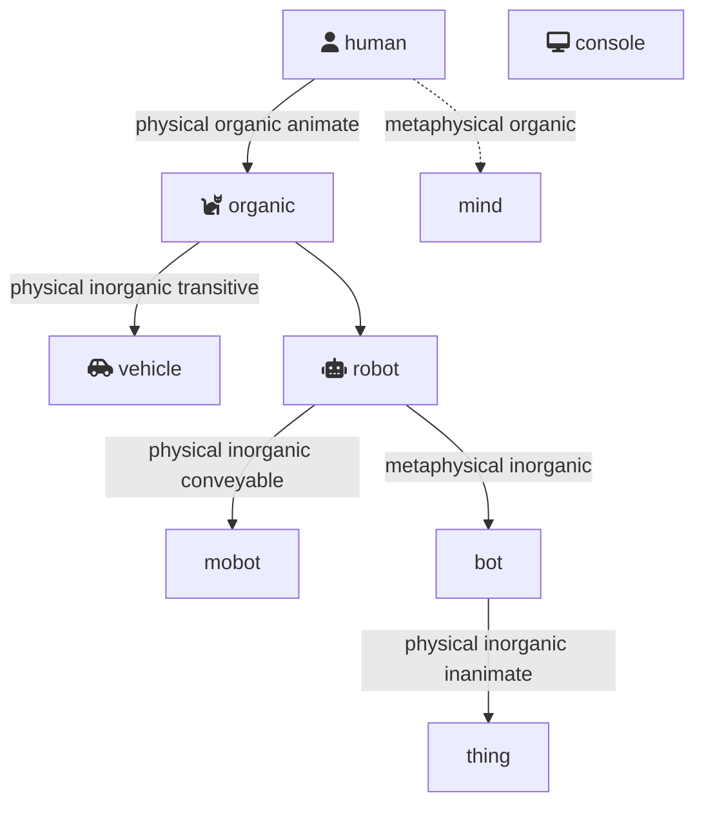
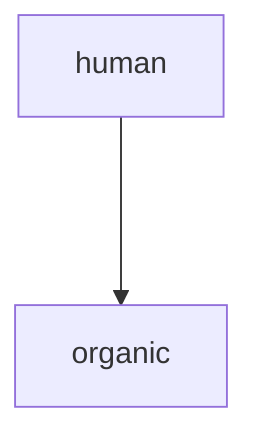

# Thingies

The top object in the hierarchy of all objects in Diego are the *`thingies`*. A `thingy` is an object with interfaces with diego commands, only `thingies` have this interface.  However, not all `thingies` are the same, they have different genera. To classify the genera of thingies we consider: its physicality (physical or metaphysical), its organicness, its animativity, its transitiveness, and, its conveyability.

| `thingy` | description | attributes | example | api |
|---|:--|---|---|---|
| `human` | Representation of a human being, present (aware of surroundings & context) and alive (animate) in the physical *'real'* world. The human version of a `thing` / `robot`.   | physical, organic, animate | *Fred Jones* | [human](obj/human.md) |
| `organic` | Representation of a non-human being, present (aware of surroundings & context) and alive in the physical *'real'* world.<br>Example: cat, dog | [organic](/organic.md) |
| `robot` | An *thingy* able to self-propel itself (animate) in the physical *'real'* world, that is maority inorganic.<br>Examples: Boston Dynamics Spot, robot arm, drone<br>See also: `human`; `thing` | physical inorganic animate | [robot](/robot.md)

 In terms of authority/hierarchy within the genera it is generally agreed that hi


sdas

 ```mermaid
graph TB
    human ---> organic
    human ---> mind
    organic ---> vehicle
    organic ---> robot
    robot ---> mobot
    bot ---> thing
    robot ---> bot
    console
```   

fdsdsaf



## <a name="genera"></a> Thingy Objects (Genera of Thingies)

| thingy genera | notes<br>examples | API |
| --------- | ----- | ----- |
| `bot`, `ai` | A construct present in the metaphysical world only. (Artificial Intelligence)<br>Example: *cal*, *ChatBot* | [bot](/bot.md) |
| `console` | A metaphysical presence used to only provide an interface to all other *thingies* | [console](/console.md) |
| `human`   | Representation of a human being, present and alive in the physical *'real'* world. The human version of a `thing` / `robot`.  The non-human version of an `organic`.<br>Example: *Fred Jones* | [human](/human.md) |
| `mobot`   | A conveyed *thingy* in the physical *'real'* world.<br>Examples: Samasung Galaxy watch, cellphone | [mobot](/mobot.md) |

| `robot`   | 
| `thing`   | An animate *thingy* in the physical *'real'* world.<br>Example: fridge, television | [thing](/thing/md) |
| `thingy` | | [thingy](/thingy.md) |
| `vehicle` | A guided *thingy* transporting `human`/`organic` thingies and/or controlled by a `human`.<br>Examples: car, airplane, ugv, radio-controlled toy car | [vehicle](/vehicle.md) |


 