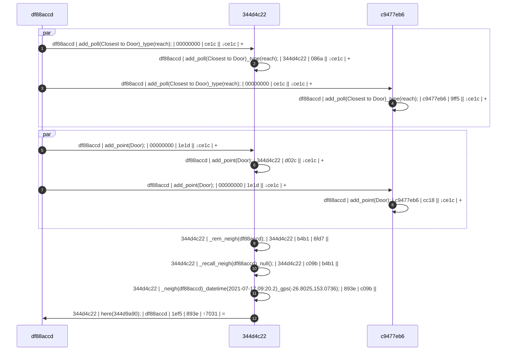

# poll


## 


### Syntax:

```Diego
add_call({poll_name});
with_poll({poll_name});
run_poll({poll_name});
freqent_poll({poll_name})_freq({frequency_millisecs})_until({milliseconds/datetime});
```

### Example:

In this example three things (`df88accd-dd43-4ff1-820e-82f75be13013`, shortened 64-bit: `df88accd`; `344d4c22-546c-4940-bdc4-c2a4371a29ac`, `344d4c22`; and, `c9477eb6-1328-4c10-8755-913d41a6e0e1`, `c9477eb6` ) are in the same universe; they have all been introduced to each other (i.e. they believe in each others existence and therefore presume each other is listening); they presume they are the only ones left in this universe...



&#9312; The caller, `df88accd`, calls out to its know universe with the command: `call();`   The message contains `{caller_uuid} | {command} | {callee} | {*hash} | {←hash} | {↕hash} | {tree}`, where: `{caller}` is  `df88accd`; `{command}` is `call();`; `{callee}` is `00000000` (`NULL`), because this is a call to the universe; in this case, `{*hash}` is `6fd7` (shortened to 16-bit); `{←hash}` is non-existent because the message is coming from outside; `{↕hash}` is `7031` from the originator; and, `{tree}` is `+` depicting a new blockchain tree.

&#9313; The callee, `344d4c22`, hears the `call` and tries to remember the caller as a neighbour: `_rem_neigh(df88accd);`.

&#9314; Callee, `344d4c22` does not recall ever meeting `df88accd`: `_recall_neigh(df88accd)_null();`, so `344d4c22` remembers the time and place `344d4c22` met `df88accd`: &#9315; ``_neigh(df88accd)_datetime(2021-07-17 09:20.2)_gps(-26.8025,153.0736);`.

&#9316; `344d4c22` responds to `df88accd`'s roll call: `here(344d9a90);`. The `{tree}` of `=` depicts the end of this child's blockchain.

At this point thing `df88accd` will perform the same process (*_neigh*) triggered by the `here` command rather than `call`.

## Implicit Call

The implicit [roll]call is a request for existence of other types in its known universe, 

### Syntax:

```Diego
call_human();
call_ai();
call_robot();
call_thing();
call_console();
```

## Explicit Call

### Syntax:

```Diego
call({uuid});
call_human({human_uuid});		call_human()_for({human_uuid});
call_ai({ai_uuid});				call_ai()_for({ai_uuid});
call_robot({robot_uuid});		call_robot()_for({robot_uuid});
call_thing({thing_uuid});		call_thing()_for({thing_uuid});
call_console({console_uuid});	call_console()_for({console_uuid});

call({moniker});
call_human({human_moniker});		call_human()_for({human_moniker});
call_ai({ai_moniker});				call_ai()_for({ai_moniker});
call_robot({robot_moniker});		call_robot()_for({robot_moniker});
call_thing({thing_moniker});		call_thing()_for({thing_moniker});
call_console({console_moniker});	call_console()_for({console_moniker});

call()_as({label})
```

## Collection Call

Syntax:

```Diego
call()_in({uuid1/moniker1},{uuid2/moniker2},...);
call_human()_in({human_uuid1/human_moniker1},{human_uuid2/human_moniker2},...);
call_ai()_in({ai_uuid1/ai_moniker1},{ai_uuid2/ai_moniker2},...);
call_robot()_in({robot_uuid1/robot_moniker1},{robot_uuid2/robot_moniker2},...);
call_thing()_in({thing_uuid1/thing_moniker1},{thing_uuid2/thing_moniker2},...);
call_console()_in({console_uuid1/console_moniker1},{console_uuid2/console_moniker2},...);

call()_asin({label1},{label2});
```


call()_what();
call()_only();


df88: call();
344d: here();
df88: ask(344d);
344d: tell_name();

df88: prog_name(344d)_name(Hoshiko Kawasaki)_withtest();
344d: tell_name(Hoshiko Kawasaki);


344d: tell_name(Hoshiko Kawasaki);
344d: tell_what(Thing);
344d: tell_comm(Bluetooth 5.2)_device(anko BT Speaker)_address(86:14:B8:ED:BB:34);
344d: tell_why(BT Speaker);
344d: tell_why(Desk Lamp);
344d: tell_why(Ambient Light);
344d: tell_why(Wireless Charger);

prog_name()


call_human();
call_ai();
call_robot();
call_thing();
call_console();
call_human({human_uuid);
call_robot({robot_uuid});
call_thing({thing_uuid});
```


​```Diego
{from_uuid}|{command}|{to_uuid}
```

