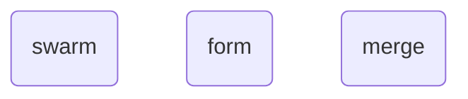
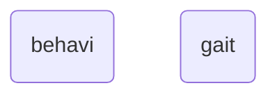

# Metaphysic
The term **metaphysic** is used to define statements in ***diego*** that represent meta-physical objects and events, such as swarm formations, communication, gaits, etc.

## Swarming
Any swarming characteristcs use particular metaphysic reprentations in ***diego***, such as:

Swarming
 

## Behaviour
Any behaviour characteristcs use particular metaphysic reprentations in ***diego***, such as:

Behaviour
 

## Communication
Any behaviour characteristcs use particular metaphysic reprentations in ***diego***, such as:

Communication
 

## See Also
----

[Topological Index of Metaphysic Objects](_topicindex.md)

[A to Z Index of Metaphysic Objects](_atozindex.md)

### Swarming
[swarm](swarm.md) 
[form](form.md) 
[merge](merge.md)

### Behaviour
[behavi](behavi.md) 
[gait](gait.md)

### Commuincation
[msg](msg.md) 
[alert](alert.md) 
[display](display.md)

## Notes
[^morethingies]: There are some *fringe* `thingy` types such as `mech`, `applian`, `mach`, and, `vehicle`.
[^devicesobot]: Smart devices are can also be treated a `sobot`s.

