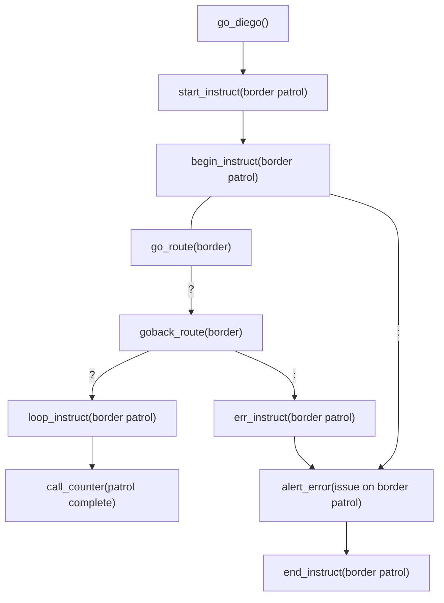

# Instructors
Instructor commands package other commands into sets, effectively an ``instruct`` is a *set of instructions*.  An ``instruct`` can be called, looped and ended using instructor commands.
## begin_instruct
The ``begin_instruct`` command marks the start of an ``instruct`` and monikers it for reference.  Internally the ``begin_instruct`` command also sets up all the default declaration for the ``instruct``.

The ```begin_instruct``` command  cannot be parameter-less, it must contain a unique (to the *diego*) '*instruct_moniker*'.

The ```begin_instruct``` command has **no** privilege definition ability, however, its associated ``start_instruct`` command has privilege definition ability.

An ``instruct`` is delimited by the ```loop_instruct``` and```end_instruct``` commands, either of which must be present.  The ``instruct`` is not allowed to bled.
#### begin_instruct(*instruct_moniker*)
The start of a ```instruct``` used to package commands under the label of *```instruct_moinker```*.    Note ```begin_instruct``` only declares an ```instruct```, to start (initiate) an ```instruct``` use ```start_instruct(```*```instruct_moniker```*```)```.
An *```instruct_moniker```* is required in order for the ```instruct```  to start (using ```start_instruct(```*```instruct_moniker```*```)```).
### Linking & Events
| | do_diego | hey_diego | oh_diego |
|--|:--:|:--:|:--:|
| events: | ```start_instruct``` |```loop_instruct```<br>```end_instruct``` | *errors from oh_diego-less commands*<br>``err_instruct`` |
| cmds: |  | ✅ allowed | ✅ allowed |
The _do_diego_ event can only be initiated with the ```start_instruct``` command with matching *instruct_moniker*.   A _hey_diego_ event is **not** triggered on ```begin_instruct```, only through ```loop_instruct``` or ```end_instruct``` elsewhere in the _diego_ code.    An _oh_diego_ event is initiated when any _error_ from an _oh_diego-less_ command, inside the ``instruct`` 'bubbles up'; or, on ``err_instruct(``*``instruct_moniker``*``)`` explicit command, whichever comes first.

Both _hey_diego_ and _oh_diego_ commands are optional, and can be useful for robots to report progress/counters/warnings/errors of the ```instruct``` to humans or other robots.
### Example
In this example we are going to instruct a robot(s) to go back and forth along a route called '*border*', until there is an error en-route on route '*border*'.  For every journey along *border* route and then back again along *border* route, the robot will announce how many times the '*patrol complete*'.  When a error occurs on the journey on route '*border*' the robot(s) will alert the human(s) of an '*issue on border patrol*'.

code:
```diego
use_namespace(diego_sandbox);

begin_instruct(border patrol);
  	
  	add_counter(patrol complete):;
  	: alert_error(issue on border patrol);
  	  
    go_route(border)?:;
    ? goback_route(border)|?:;
    	| with_counter(patrol complete)_inc(++);
    	? loop_instruct(border patrol);
        : err_instruct(border patrol);
    : err_instruct(border patrol);

end_instruct(border patrol);

start_instruct(border patrol)_forof(droid1)_you(droid1)?:;
? msg_human(Jim)_counter(patrol complete)
: msg_human(Jim)_err();
```
flow:



## loop_instruct
#### loop_instruct(*instruct_moniker*)
## <a name="end_instruct"></a>end_instruct
#### end_instruct(*instruct_moniker*)
The finisher of an ```instruct``` ends with  ```end_instruct(```*```instruct_moniker```*```)```, with no sub command the```instruct``` will end  for _all_ monikers (robots, swarms, labels of).
### Privileges
#### end_instruct(*instruct_moniker*)*[…]*_for(*moniker1*, *n…*)
A whitelist (*moniker1*, *n…*) of monikers (robots, swarms, labels of) that should only be allowed to finish the *instruct_moniker* ```instruct```.
#### end_instruct(*instruct_moniker*)*[…]*_not((*moniker1*, *n…*)
A blacklist (*moniker1*, *n…*) of monikers (robots, swarms, labels of) that are denied to finish the *instruct_moniker* ```instruct```.
#### end_instruct(*instruct_moniker*)*[…]*_for(*moniker1*, *n…*)_not(*moniker1*, *n…*)
A whitelist with blacklist of monikers (robots, swarms, labels of) that allowed/denied to finish the *instruct_moniker* ```instruct```.
## <a name="start_instruct"></a>start_instruct
Where a duplicate ```start_instruct``` (with the same signature) exists the first ```start_instruct``` command in the diego flow will be executed and later duplicates will restart the ```instruct``` at ```begin_instuct``` with **no** _hey_diego__ nor _oh_diego_ events triggered.
#### start_instruct(*instruct_moniker*)
The initiation of an ```instruct``` starts with  ```start_instruct(```*```instruct_moniker```*```)```, with no sub command the```instruct``` will start for _all_ monikers (robots, swarms, labels of).
### Sub Commands
#### start_instruct(*instruct_moniker*)_for(*moniker1*, *n…*)
An whitelist (*moniker1*, *n…*) of monikers (robots, swarms, labels of) that should only be allowed to initiate the *instruct_moniker* ```instruct```.
#### start_instruct(*instruct_moniker*)_not((*moniker1*, *n…*)
A blacklist (*moniker1*, *n…*) of monikers (robots, swarms, labels of) that are denied to initiate the *instruct_moniker* ```instruct```.


## <a name="proce"></a> Procedural Structuring

| procedural | notes<br>examples | API |
|--|:--|--|
| `instruct`, `instruction` |  | [instruct](/instruct.md) |
| `proc`, `procedure` | | [proc](/proc.md) |
| `prog`, `program`, `programme` | | [prog](/prog.md) |
| `action` | | [action](/action.md) |