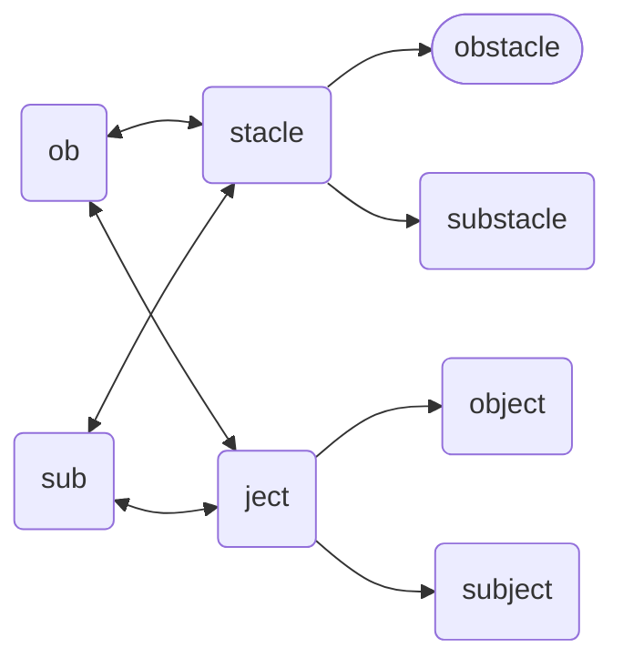

# Obstacle (object)
The `obstacle` *object* is derived from the [`ob`](./ob.md) and [`stacle`](./stacle.md) *objects* representing a stationary object that blocks a route/path/way of a thingy.  The sibling of an [substacle](./substacle.md), and the cousin of an [`object`](./object.md).

Stacle & Ject Hierarchy

## Declaration
The default declaration of the `obstacle` *object* is to at least provide a *moniker*.  The derived *objects* can be declared by name. The `obstacle` object can also be declared by casting `ob` or `stacle`.

&nbsp;&nbsp;&nbsp;&nbsp;&nbsp;&nbsp; `add_obstacle(`*`moniker`*`);` 
&nbsp;&nbsp;&nbsp;&nbsp;&nbsp;&nbsp; `add_stacle({`*`ob`*`},`*`moniker`*`);` 
&nbsp;&nbsp;&nbsp;&nbsp;&nbsp;&nbsp; `add_ob({stacle},`*`moniker`*`);`

A type (`{ob}` or `{sub}`) can be provided at declaration using curly brackets (`{}`).