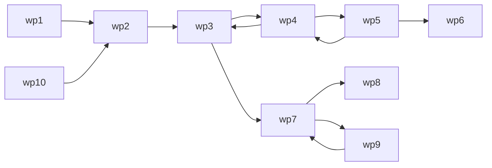

# Path (object)
The `path` object is a representation of a pair of two physical point and there relationship between them. `path`s require a moniker and two waypoints.

The `path` is at the preultimate lowest hierarchical level of the 'Route Matrix', being similar to a `way` and a `trip`.

|  |
| :---: |
| *Route Matrix* |

In the family of 'location' based navigation objects, one `itiner` has many `route`s, one `route` has many `path`s, and, one `path` has a pair of `waypoints`s.

<a name="declare"></a>
## Declaration
The default declaration of the `path` object is to at least provide a *moniker*, however, at declaration it is common to provide two locations using either: a child `waypoint` (or shortened `wp`) assignment; or, using the `_coords` posit.

&nbsp;&nbsp;&nbsp;&nbsp;&nbsp;&nbsp;` add_path(`*`moniker`*`);`<br>
&nbsp;&nbsp;&nbsp;&nbsp;&nbsp;&nbsp;` add_path(`*`moniker1`*`, `*`moniker2`*`,...);`<br>
&nbsp;&nbsp;&nbsp;&nbsp;&nbsp;&nbsp;` add_path(`*`moniker`*`)_wp(`*`moniker`*`)_wp(`*`moniker`*`);`<br>
&nbsp;&nbsp;&nbsp;&nbsp;&nbsp;&nbsp;` add_waypoint(`*`moniker`*`)_coords(`*`x_lat`*`, `*`y_long`*`, `*`z_alt`*`)_coords(`*`x_lat`*`, `*`y_long`*`, `*`z_alt`*`);`


 The parameters of `_coords` are numeric, when not specified they will be implied to be `{double}`. Providing `x_lat` and `y_long` only implies a two-dimensional waypoint, and adding the `z_alt` parameter implies a three-dimensional waypoint.
 
 `waypoint` can be shortened to `wp`, both terms are syntactically the same and can be used freely and interchangabily.  When a `waypoint` *object* comes after a `path` *object* it is assigned as its child. Any more than two waypoints added, and the `path` will be recast as `route` *object*. The paths will then be paired off as children of the `route`. The newly formed path forsake their moniker to their parent `route`, for example:
```diego
add_path(path_or_route)_wp(wp1)_wp(wp2);
log_console()_path(path_or_route)_typeof();    // {path}

with_path(path_or_route)_wp(wp3);
log_console()[]: [])_nameof()_typeof(path_or_route);          // path_or_route: {route}
log_console([]: [])_nameof()_rosaryof(path_or_route);         // path_or_route: [wp1]↔[wp2]↔[wp3]
log_console([]: [])_nameof()_pathof(path_or_route);           // : [wp1]↔[wp2],: [wp2]↔[wp3]
```

## Relationship
The `path` *object* is used to hold information on the relationship between the pair of waypoints. It should be noted that the relationship only provide scalar values and the relationship is bijective, as dipicted with the left-right arrow (`↔`).  The relationship of the left waypoint to the right waypoint is the same as the relationship of the right waypoint to the left.

Physical Distance (metaphorical pathway - path of least resistance) 
 Desired Path
Planar Distance

&nbsp;&nbsp;&nbsp;&nbsp;&nbsp;&nbsp; `with_path(`*`moniker`*`)_distan_(❬`*`unit`*`❭,`*`value`*`);`<br>
&nbsp;&nbsp;&nbsp;&nbsp;&nbsp;&nbsp; `with_path(`*`moniker`*`)_distan(`*`value`*`);`<br>
&nbsp;&nbsp;&nbsp;&nbsp;&nbsp;&nbsp; `with_path(`*`moniker`*`)_distan(,`*`value`*`)_unit(`*`unit`*`);`

https://en.wikipedia.org/wiki/Path_of_least_resistance#:~:text=The%20path%20of%20least%20resistance,entity%20takes%20a%20given%20path.

https://en.wikipedia.org/wiki/Desire_path

extimated 

Breath - length = interspace = gap = extene = range = reach
Great Circle Distance

Note, that even if the distance to travel has a one-way gate (diode) then this is ignored.

Geodesic Distance

https://owlcation.com/social-sciences/Measuring-Distances-on-Earth

Absolute Altitude Difference

&nbsp;&nbsp;&nbsp;&nbsp;&nbsp;&nbsp; `with_path(`*`moniker`*`)_absaltdiff_(❬`*`unit`*`❭,`*`value`*`);`<br>
&nbsp;&nbsp;&nbsp;&nbsp;&nbsp;&nbsp; `with_path(`*`moniker`*`)_absaltdiff(`*`value`*`);`<br>
&nbsp;&nbsp;&nbsp;&nbsp;&nbsp;&nbsp; `with_path(`*`moniker`*`)_absaltdiff(,`*`value`*`)_unit(`*`unit`*`);`

Absolute Elevation Difference

&nbsp;&nbsp;&nbsp;&nbsp;&nbsp;&nbsp; `with_path(`*`moniker`*`)_abselevdiff_(❬`*`unit`*`❭,`*`value`*`);`<br>
&nbsp;&nbsp;&nbsp;&nbsp;&nbsp;&nbsp; `with_path(`*`moniker`*`)_abselevdiff(`*`value`*`);`<br>
&nbsp;&nbsp;&nbsp;&nbsp;&nbsp;&nbsp; `with_path(`*`moniker`*`)_abselevdiff(,`*`value`*`)_unit(`*`unit`*`);`


purlieus, environs or neighborhood.
ambit


rosary

```diego
log_console()_itiner(itiner1)_rosary();
// wp1→wp2→wp3→wp4→wp5→wp6,wp5→wp4,wp4→wp3,wp10→wp2,wp3→wp7→wp8,wp7→wp9,wp9→wp7
/*

log_console()_itiner(itiner1)_rosary()_mermaid({code}❭);
wp1 --> wp2 --> wp3 --> wp4 --> wp5 --> wp6
=> wp5 --> wp4
=> wp4 --> wp3
=> wp10 --> wp2
=> wp3 --> wp7 --> wp8
=> wp7 --> wp9
=> wp9 --> wp7
/*

log_console()_itiner(itiner1)_rosary()_mermaid({lr});
```

