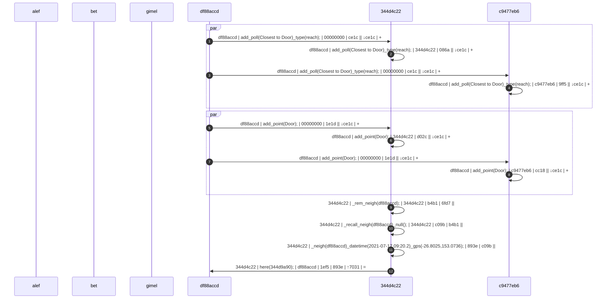
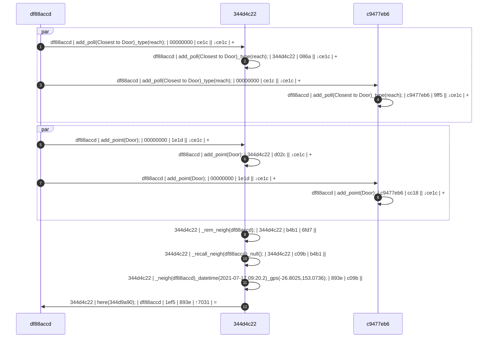

# Poll (object)
The `poll` *object* is used to conduct polls with thingies to come to consensus decisions or information.  The `poll_` verb is used in conjunction with the `poll` *object*.


<a name="declare"></a>
## Declaration
The default declaration of the `poll` *object* is to at least provide a *moniker*.

&nbsp;&nbsp;&nbsp;&nbsp;&nbsp;&nbsp; `add_poll(`*`moniker`*`);`<br>
&nbsp;&nbsp;&nbsp;&nbsp;&nbsp;&nbsp; `add_poll({`*`type`*`}, `*`moniker`*`);`

<a name="reference"></a>
## Referencing
Referencing a `poll` *object* is achieved with the `with` verb, or the shortened [`(`*`poll_moniker`*`)`](../../abstract/special/reference.md) syntax. 

&nbsp;&nbsp;&nbsp;&nbsp;&nbsp;&nbsp; `with_poll(`*`moniker`*`);`<br>
&nbsp;&nbsp;&nbsp;&nbsp;&nbsp;&nbsp; `(`*`poll_moniker`*`);`

<a name="assign"></a>
## Assignment

<a name="verb"></a>
## Verbing

| `verb_` | description | API |
| --- | --- | --- |
| <a name="with"></a> `with_` | Reference to proceeding *object*. | [with]() |
| <a name=""></a> `_` | . | [with](../../abstract/verb/with.md#poll) |
| <a name="()"></a> `(`*`moniker`*`)` | Reference to *object* *`moniker`*. | []() |
| <a name=""></a> `_` | . | []() |
| <a name=""></a> `_` | . | []() |
| <a name=""></a> `_` | . | []() |
| <a name=""></a> `_` | . | []() |
| <a name=""></a> `_` | . | []() |
| <a name=""></a> `_` | . | []() |
| <a name=""></a> `_` | . | []() |

<a name="type"></a>
## Typing
There are eight primitive [*types*](../prop/type.md#poll) of the `poll` *object*.

| `{type}` | description | API |
| --- | --- | --- |
| <a name="opinion"></a> `{opin}` &nbsp; `{opinion}` | The collection of a series of questions to then extrapolate generalities from responses in ratio or within confidence intervals. | |
| <a name="benchmark"></a> `{bmark}` &nbsp; `{benchmark}` | Minimal (usually one) questions given with no deliberation required or base only on available information of the thingies at the time of the poll. |  |
| <a name="bushfire"></a> `{bfire}` &nbsp; `{bushfire}` | A collection of questions given to specific subsets at irregular frequencies. |
| <a name="tracking"></a> `{track}` &nbsp; `{tracking}` | A frequently repeated collection of questions. | |
| <a name="entrance"></a> `{entr}` &nbsp; `{entrance}` | A small collection of questions asked before any deliberation, used to compare with exit poll. | |
| <a name="entrance_exit"></a> `{exit}` | A small collection of questions (the same as an associated entrance poll) asked after deliberation, used to compare with entrance poll. | |
| <a name="deliberat"></a> `{deliberat}` &nbsp; `{deliberative}` | . | |
| <a name="pull"></a> `{pull}` | . | |
| <a name="push"></a> `{push}` | . | |
| <a name="straw"></a> `{straw}` | . | |

<!-- http://kolibri.teacherinabox.org.au/modules/en-boundless/www.boundless.com/political-science/textbooks/boundless-political-science-textbook/public-opinion-6/measuring-public-opinion-46/types-of-polls-269-1480/index.html -->

<a name="cast"></a>
## Casting


### Syntax:

```Diego
add_call({poll_name});
with_poll({poll_name});
run_poll({poll_name});
freqent_poll({poll_name})_freq({frequency_millisecs})_until({milliseconds/datetime});
```

### Example:


Three robots (alef,bet,gimel) have all been introduced to each other (i.e. they believe in each others existence and therefore presume each other is listening). They are left alone in a garage of a house (`room(garage)`) with all the doors closed. They are free (and encouraged) to look around the garage and investigate. However, there is one charge station (`object(tav)`) which must be shared amongst the three robots.

```diego

add_poll({track},charger_share)
	()_quest(energy_level)_gauge({nrg})_v(❬urgency❭);
	()_freq("quarter_hr",❬min❭,15);
;


_calc("m",lkdsjalkj)


```




In this example three things (`df88accd-dd43-4ff1-820e-82f75be13013`, shortened 64-bit: `df88accd`; `344d4c22-546c-4940-bdc4-c2a4371a29ac`, `344d4c22`; and, `c9477eb6-1328-4c10-8755-913d41a6e0e1`, `c9477eb6` ) are in the same universe; they have all been introduced to each other (i.e. they believe in each others existence and therefore presume each other is listening); they presume they are the only ones left in this universe…



&#9312; The caller, `df88accd`, calls out to its know universe with the command: `call();`   The message contains `{caller_uuid} | {command} | {callee} | {*hash} | {←hash} | {↕hash} | {tree}`, where: `{caller}` is  `df88accd`; `{command}` is `call();`; `{callee}` is `00000000` (`NULL`), because this is a call to the universe; in this case, `{*hash}` is `6fd7` (shortened to 16-bit); `{←hash}` is non-existent because the message is coming from outside; `{↕hash}` is `7031` from the originator; and, `{tree}` is `+` depicting a new blockchain tree.

&#9313; The callee, `344d4c22`, hears the `call` and tries to remember the caller as a neighbour: `_rem_neigh(df88accd);`.

&#9314; Callee, `344d4c22` does not recall ever meeting `df88accd`: `_recall_neigh(df88accd)_null();`, so `344d4c22` remembers the time and place `344d4c22` met `df88accd`: &#9315; ``_neigh(df88accd)_datetime(2021-07-17 09:20.2)_gps(-26.8025,153.0736);`.

&#9316; `344d4c22` responds to `df88accd`'s roll call: `here(344d9a90);`. The `{tree}` of `=` depicts the end of this child's blockchain.

At this point thing `df88accd` will perform the same process (*_neigh*) triggered by the `here` command rather than `call`.
