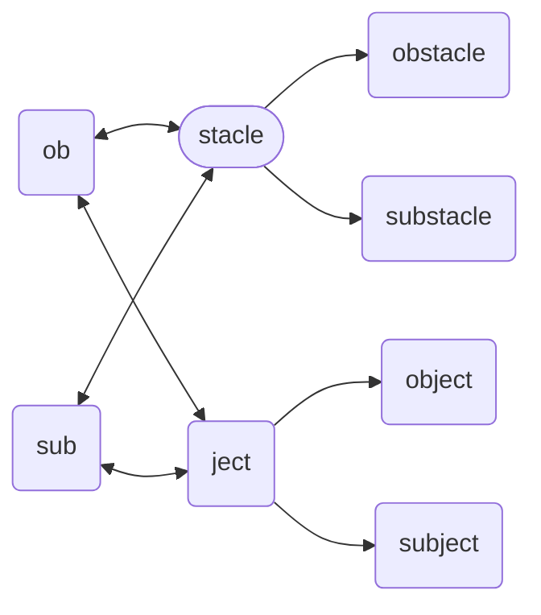

# Stacle (object)
The primitive *object* representing a stationary object ([obstacle](./obstacle.md)) or a moving object ([substacle](./substacle.md)) that blocks a route/path/way of a thingy.  The converse of a [ject](./ject.md).

Stacle & Ject Hierarchy

## Declaration
The default declaration of the `stacle` *object* is to at least provide a *moniker*. A type (`{ob}` or `{sub}`) can be provided at declaration using curly brackets (`{}`). The derived *objects* can be declared by name. The `cellphone` object can also be declared by casting `mobot`.

&nbsp;&nbsp;&nbsp;&nbsp;&nbsp;&nbsp; `add_stacle(`*`moniker`*`);` 
&nbsp;&nbsp;&nbsp;&nbsp;&nbsp;&nbsp; `add_stacle({`*`ob`*`},`*`moniker`*`);` 
&nbsp;&nbsp;&nbsp;&nbsp;&nbsp;&nbsp; `add_stacle({`*`sub`*`},`*`moniker`*`);` 
&nbsp;&nbsp;&nbsp;&nbsp;&nbsp;&nbsp; `add_ob({stacle},`*`moniker`*`);` 
&nbsp;&nbsp;&nbsp;&nbsp;&nbsp;&nbsp; `add_sub({stacle},`*`moniker`*`);`

## Declaration & Assignment

## Referencing
Referencing a `stacle` *object* is achieved with the `with` verb (or shortened `>_`), or the shortened `(`*`stacle_moniker`*`)` syntax using brackets (`()`). For inside *expressions* use square brackets (`[]`) as in `[`*`stacle_moniker`*`]`.

&nbsp;&nbsp;&nbsp;&nbsp;&nbsp;&nbsp; `with_stacle(`*`moniker`*`);` 
&nbsp;&nbsp;&nbsp;&nbsp;&nbsp;&nbsp; `>_stacle(`*`moniker`*`);` 
&nbsp;&nbsp;&nbsp;&nbsp;&nbsp;&nbsp; `(`*`stacle_moniker`*`);` 
&nbsp;&nbsp;&nbsp;&nbsp;&nbsp;&nbsp; ``*`…`*`[`*`stacle_moniker`*`]`*`…`*``

## Typing
There are only two types of stacles: `{ob}` representing obstacles, stationary objects that block a thingy's path; and, `{sub}` representing substacles, moving objects that black a thingy's path.

&nbsp;&nbsp;&nbsp;&nbsp;&nbsp;&nbsp; `add_stacle({`*`ob`*`},`*`moniker`*`);` 
&nbsp;&nbsp;&nbsp;&nbsp;&nbsp;&nbsp; `with_stacle({`*`ob`*`},`*`moniker`*`);` 
&nbsp;&nbsp;&nbsp;&nbsp;&nbsp;&nbsp; `with_stacle(`*`moniker`*`)_type(`*`ob`*`);` 
&nbsp;&nbsp;&nbsp;&nbsp;&nbsp;&nbsp; `add_stacle({`*`sub`*`},`*`moniker`*`);` 
&nbsp;&nbsp;&nbsp;&nbsp;&nbsp;&nbsp; `with_stacle({`*`sub`*`},`*`moniker`*`);` 
&nbsp;&nbsp;&nbsp;&nbsp;&nbsp;&nbsp; `with_stacle(`*`moniker`*`)_type(`*`sub`*`);`

## Casting

# Posits

# Operators