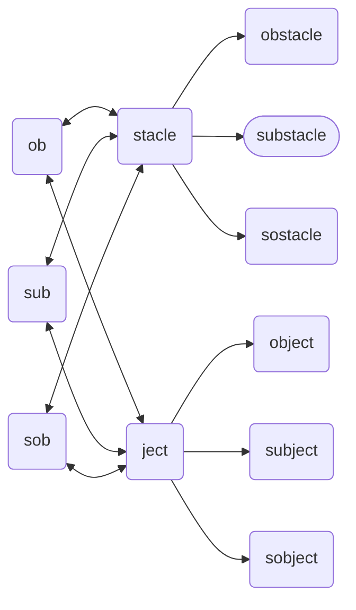

# Substacle (object)
The `substacle` *object* is derived from the [`sub`](./sub.md) and [`stacle`](./stacle.md) *objects* representing a moving object that blocks a route/path/way of a thingy. The sibling of an [obstacle](./obstacle.md), and the cousin of an [`subject`](./subject.md) and an [`sobject`](./sobject.md).

Stacle & Ject Hierarchy

## Declaration
The default declaration of the `substacle` *object* is to at least provide a *moniker*.  The derived *objects* can be declared by name. The `substacle` object can also be declared by casting `subb` or `stacle`.

&nbsp;&nbsp;&nbsp;&nbsp;&nbsp;&nbsp; `add_substacle(`*`moniker`*`);` 
&nbsp;&nbsp;&nbsp;&nbsp;&nbsp;&nbsp; `add_stacle({`*`sub`*`},`*`moniker`*`);` 
&nbsp;&nbsp;&nbsp;&nbsp;&nbsp;&nbsp; `add_sub({stacle},`*`moniker`*`);`