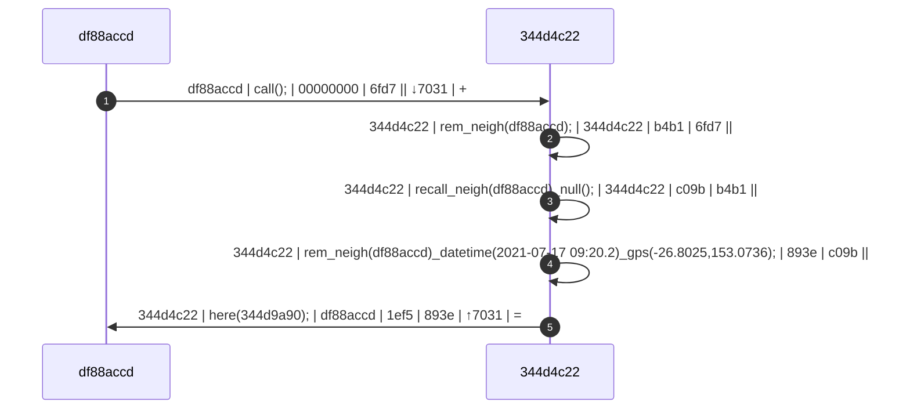
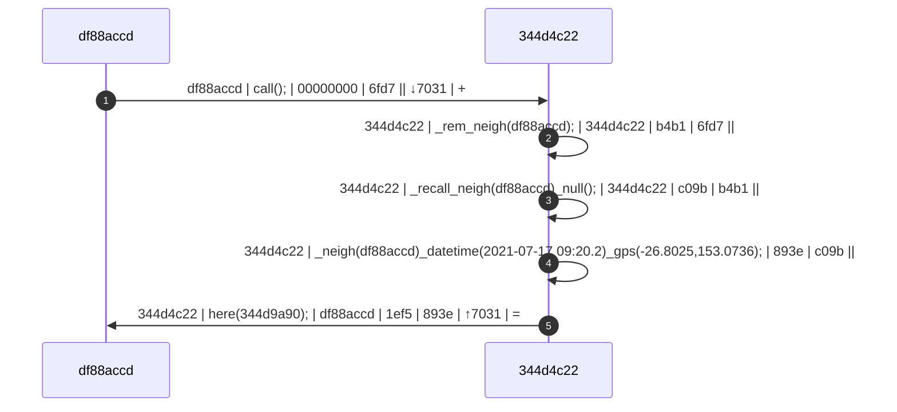

# Call

## call_payload(*payload_moniker*)

## call_sensor(*sensor_moniker*)

# [roll]call

The `call` is a register request for existence, made by the caller and returned to the caller with `here` (if a new connection) or `pong` (if there is a relationship).

## Basic Call

The basic [roll]call is an indiscriminate and implicit request for existence of others in its known universe, 

### Syntax:

```Diego
call();
```

### Example:

In this example two things (`df88accd-dd43-4ff1-820e-82f75be13013`, shortened 64-bit: `df88accd`; and, `344d4c22-546c-4940-bdc4-c2a4371a29ac`, `344d4c22`) are in the same universe and have never met each other before. Both parties are shy and appear to be primitive...


&#9312; The caller, `df88accd`, calls out to its know universe with the command: `call();`   The message contains `{caller_uuid} | {command} | {callee} | {*hash} | {←hash} | {↕hash} | {tree}`, where: `{caller}` is  `df88accd`; `{command}` is `call();`; `{callee}` is `00000000` (`null`), because this is a call to the universe; in this case, `{*hash}` is `6fd7` (shortened to 16-bit); `{←hash}` is non-existent because the message is coming from outside; `{↕hash}` is `7031` from the originator; and, `{tree}` is `+` depicting a new blockchain tree.

&#9313; The callee, `344d4c22`, hears the `call` and tries to remember the caller as a neighbour: `rem_neigh(df88accd);`.

&#9314; Callee, `344d4c22` does not recall ever meeting `df88accd`: `recall_neigh(df88accd)_null();`, so `344d4c22` remembers the time and place `344d4c22` met `df88accd`: &#9315; `rem_neigh(df88accd)_datetime(2021-07-17 09:20.2)_gps(-26.8025,153.0736);`.

&#9316; `344d4c22` responds to `df88accd`'s roll call: `here(344d9a90);`. The `{tree}` of `=` depicts the end of this child's blockchain.

At this point thing `df88accd` will perform the same _remembering_ process (*_neigh*) triggered by the `here` command rather than `call`.

## Implicit Call

The implicit [roll]call is a request for existence of other thingy types in its known universe, 

### Syntax:

```Diego
call_human();
call_ai();
call_robot();
call_organic();
call_thing();
call_console();
```

## Explicit Call

### Syntax:

```Diego
call({uuid});
call_human({human_uuid});		call_human()_for({human_uuid});
call_ai({ai_uuid});				call_ai()_for({ai_uuid});
call_robot({robot_uuid});		call_robot()_for({robot_uuid});
call_thing({thing_uuid});		call_thing()_for({thing_uuid});
call_console({console_uuid});	call_console()_for({console_uuid});

call({moniker});
call_human({human_moniker});		call_human()_for({human_moniker});
call_ai({ai_moniker});				call_ai()_for({ai_moniker});
call_robot({robot_moniker});		call_robot()_for({robot_moniker});
call_thing({thing_moniker});		call_thing()_for({thing_moniker});
call_console({console_moniker});	call_console()_for({console_moniker});

call()_as({label})
```

## Collection Call

### Syntax:

```Diego
call()_in({uuid1/moniker1},{uuid2/moniker2},...);
call_human()_in({human_uuid1/human_moniker1},{human_uuid2/human_moniker2},...);
call_ai()_in({ai_uuid1/ai_moniker1},{ai_uuid2/ai_moniker2},...);
call_robot()_in({robot_uuid1/robot_moniker1},{robot_uuid2/robot_moniker2},...);
call_thing()_in({thing_uuid1/thing_moniker1},{thing_uuid2/thing_moniker2},...);
call_console()_in({console_uuid1/console_moniker1},{console_uuid2/console_moniker2},...);

call()_asin({label1},{label2});
```


--4b2b-b8da-59c35467963b

57e7-3869-43be-a16f-97cad6b4e14c

d244714e-7711-48f4-b79c-eb152265e687

d6963830-3e64-405d-ac63-9ddbeb641c8b

68937890--4693-9b4a-63dc25646e30

4191a526-52f4-481e-a059-2d5aa59eb95b

93f0278a-7548-4c3e-af2f-71da2a69aa4e

094f129e-f2e4-4134-b6bd-909b840431a8

35dccb9d

9543ebae


call()_what();
call()_only();


df88: call();
344d: here();
df88: ask(344d);
344d: tell_name();

df88: prog_name(344d)_name(Hoshiko Kawasaki)_withtest();
344d: tell_name(Hoshiko Kawasaki);


344d: tell_name(Hoshiko Kawasaki);
344d: tell_what(Thing);
344d: tell_comm(Bluetooth 5.2)_device(anko BT Speaker)_address(86:14:B8:ED:BB:34);
344d: tell_why(BT Speaker);
344d: tell_why(Desk Lamp);
344d: tell_why(Ambient Light);
344d: tell_why(Wireless Charger);

prog_name()


call_human();
call_ai();
call_robot();
call_thing();
call_console();
call_human({human_uuid);
call_robot({robot_uuid});
call_thing({thing_uuid});
```


​```Diego
{from_uuid}|{command}|{to_uuid}
```


# `call_`, `rollcall_`

The `call_` verb is a register request for existence, made by the caller and returned to the caller with `here_` (if a new connection) or `pong_` (if there is a relationship).

## Basic Call

The basic [roll]call is an indiscriminate and implicit request for existence of all in its known universe:

> `call();` *"Who is here?"*
>
>> ...responses may be for example: `here_robot(thah);` *"robot thah here, we haven't met before*"
>> `ping_vehicle(trevor_tesla_m3);` *"vehicle trevor_telsa_m3 here, we have met before"*
>>

## Thingies (Genera)

The common use of `call_` is to find all thingies of a certain genera, for example:

> `call_human();` will find all humans in memory / its world. *"where are all the humans?"*
>
>> ...responses may be, for example: `found_human(James)_me();` *"I am James, a human.*"
>> ... `found_human(Sally);` *"I'm here, I'm Sally, I'm human."*
>> ... *and so on...*


... with variations for all the [thingy genera](/obj/_topicindex.md#genera):  `find_{thingy}();`, including...

> `find_genera();` *"is anyone here?"*

## `_me`

## Puff

The `call_` verb can be used to roll call the puff(s) the caller is in, and roll call the puffs everyelse available is in, for example:

> `call_puff()_me();` *"Where am I?"*
>
>> ...example response: `here_puff()_mist(mist_f4ee)_me();` *"I am in the mist called 'mist_f4ee'"*

> `call_puff()_robot();` or `call_robot()_puff();` *"Where are all the robots?*"
> 
>> ... `here_puff()_mist(mist_f4ee)_mist(mist_a345)_fog(fog_1234)_robot(thah);` *"

### Example:

In this example two things (`df88accd-dd43-4ff1-820e-82f75be13013`, shortened 64-bit: `df88accd`; and, `344d4c22-546c-4940-bdc4-c2a4371a29ac`, `344d4c22`) are in the same universe and have never met each other before. Both parties are shy and appear to be primitive...


&#9312; The caller, `df88accd`, calls out to its know universe with the command: `call();`   The message contains `{caller_uuid} | {command} | {callee} | {*hash} | {←hash} | {↕hash} | {tree}`, where: `{caller}` is  `df88accd`; `{command}` is `call();`; `{callee}` is `00000000` (`NULL`), because this is a call to the universe; in this case, `{*hash}` is `6fd7` (shortened to 16-bit); `{←hash}` is non-existent because the message is coming from outside; `{↕hash}` is `7031` from the originator; and, `{tree}` is `+` depicting a new blockchain tree.

&#9313; The callee, `344d4c22`, hears the `call` and tries to remember the caller as a neighbour: `_rem_neigh(df88accd);`.

&#9314; Callee, `344d4c22` does not recall ever meeting `df88accd`: `_recall_neigh(df88accd)_null();`, so `344d4c22` remembers the time and place `344d4c22` met `df88accd`: &#9315; ``_neigh(df88accd)_datetime(2021-07-17 09:20.2)_gps(-26.8025,153.0736);`.

&#9316; `344d4c22` responds to `df88accd`'s roll call: `here(344d9a90);`. The `{tree}` of `=` depicts the end of this child's blockchain.

At this point thing `df88accd` will perform the same process (*_neigh*) triggered by the `here` command rather than `call`.

## Implicit Call

The implicit [roll]call is a request for existence of other types in its known universe, 

### Syntax:

```Diego
call_human();
call_ai();
call_robot();
call_organic();
call_thing();
call_console();
```

## Explicit Call

### Syntax:

```Diego
call({uuid});
call_human({human_uuid});		call_human()_for({human_uuid});
call_ai({ai_uuid});				call_ai()_for({ai_uuid});
call_robot({robot_uuid});		call_robot()_for({robot_uuid});
call_thing({thing_uuid});		call_thing()_for({thing_uuid});
call_console({console_uuid});	call_console()_for({console_uuid});

call({moniker});
call_human({human_moniker});		call_human()_for({human_moniker});
call_ai({ai_moniker});				call_ai()_for({ai_moniker});
call_robot({robot_moniker});		call_robot()_for({robot_moniker});
call_thing({thing_moniker});		call_thing()_for({thing_moniker});
call_console({console_moniker});	call_console()_for({console_moniker});

call()_as({label})
```

## Collection Call

Syntax:

```Diego
call()_in({uuid1/moniker1},{uuid2/moniker2},...);
call_human()_in({human_uuid1/human_moniker1},{human_uuid2/human_moniker2},...);
call_ai()_in({ai_uuid1/ai_moniker1},{ai_uuid2/ai_moniker2},...);
call_robot()_in({robot_uuid1/robot_moniker1},{robot_uuid2/robot_moniker2},...);
call_thing()_in({thing_uuid1/thing_moniker1},{thing_uuid2/thing_moniker2},...);
call_console()_in({console_uuid1/console_moniker1},{console_uuid2/console_moniker2},...);

call()_asin({label1},{label2});
```


--4b2b-b8da-59c35467963b

57e7-3869-43be-a16f-97cad6b4e14c

d244714e-7711-48f4-b79c-eb152265e687

d6963830-3e64-405d-ac63-9ddbeb641c8b

68937890--4693-9b4a-63dc25646e30

4191a526-52f4-481e-a059-2d5aa59eb95b

93f0278a-7548-4c3e-af2f-71da2a69aa4e

094f129e-f2e4-4134-b6bd-909b840431a8

35dccb9d

9543ebae


call()_what();
call()_only();


df88: call();
344d: here();
df88: ask(344d);
344d: tell_name();

df88: prog_name(344d)_name(Hoshiko Kawasaki)_withtest();
344d: tell_name(Hoshiko Kawasaki);


344d: tell_name(Hoshiko Kawasaki);
344d: tell_what(Thing);
344d: tell_comm(Bluetooth 5.2)_device(anko BT Speaker)_address(86:14:B8:ED:BB:34);
344d: tell_why(BT Speaker);
344d: tell_why(Desk Lamp);
344d: tell_why(Ambient Light);
344d: tell_why(Wireless Charger);

prog_name()


call_human();
call_ai();
call_robot();
call_thing();
call_console();
call_human({human_uuid);
call_robot({robot_uuid});
call_thing({thing_uuid});
```


​```Diego
{from_uuid}|{command}|{to_uuid}
```


## Implicit Call

The implicit [roll]call is a request for existence of other types in its known universe, 

### Syntax:

```Diego
call_human();
call_ai();
call_robot();
call_thing();
call_console();
```

## Explicit Call

### Syntax:

```Diego
call({uuid});
call_human({human_uuid});		call_human()_for({human_uuid});
call_ai({ai_uuid});				call_ai()_for({ai_uuid});
call_robot({robot_uuid});		call_robot()_for({robot_uuid});
call_thing({thing_uuid});		call_thing()_for({thing_uuid});
call_console({console_uuid});	call_console()_for({console_uuid});

call({moniker});
call_human({human_moniker});		call_human()_for({human_moniker});
call_ai({ai_moniker});				call_ai()_for({ai_moniker});
call_robot({robot_moniker});		call_robot()_for({robot_moniker});
call_thing({thing_moniker});		call_thing()_for({thing_moniker});
call_console({console_moniker});	call_console()_for({console_moniker});

call()_as({label})
```

## Collection Call

Syntax:

```Diego
call()_in({uuid1/moniker1},{uuid2/moniker2},...);
call_human()_in({human_uuid1/human_moniker1},{human_uuid2/human_moniker2},...);
call_ai()_in({ai_uuid1/ai_moniker1},{ai_uuid2/ai_moniker2},...);
call_robot()_in({robot_uuid1/robot_moniker1},{robot_uuid2/robot_moniker2},...);
call_thing()_in({thing_uuid1/thing_moniker1},{thing_uuid2/thing_moniker2},...);
call_console()_in({console_uuid1/console_moniker1},{console_uuid2/console_moniker2},...);

call()_asin({label1},{label2});
```


call()_what();
call()_only();


df88: call();
344d: here();
df88: ask(344d);
344d: tell_name();

df88: prog_name(344d)_name(Hoshiko Kawasaki)_withtest();
344d: tell_name(Hoshiko Kawasaki);


344d: tell_name(Hoshiko Kawasaki);
344d: tell_what(Thing);
344d: tell_comm(Bluetooth 5.2)_device(anko BT Speaker)_address(86:14:B8:ED:BB:34);
344d: tell_why(BT Speaker);
344d: tell_why(Desk Lamp);
344d: tell_why(Ambient Light);
344d: tell_why(Wireless Charger);

prog_name()


call_human();
call_ai();
call_robot();
call_thing();
call_console();
call_human({human_uuid);
call_robot({robot_uuid});
call_thing({thing_uuid});
```


​```Diego
{from_uuid}|{command}|{to_uuid}
```

