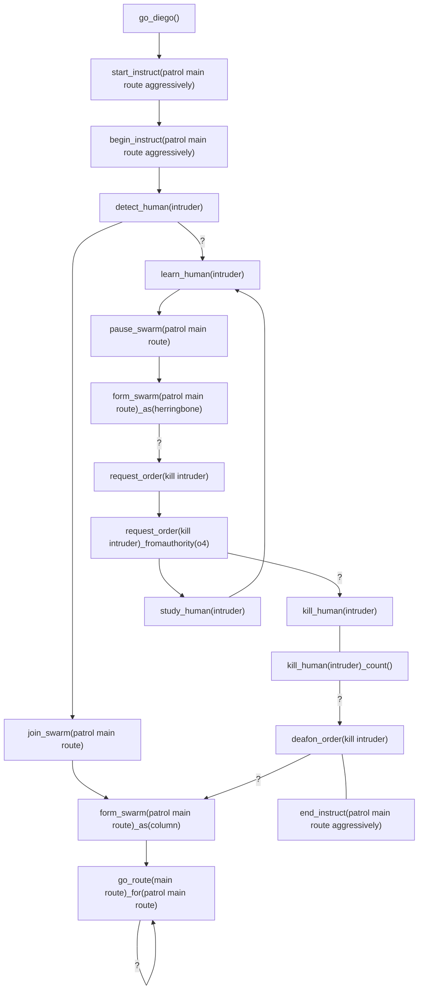

# Kill (verb)
The `kill` instructs the decommission of a thingy by force with specialised killing equipment. Only the four children of `thingy` are available for killing. For a non-living thingies `kill` means immobilisation **and** complete loss of processing power. For living thingies (`human` and `organic`) `kill` means immobilisation **and** complete loss of the capacity to live.

If the thingies commanded to kill have no specialised equipment (i.e. weaponry) then the `kill` command cannot be executed. In this case, the `murder` command should be used.

## Declaration
To declare `kill`, you will need to provide the *`target(s)`* as monikers. Declaration of the `kill` command can only be executed when the thingies required to kill have weaponry or access to weaponry.

&nbsp;&nbsp;&nbsp;&nbsp;&nbsp;&nbsp; `kill_`*`<thingy>`*`(`*`target_moniker`*`);`<br>
&nbsp;&nbsp;&nbsp;&nbsp;&nbsp;&nbsp; `kill_`*`<thingy>`*`(`*`target_moniker1`*`,`*`target_moniker2`*`,`*`...`*`);`<br>
&nbsp;&nbsp;&nbsp;&nbsp;&nbsp;&nbsp; `kill_`*`<thingy>`*`([`*`target_variable_name`*`]);`

Declaration of the killer is provided with discirimation posit, for example: `forof`.

&nbsp;&nbsp;&nbsp;&nbsp;&nbsp;&nbsp; `kill_`*`<thingy>`*`(`*`target_moniker`*`)_forof(`*`killer_moniker`*`);`

## Posits

## Objects
Only the four children of `thingy` are available for killing, both as the killer and the target: `human`; `organic`; `robot`; and `thing`.

### Human (object)
The `kill_human` is a command for a robot(s) to end the life of an identified human in the physical world using purpose-build tools (i.e. weaponry).  If a robot(s)/swarm has no weaponry the `kill_human` command cannot be executed, and in this case the `murder_human` command should be used.
The `kill_human` command cannot be param-less.

&nbsp;&nbsp;&nbsp;&nbsp;&nbsp;&nbsp; `kill_human(`*`target_moniker`*`);`<br>
&nbsp;&nbsp;&nbsp;&nbsp;&nbsp;&nbsp; `kill_human(`*`target_moniker1`*`,`*`target_moniker2`*`,`*`...`*`);`<br>
&nbsp;&nbsp;&nbsp;&nbsp;&nbsp;&nbsp; `kill_human([`*`target_variable_name`*`]);`

### kill_human(*human_moniker*)
The human identified as *human_moniker* will be killed using the weaponry of the robot(s)/swarm.

Note: The *human_moniker* used in the ```kill_human``` command is only an identified human in the physical world and **not** a human(s) within the diego.  A human identified in the physical world who is also moniker-ed in the diego, will not killed by the robot, and an ````err(*human_moniker* is in the diego)``` will be returned in the _oh_diego_ event and '*bubbled up*'.
### Sub Commands
### kill_human(*human_moniker*)_count()
With the ```_count``` sub command the robot will keep a kill count of 
### Example
https://www.globalsecurity.org/wmd/library/policy/army/fm/3-19/Ch7.htm
In this example a robot(s) will join the '*patrol main route*' swarm and the swarm will go along route '*main_route*' in a _column_ formation.  The swarm will continue along '*main_route*' indefinitely[^kill_human_eg] until a human is detected and subsequently labelled as '*intruder*'. 

Upon detecting the  '*intruder*' the swarm will transform into a '*herringbone*' formation, then request for a '*kill intruder*' order. 

The swarm will continually  ```learn - study``` the '*intruder*' until a ```call_order(kill intruder)```  is executed from an authority of *o4* ('*robotenant*') or above.  Upon the ```call_order``` all robot(s) in the swarm able to kill (i.e. have weaponry) will kill the human (in the physical world) until the human is confirmed dead.

The killing robots will keep a count of the '*intruder*'s killed.  When the kill is completed all robots will no longer react to a ```call_order(kill intruder)```.  The swarm will re-form into a _column_ formation and  go along route '*main_route*', entering the first loop.
```diego
go_diego();

begin_instruct(patrol main route aggressively);
  
  detect_human(intruder) ? learn_human(intruder);

  join_swarm(patrol main route);

  form_swarm(patrol main route)_as(column);
 
    go_route(main route)_for(patrol main route) ? go_route(main route);

  learn_human(intruder) : form_swarm(patrol main route)_as(column);	

    pause_swarm(patrol main route) ? form_swarm(patrol main route)_as(herringbone);
 
    form_swarm(patrol main route)_as(herringbone) ? request_order(kill intruder);

    request_order(kill intruder)_fromauthority(o4) ? kill_human(intruder);

  study_human(intruder);

  kill_human(intruder)_count() ? deafon_order(kill intruder);

  deafon_order(kill intruder) ? form_swarm(patrol main route)_as(column);
  
end_instruct(patrol main route aggressively);

start_instruct(patrol main route aggressively);
```

[^kill_human_eg]: In the ```kill_human``` example, in order for the ```go_route(main route)``` to link its own _hey_diego_ event it must be a loop-able route.
## murder_human


https://www.youtube.com/watch?v=IykWbUVDWL8