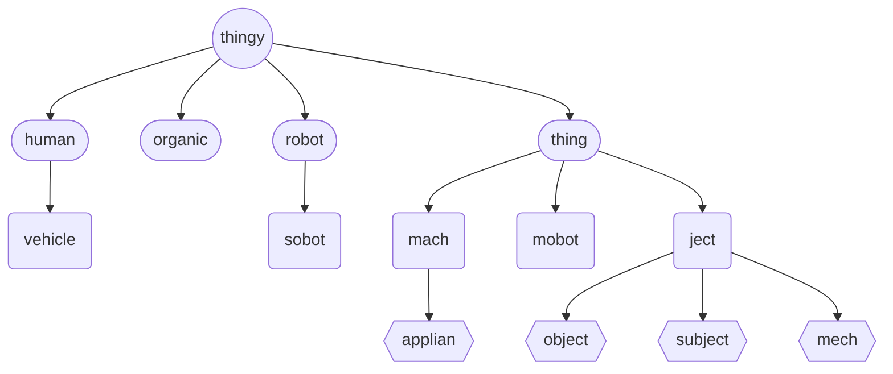
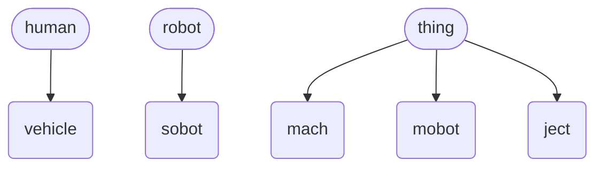
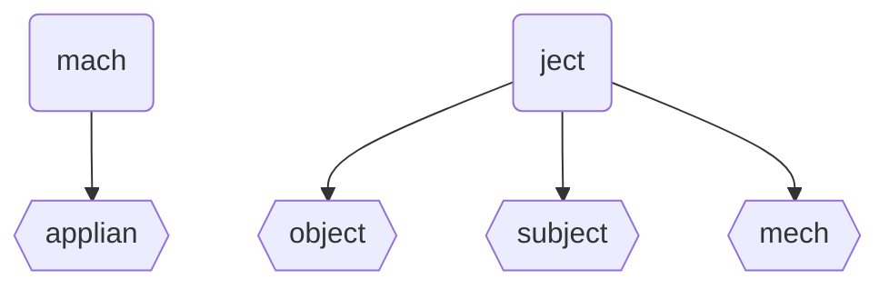
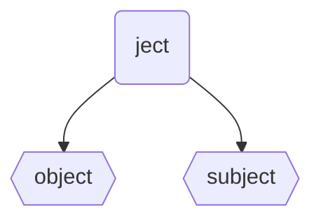
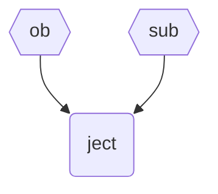
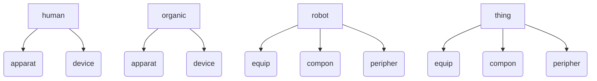

# Topological Physic Object Index

An topological index of all physic objects used by **diego** instruction programming language.

##  Thingy Objects (Genera of Thingies)
The top most physic objects are derived from `thingy`.  There are three main categories: 'types'; 'sub-types'; and, '*fringe* types':

Genera of Thingies
 

| thingy genera *types* | notes examples `example` | API |
| --------- | ----- | ----- |
| `thingy`   | The top most representation of all *physic*al objects. | [thingy](./obj/thingy.md) |
| `human`   | Representation of a human being, present and alive in the physical *'real'* world. The human version of a `thing` / `robot`.  The non-human version of an `organic`. Example: *Fred Jones* `msg_human(fred)_msg(Hi Fred!);` | [human](./obj/human.md) |
| `organic` | Representation of a non-human being, present and alive in the physical *'real'* world. Example: a cat, a dog `call_organic(fido)_speak(walkies!);` | [organic](./obj/organic.md) |
| `robot` | A self-propelled *thingy* in the physical *'real'* world. Examples: Boston Dynamics Spot, drone `go_robot(spot)_waypoint([wp1]);` | [robot](./obj/robot.md) |
| `thing` | An immobile *thingy* in the physical *'real'* world, such as a *thing* in <abbr title="Internet of Things">IoT</abbr>. Example: smart fridge, smart television `with_thing(livingRoomTV)_on()_app(netflix)_open();` | [thing](./obj/thing.md) |

&nbsp;

Thingy Sub-Types
 

| thingy genera *sub-types* | notes examples `example` | API |
| --------- | ----- | ----- |
| `vehicle` | A guided *thingy* transporting `human`/`organic` thingies and/or controlled by a `human`. Examples: car, airplane, <abbr title="uncrewed ground vehicle">ugv</abbr>. `with_vehicle(familyCar)_equip(frontLeftWheel)_metric()_tyrepress();` | [vehicle](./obj/vehicle.md) |
| `sobot` | A stationary `robot`, that although can be self-propelled, does not necessarily interact physically in the physical world outside its own environment. Example: robot arm `with_sobot(robotarm1)_exec(weld_door_prog_3725255_v2);` | [sobot](./obj/sobot.md) |
| `mach` `machine` | A smart mobot using mechanical power and having several parts, each with a definite function and together performing a particular task. Examples: CNC machine, 3D printer, metal laser cutter, etc. `with_mach(metalCutter)_exec()_file(./2d-flower.dxf);` | [mach](./obj/mach.md) |
| `mobot` | A conveyed *thingy* in the physical *'real'* world. Examples: Samsung Galaxy watch, cellphone `with_mobot(Jill's I-Phone)_call()_human(Bob);` | [mobot](./obj/mobot.md) |
| `ject` | A non-smart object in the physical *'real'* world. Examples: a rock, a shopping trolley, a chair, etc. `with_search(findTVRemote)_found()_object(TVRemote);` | [object](./obj/object.md) |

&nbsp;

Thingy <i>Fringe</i> Types
 

| thingy genera *fringe types* | notes examples `example` | API |
| --------- | ----- | ----- |
| `applian` `applicance` | A smart mobot that can safetly be classified as a *household applicance*. Examples: washing machine, dishwasher. `with_applian(dishWasher)_start(normalWash);` | [applian](./obj/applian.md) |
| `mech` _[mechanical thing]_ | A non-smart ject using mechanical power and having several parts, each with a definite function and together performing a particular task. Examples: a Rube Goldberg machine, paper shredder `alert_human(joe)_msg(Please shred documents in [])_mach(paperShredder1)_moniker();` | [mach](./obj/mach.md) |

## Known/Identified Jects
Using visacuity most robot can identify an object (`object`) and a moving object (`subject`), these identified jects are represented in ***diego*** using the `object` and `subject` *objects*.

Known/Identified Jects

| known ject | notes examples `example` | metaphysic version | API |
|--|:--|:-:|--|
| `object`  | A non-smart immobile ject in the physical *'real'* world. Examples: a rock, a chair, etc. `call_robot(alif)_found()_object(carKeys);` | [stacle](../metaphysic/stacle.md) | [object](object.md) |
| `subject` | A non-smart mobile ject in the  physical *'real'* world. Examples: a shopping trolley object `with_robot(sha)_follow()_subject(ball_ef42b);` | [hunderan](../metaphysic/hinderan.md) *[ghost](../metaphysic/ghost.md)* | [subject](./obj/subject.md) |

## Unknown/Unidentified Jects
Using visacuity most robots can observe a ject (`ob`) and a moving ject (`sub`), these unidentified jects are represented in ***diego*** using the `ob` and `sub` *objects*.

Unknown/Unidentified Jects

| unknown ject | notes examples `example` | metaphysic version | API |
|--|:--|:-:|--|
| `ob`  | A civilian[^civilian] immobile ject in the  physical *'real'* world. Examples: unidentified lampost (or thing pointing out of the ground), etc. `call_robot(alif)_found()_ob()_photo()_blob(d3Mtd2l6EAMyCwguEBDIL`*`...`* | [obstacle](../metaphysic/obj/obstacle.md) | [ob](../metaphysic/obj/ob.md) |
| `sub` | A civilian[^civilian] mobile ject in the  physical *'real'* world. Exmaples: *unidentified moving animal*, *unidentified flying object* `with_robot(tha)_follow()_sub(e32f0);` | [substacle](../metaphysic/obj/substacle.md) | [sub](../metaphysic/obj/sub.md) |

##  Thingy Composition (Organ / Components / Devices)

Thingy Composition
 

| thing composition level 1| notes examples `examples` | API |
|--|:--|--|
| `apparat` `apparatus` | A logical grouping of `instru`s, necessary for a particular purpose. | [apparat](./obj/apparat.md) |
| `equip` `equipment` | A logical grouping of `peripheral`s, necessary for a particular purpose. | [equip](./obj/equip.md) |
| `compon` `component` | | [compon](./obj/compon.md) |
| `device` | A genera agnostic 'thingy', used and carried/attached/worm by another 'thingy', for use for a particular activity or purpose.  | [device](./obj/device.md) |
| `peripher` `peripheral` | A device ('thingy'), used by a non-human, for use for a particular activity or purpose. but not an integral part (_i.e. carried / attached via a port_) of the non-human. | [peripher](./obj/peripher.md) |

| apparatus / equipment | notes examples `examples` | API |
|--|:--|--|
| `instrument`, `instru`, `implement`, `imple` | A device ('thingy'), used and carried/worm by a human, for use for a particular activity or purpose. Example: geiger counter, multi-meter; *a handheld device* | [instru](./obj/instru.md) _see also:_ [peripheral](./obj/peripher.md) |
| `gimbal` |||

| component | notes examples `examples` | API |
|--|:--|--|
| `actuator', 'actuat', mover` | A device ('thingy') that causes a _'thingy'_ or other device to operate. derived objects: `jigger` ... ``actuat()_motion(jigger)` `rotator` ... `actuat()_motion(rotator)` | [actuat](./obj/actuat.md) |

| device / peripheral | notes examples `examples` | API |
|--|:--|--|
| `sensor` | A device ('thingy') which detects and/or measures a physical property and records, indicates, or otherwise responds to it. | [sensor](./obj/sensor.md) _see also:_ [camera](./obj/camera.md) |
| `willis` | A logical grouping of `sensor`s, necessary for a particular purpose. | | 
, , `impedimentum`, `impedi`

##  Spatial Awareness

| spatial awareness | notes examples | metaphysic version | API |
|--|:--|:-:|--|
| `arena`  | A representation of a collection of physical 3d spactial objects in a defined 3d space for a `thingy` to move freely around inside. There should be an attempt to represent physical (real-world) borders. Examples: atrium, open plan office floor | [expans](../metaphysic/espans.md) | [arena](./obj/arena.md) |
| `room` | A representation of a single physical enclosed space for a `thingy` to move freely around inside. | [chamber](../metaphysic/chamber.md) | [room](./obj/room.md) |
| `door` `gate`  | A representation of a physical doorway / gate, designed for a human. | [portal](../metaphysic/portal.md) |  [door](#door) |
| `corridor`  | A representation of a physically defined 3d space, designed for a human, to manoeuvre inside, predominately along a single plane. There should be an attempt for physical (real-world) borders. | [hollowsec](../metaphysic/hollowsec.md) | [corridor](./obj/corridor.md) |
| `firma` | An identified down _side_ of a representation space in the physical world. | [marack](../metaphysic/marack.md) | [firma](./obj/firma.md) |
| `wall` | An identified right / left[^righthandrule] _side_ (using the right-hand rule) of a representation space in the physical world. | [litsan](../metaphysic/litsan.md) | [wall](./obj/wall.md) |
| `ceiling` | An identified top _side_ of a representation space in the physical world. | [plafond](../metaphysic/plafond.md) | [ceiling](./obj/ceiling.md) |

##  Enclosed Spatial Awareness

| enclosed space | notes examples | metaphysic version | API |
|--|:--|:-:|--|
| `tunnel` | Physical bar or continuous line of bars construction used to physically guide object along a pre-defined route. Example:  "" by  is licensed under <a href="">CC BY </a> | [?](../metaphysic/?.md)  | [tunnel](./obj/tunnel.md) |
| `pipe` | Physical bar or continuous line of bars construction used to physically guide object along a pre-defined route. Example:  "" by  is licensed under <a href="">CC BY </a> | [duct](../metaphysic/duct.md)  | [pipe](./obj/pipe.md) |
| `shaft` | Physical bar or continuous line of bars construction used to physically guide object along a pre-defined route. Example:  "" by  is licensed under <a href="">CC BY </a> | [?](../metaphysic/?.md)  | [shaft](./obj/shaft.md) |
| `canal` | Physical bar or continuous line of bars construction used to physically guide object along a pre-defined route. Example:  "" by  is licensed under <a href="">CC BY </a> | [channel](../metaphysic/channel.md)  | [canal](./obj/canal.md) |

## Roundsup
| roundsup | notes examples | metaphysic version | API |
|--|:--|:-:|--|
| `wayfind` | Wayfinding floor signature, created using paint, tape, or, decals. Example:  "<a href="https://commons.wikimedia.org/wiki/File:Long-distance_Bus_Navigation_in_Japan.jpg">Tokyo Station</a>" by <a href="https://www.flickr.com/people/36516818@N00">mrhayata</a> is licensed under <a href="https://creativecommons.org/licenses/by/2.0/">CC BY 2.0</a> | [route](../metaphysic/route.md)  | [wayfind](./obj/wayfind.md) |
| `border` | Floor marking showing borders, created using paint, tape, or, decals. Example:  "<a href="https://commons.wikimedia.org/wiki/File:Floor_marking_5S_safety_Scanfil_Sieradz.jpg">Floor marking at the Scanfil Poland factory in Sieradz</a>" by <a href="https://commons.wikimedia.org/wiki/User:Boston9">Adrian Grycuk</a> is licensed under <a href="https://creativecommons.org/licenses/by-sa/3.0/pl/">CC BY 2.0 Poland</a>  | [geofence](../metaphysic/geofence.md) | [border](./obj/border.md) |
| `track` | Floor/ground marking the side borders of a lane. Example:  "<a href="https://commons.wikimedia.org/wiki/File:All-weather_running_track.jpg">An all-weather running track (photo taken at the Dalin Sports Park, Chiayi, Taiwan)</a>" by <a href="https://commons.wikimedia.org/wiki/User:Mk2010">Mk2010</a> is licensed under <a href="https://creativecommons.org/licenses/by-sa/4.0">CC BY 4.0 International</a>  | [lane](../metaphysic/lane.md) | [track](./obj/track.md) |
| `rail` | Physical bar or continuous line of bars construction used to physically guide object along a pre-defined route. Example:  "<a href="https://commons.wikimedia.org/wiki/File:Eastern_rail_01_gnangarra.JPG">the point where the Eastern Rail line leaves the Swan Coastal plain and follows the Avon river through the Darling Scarp to Toodyay</a>" by <a href="https://commons.wikimedia.org/wiki/User:Gnangarra">Gnangarra</a> is licensed under <a href="https://creativecommons.org/licenses/by-sa/4.0">CC BY 2.5 Australia</a> Photographs by Gnangarra...commons.wikimedia.org | [spine](../metaphysic/spine.md)  | [rail](./obj/rail.md) |

; [ceiling](#ceiling); [wall](#wall); ; [ground](#ground); [track](#track) | 

) An undetermined human version of a ``. See also: [side](#side); [plafond](#plafond); [firma](#firma); [wall](#wall); [border](#border)

| geospatial | notes examples | API |
|--|:--|--|
|  | |
| `floor` / `level` | |
| `foreign`, `foreigner` | | [foreginer](./obj/foreign.md) |
| `litsan` |**L**ine **i**n **t**he **San**d is a 2d geo-spatial line. |
| `map` | A map |
| `marker` | | [marker](./obj/marker.md) |
| `path` | | [path](./obj/path.md) |
| `pipe` | The thing version of a `corridor` | [pipe](./obj/pipe.md) |
| `plafond` | | [plafond](./obj/plafond.md) |
| `point` |  See also: `route`; `path` | [path](./obj/path.md) |
| `zone` | The thing version of an `arena` |
| `rosary` |

https://arxiv.org/pdf/1906.10641.pdf mavlink
https://docs.wpilib.org/en/stable/docs/romi-robot/index.html
https://www.bigocheatsheet.com/

##  Sensors

| sensors | notes | API _see also_ |
|--|:--|--|
| `camera` | A sensor for recording/streaming visual images. Derived from `sensor` of `_type(camera)`. |  _see also:_ [lens](./obj/lens.md)) |

| `spec`, `specification` |  See also: `attribute` | [spec](./obj/spec.md) |

| ~~`manip`*[ulator]*~~ | ~~Depreciated from version 1.1, use `equip` with type `manip`~~|

`stance` = URDF Model_State  joint_state array

| actuators | notes | API _see also_ |
|--|:--|--|
| `jagger` | An actuator that follows am irrational motion. Derived from `acutator` of `_motion(jagger)`. | [jagger](actuat.md#jagger) _see also:_ [actuat](#actuat) |
| `jigger` | An actuator that follows a _'to and fro'_ motion. Derived from `acutator` of `_motion(jigger)`. | [jigger](actuat.md#jigger) _see also:_ [actuat](#actuat) |
| `periodicator` | An actuator that follows a periodic motion. Derived from `actuator` of `_motion(periodicator)`. | [periodicator](actuat.md#preiodicator) _see also:_ [actuat](#actuat) |
| `rotator` | An actuator that follows a rotational motion. Derived from `acutator` of `_motion(rotator)`. | [rotator](actuat.md#rotator) _see also:_ [actuat](#actuat) |

## Thing External Anatomy

| thing anatomy | notes | API |
|--|:--|--|
| `head` | | |
| `torso` |||
| `limb` |||
| `manipulator` | `limb()_type(manipulator)` | | 
| `prolongation` | | |
`cavity`; `generator`, `body`, `leg`, `arm`

## Thing Internal Anatomy

| thing anatomy | notes | API |
|--|:--|--|
| `` | | |
| `` |||
| `` |||
| `` | `limb()_type(manipulator)` | | 
| `` | | |
``; `generator`

## Thing Descriptor (Universal Robotic Description Format - URDF)

| thing descriptor | notes | API |
|--|:--|--|
| `joint` | A structure that transforms spatial vectors between two or more `link`s.  Most usually a `joint`'s state is managed through an `actuat`or. |  [joint](joint.md) _see also:_ [link](link.md) [actuat](actuat.md) |
| `link` |||
| `transmiss`, `transmission` |||

## Joints (Universal Robotic Description Format - URDF)

| thing descriptor | notes | API |
|--|:--|--|
| `hip` | `joint()_ofsort(hip) |  [joint](./obj/joint.md) _see also:_ [link](./obj/link.md) [actuat](./obj/actuat.md) |
| `link` |||
| `transmiss`, `transmission` |||

##  Movement & Formation

| movement | notes examples | API |
|--|:--|--|
| `form`, `formation` | | [form](../metaphysic/obj/form.md) |
| `gait` | The thing version of `stride` | [gait](../metaphysic/obj/gait.md) |
| `ghost` |  | [ghost](../metaphysic/obj/ghost.md) |
| `stride` | The human version of `gait` | [stride](../metaphysic/obj/stride.md) |
| `stance` | | [stance](../metaphysic/obj/stance.md) |
| `swarm` | | [swarm](../metaphysic/obj/swarm.md) |

##  Commuincation

| comunication | notes examples | API |
|--|:--|--|
| `email` | | |

##  Statistics

| statistics | notes examples | API |
|--|:--|--|
| `metric` | | [metric](../metaphysic/obj/metric.md) |
| `payload` | | [payload](../physic/obj/payload.md) |

| `mode` | | [mode](./obj/mode.md) |
| `gate` | | [gate](./obj/gate.md) |
| `guide` | | [guide](./obj/guide.md) |
| `side` | | [side](./obj/side.md) |

human - thing (mech, robot, obstacle, organic)

https://specializedstairs.com/anatomy-of-a-staircase/
_stringer(open, closed, mono

## Notes

[^civilian]: A civilian is a *thingy* with (or presumed to be with) no ***diego*** interface.
[^righthandrule]: Using the *right-hand rule*.