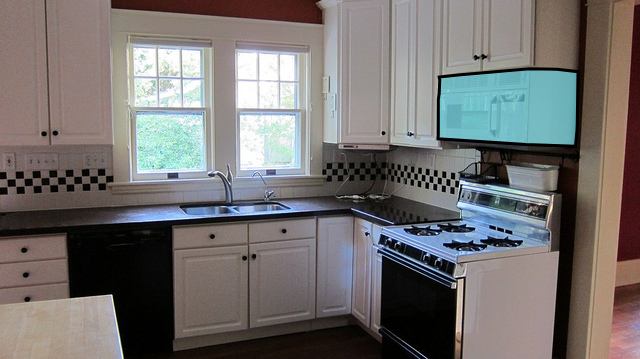

# Appliance (object)
| `appliance` | A *device* or *piece of equipment* `thingy` designed to perform a specific task, that is **not** attached / carried / worm by a human. An `apparatus` can or cannot have access to the _puff_. The human version of a `mach`*[ine].* Example: refrigerator, washing machine See also: [mach](#mach) | [appliance](/applicance.md)

| `type` &nbsp; `operator` | description | API |
| --- | --- | --- |
|  `{blender}` &nbsp;  | blender | [blender](#blender) |
|  `{fridge}` &nbsp; `{refrigerator}` &nbsp; `{freezer}` &nbsp; `{fridge_freezer}` &nbsp;  | fridge | [fridge](#fridge) |
|  `{hairdrier}` &nbsp; `{hair_drier}` &nbsp;  | hairdrier | [hairdrier](#hairdrier) |
|  `{oven}` &nbsp;  | oven | [oven](#oven) |
|  `{sink}` &nbsp;  &nbsp;  | sink | [sink](#sink_) |
|  `{toaster}` &nbsp;  | toaster | [toaster](#toaster) |
|  `{microwave}` &nbsp; `{microwave_oven}` &nbsp;  | microwave | [microwave](#microwave_) |

## Blender (type)

## Fridge (type)

## Hairdrier (type)

## Oven (type)

## Sink (type)

## Toaster (type)

## Microwave (type)

 Source: [#544085 Coco Explorer](https://cocodataset.org/#explore?id=544085)

