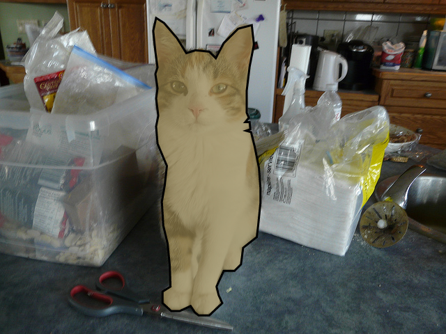

# Cat (type)
`cat` is a *type* of the `organic` *object*, representing a physical living feline animal (cat).

## Declaration & Assignment
The `cat` *type* can only be declared, assigned and referenced through the `organic` *object*, defining the *type* by using curly brackets (`{}`) and the type monikier `{bird}`.

&nbsp;&nbsp;&nbsp;&nbsp;&nbsp;&nbsp; `add_organic({cat},`*`moniker`*`);` 
&nbsp;&nbsp;&nbsp;&nbsp;&nbsp;&nbsp; `add_organic(`*`moniker`*`)_type(cat);`

## Referencing
To reference the `cat` *type*, use, either `with_organic` or shortened referencing using brackets (`()`).  The type is implied from the declaration, or can be cast when referenced.

&nbsp;&nbsp;&nbsp;&nbsp;&nbsp;&nbsp; `with_organic(`*`moniker`*`);` 
&nbsp;&nbsp;&nbsp;&nbsp;&nbsp;&nbsp; `with_organic({cat},`*`moniker`*`);` 
&nbsp;&nbsp;&nbsp;&nbsp;&nbsp;&nbsp; `(`*`cat_moniker`*`);` 
&nbsp;&nbsp;&nbsp;&nbsp;&nbsp;&nbsp; `({cat},`*`moniker`*`);`

## Expressions
The operator (`🐈`) can be used in expressions.

&nbsp;&nbsp;&nbsp;&nbsp;&nbsp;&nbsp; *`<expression_posit>(`*`...🐈...`*`);`

## Visacuity
A thingy can learn to detect a `cat` after learning. For visacuity, several datasets of images are available, such as Coco Explorer.

 Source: [#139721 Coco Explorer](https://cocodataset.org/#explore?id=139721)

---
## References

