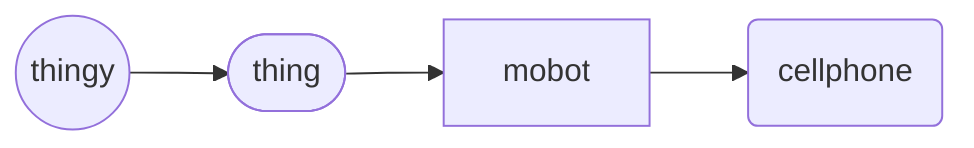

# Cell Phone (object)
The `cellphone` *object* is a derived `mobot`, representing a portable telephone that can make and receive calls over a radio frequency link within changing service cells.

Cellphone Hierarchy

## Declaration
The default declaration of the `cellphone` *object* is to at least provide a *moniker*. A type can be provided at declaration using curly brackets (`{}`). The derived *objects* can be declared by name. The `cellphone` object can also be declared by casting `mobot`.

&nbsp;&nbsp;&nbsp;&nbsp;&nbsp;&nbsp; `add_cellphone(`*`moniker`*`);` 
&nbsp;&nbsp;&nbsp;&nbsp;&nbsp;&nbsp; `add_cellphone({`*`type`*`},`*`moniker`*`);` 
&nbsp;&nbsp;&nbsp;&nbsp;&nbsp;&nbsp; `add_mobot({cellphone},`*`moniker`*`);`

## Referencing
To reference `cellphone`, use, either the `with` verb or the shortened syntax using brackets (`()`).  The type is implied from the declaration, or can be cast when referenced.

&nbsp;&nbsp;&nbsp;&nbsp;&nbsp;&nbsp; `with_cellphone(`*`moniker`*`);` 
&nbsp;&nbsp;&nbsp;&nbsp;&nbsp;&nbsp; `with_cellphone({`*`type`*`,`*`moniker`*`);` 
&nbsp;&nbsp;&nbsp;&nbsp;&nbsp;&nbsp; `(`*`cellphone_moniker`*`);`

## Types
The [*types*](../../metaphysic/prop/type.md#cellphone) of `cellphone` are realised through the operating system the cell phone runs on. There are only four defined `cellphone` *types*.

| `{type}` | operator | description | API |
| --- | --- | --- | ---|
|  `{android}` &nbsp; `{google}` | :: | Cell phone running on Google&reg; Android&#8482;. | [android](../prop/android.md#cellphone) |
|  `{bb}` &nbsp; `{blackberry}` | :: | Cell phone running on Blackberry&reg; operating system. | [bb](../prop/bb.md#blackberry) |
|  `{ios}` &nbsp; `{iphone}` &nbsp; `{apple}` | :: | Cell phone running on Apple&reg; iOS&#8482;. | [ios](../prop/ios.md#cellphone) |
|  `{win}` &nbsp; `{ms}` &nbsp; `{microsoft}` | :: | Cell phone running on Microsoft&reg; Windows Mobile&#8482;. | [win](../prop/win_mobile.md#cellphone) |

## Posits

| `posit` | description | API |
| --- | --- | ---- |
|  `_imei()` &nbsp; `_id({imei})` &nbsp;`_id()_imei()` `imei(`*`imei`*`)` &nbsp; `id()_imei(`*`imei`*`)` &nbsp; `id({imei},`*`imei`*`)` | Provide / declare the International Mobile Equipment Identity. *Promoted posit of `ident`*. | [imei](../prop/imei.md#cellphone) |
|  `_phonenum` &nbsp; `_num` &nbsp; `_cell` &nbsp; `_phonenumber`  | The phone number of the `cellphone` consisiting of the NDA [National Signigicant Number] and SN (Subscribers Number). | [phonenum](../prop/phonenum.md#cellphone) |

| `phonenum`  | `_type(phonenum)_value({phone_number});`  `_type(phonenum)_value({country},{country_code},{national_code},{national_destination_codephone_number});
|  `_` |  |  |
|  `_` |  |  |
|  `_` |  |  |
|  `_` |  |  |
|  `_` |  |  |
|  `_` |  |  |
|  `_` |  |  |
|  `_` |  |  |
|  `_` |  |  |
|  `_` |  |  |

| `id_type`   | syntax                                     | notes                                                        |
| ----------- | ------------------------------------------ | ------------------------------------------------------------ |
| `serialnum` | `_type(serialnum)_value({serial_number});` | `{serial_number}` is the serial number of the *thingy*.         |
| `id`        | `_type(id)_value({id_number});`            | Any user defined identification number/code as `{id_number}`. |
| `ip`        | `_type(ip)_value({ip_address});`              | The current Internet Protocol address used at the time of the command by the *thingy*                                                            |
| `phonenum`  | `_type(phonenum)_value({phone_number});`  `_type(phonenum)_value({country_number},{region_number},{phone_number});`                                         | Phone number, usually for `cellphone` type *mobots*                                                            |
| `imei`      | `_type(imei)_value({imei});`                                            | International Mobile Equipment Identity, usually for the `cellphone` type *mobots*                                                             |
