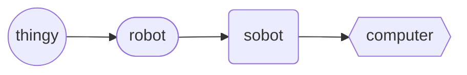

# Computer (object)
The `computer` *object* (also shortened syntax of `pc`) is a derived `sobot`, representing is a multi-purpose desktop microcomputer whose size, capabilities, and price make it feasible for individual use.

Computer Hierarchy

## Declaration
The default declaration of the `computer` *object* is to at least provide a *moniker*. The shortened syntax of `pc` can be used freely and interchangeably. There are no *types* of the `computer` *object*. The `computer` object can also be declared by casting `sobot`.

&nbsp;&nbsp;&nbsp;&nbsp;&nbsp;&nbsp; `add_computer(`*`moniker`*`);` 
&nbsp;&nbsp;&nbsp;&nbsp;&nbsp;&nbsp; `add_pc(`*`moniker`*`);` 
&nbsp;&nbsp;&nbsp;&nbsp;&nbsp;&nbsp; `add_sobot({computer},`*`moniker`*`);` 
&nbsp;&nbsp;&nbsp;&nbsp;&nbsp;&nbsp; `add_sobot({pc},`*`moniker`*`);`

## Referencing
To reference `computer`, use, either the `with` verb or the shortened syntax using brackets (`()`).  The type is implied from the declaration, or can be cast when referenced.

&nbsp;&nbsp;&nbsp;&nbsp;&nbsp;&nbsp; `with_computer(`*`moniker`*`);` 
&nbsp;&nbsp;&nbsp;&nbsp;&nbsp;&nbsp; `with_pc(`*`moniker`*`);` 
&nbsp;&nbsp;&nbsp;&nbsp;&nbsp;&nbsp; `(`*`computer_moniker`*`);`

## Posits

| `posit` | description | API |
| --- | --- | ---- |
|  `_opsys()` `_opsys(`*`op_sys`*`)` | Provide / declares the operating system(s) of the computer. | [opsys](../prop/opsys.md#computer) |
|  `_()` `_(`*` `*`)` | Provide / declare the . |  |
|  `_()` `_(`*` `*`)` | Provide / declare the . |  |
|  `_()` `_(`*` `*`)` | Provide / declare the . |  |