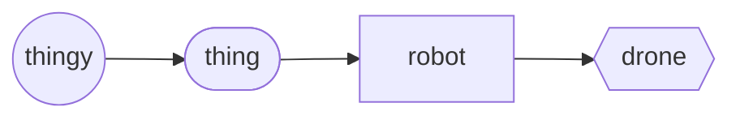

# Drone (object)
The `drone` *object* is a derived `robot`, representing an aerial self-propelled thingy in the physical 'real' world.

A thingy that aerially transports the human who is controlling it, is a `vehicle` of type `{uav}`.  Similarly a thingy that was originally designed to aerially transport the human who is controlling it, but then later modified to be self-controlled and not carry the human who is controlling it, then this will also be a `vehicle` of type `{uav}`, not a `drone`.

Drone Hierarchy

## Declaration
The default declaration of the `drone` *object* is to at least provide a *moniker*. There are no `drone` *types*. The `drone` object can also be declared by casting `robot`.

&nbsp;&nbsp;&nbsp;&nbsp;&nbsp;&nbsp; `add_drone(`*`moniker`*`);` 
&nbsp;&nbsp;&nbsp;&nbsp;&nbsp;&nbsp; `add_robot({drone},`*`moniker`*`);`

## Referencing
To reference `drone`, use, either the `with` verb or the shortened syntax using brackets (`()`).

&nbsp;&nbsp;&nbsp;&nbsp;&nbsp;&nbsp; `with_drone(`*`moniker`*`);` 
&nbsp;&nbsp;&nbsp;&nbsp;&nbsp;&nbsp; `(`*`drone_moniker`*`);`

## Posits

| `posit` | description | API |
| --- | --- | ---- |
|  `_impetus()` `_impetus(`*`impetus_configuration`*`)` `_impetus()_lift(`*`lift_impetus`*`)_propulsion(`*`propulsion_impetus`*`)_steer(`*`steer_impetus`*`)` | Provides / declares the means of momentum of the drone, in terms of lift, propulsion, and, steer. | [impetus](../../metaphysic/prop/impetus.md#drones) |
|  `_size()` &nbsp; `_size(`*`size_enum`*`)` | Provides / declares a generalised size enumerator dipicting the physical dimensions of the drone. | [size](#size) |
|  `_mgtw()` `_mgtw(`*`mgtw_value`*`)` &nbsp; `_mgtw({`*`unit`*`},`*`mgtw_value`*`)` | Provides / declares the maximum gross takeoff weight of the drone. | [size](#size) |
|  `_opalt()`   `_opalt(`*`normal_operating_altitude`*`)` &nbsp; `_({`*`unit`*`},`*`normal_operating_altitude`*`)` | Provides / declares the normal operating altitude of the drone. | [opalt](../prop/alt#opalt) |
|  `_maxair()`   `_maxair(`*`maximum_airspeed`*`)` &nbsp; `_({`*`unit`*`},`*`maximum_airspeed`*`)` | Provides / declares the  of the drone. | [maxair](../prop/air.md#maxair) |
|  `_adsb()` | Provides the (`adsb`) *object*, representing the Automatic Dependent Surveillance–Broadcast component, from the preceding drone *object*. | [adsb](./adsb.md#drones) |
|  `_status()` | Provides the status of the drone. | [status](../prop/status.md#drones) |
|  `_()`   `_(`*` `*`)` &nbsp; `_({`*`unit`*`},`*` `*`)` | Provides / declares the  of the drone. |  |
|  `_()`   `_(`*` `*`)` &nbsp; `_({`*`unit`*`},`*` `*`)` | Provides / declares the  of the drone. |  |
|  `_()`   `_(`*` `*`)` &nbsp; `_({`*`unit`*`},`*` `*`)` | Provides / declares the  of the drone. |  |

### Size
The `_size` posit provides or retrieves a generalised grouping of the physical aggregate dimensions of a drone. The size groupings are roughly based on PenState [classifications](https://www.e-education.psu.edu/geog892/node/5) (part of PennState '[GEOG 892](https://www.e-education.psu.edu/geog892/): Geospatial Applications of Unmanned Aerial Systems (UAS)' program).

| `size` | description | API |
| --- | --- | --- |
|  `very_small` &nbsp; `tiny` &nbsp; `micro` | Drones with dimensions ranging from the size of a large insect to 30-50cm long. | [very_small](#verysmall) |
|  `small` &nbsp; `mini` | At least one dimension greater than 50cm and no larger than 2meters. | [small](#small) | 
|  `medium` | Drones that are too heavy to be carried by one human but are still smaller than a light aircraft. They usually have a wingspan of about 5-10m and can carry payloads of 100Kg to 200kg. | [medium](#medium) |
|  `large` | Any drones with a maximum gross takeoff weight [`mgtw`](#mgtw) of 600kg or over. | [large](#large) |

#### Very Small Size
The very small drone size class applies to drones with dimensions ranging from the size of a large insect to 30-50 cm long. The insect-like drones, with flapping or rotary wings, are a popular micro design. They are extremely small in size, are very light weight, and can be used for spying and biological warfare. Larger ones utilize conventional aircraft configuration. The choice between flapping or rotary wings is a matter of desired maneuverability. Flapping wing-based designs allow perching and landing on small surfaces. Examples of very small drones are: the Israeli IAI Malat Mosquito[^mosquito] (with wing span of 35 cm and endurance of 40 minutes) the US Aurora Flight Sciences Skate[^suas] (with wing span of 60 cm and length of 33 cm), the Australian Cyber Technology CyberQuad Mini[^cyberquad] (with 42x42 cm square).

Examples of very small drones

Source: <a href="https://isbnsearch.org/isbn/9781119978664">Fahlstrom, Paul & Gleason, Thomas (2012); 'Introduction to UAV Systems'; Wiley</a>
 

#### Small Size
The Small drone size class (which also called sometimes mini) applies to drones that have at least one dimension greater than 50 cm and no larger than 2 meters. Many of the designs in this category are based on the fixed-wing model, and most are hand-launched by throwing them in the air. Examples of members of this small drone size class are: the 1 meter long RQ-11 Raven, by US Aero Vironment with a wingspan of 1.4 m; the Turkish Bayraktar, which weighs about 5 kg and has a data link range of 20 km; and, the US Army RQ-7 Shadow.

Examples of small drones

Source: <a href="https://isbnsearch.org/isbn/9781119978664">Fahlstrom, Paul & Gleason, Thomas (2012); 'Introduction to UAV Systems'; Wiley</a>
 

---
## References

[Anon. (2011); 'Mosquito Micro Unmanned Aerial Vehicle'; Airforce Technology](https://www.airforce-technology.com/projects/mosquitomicrouav/) 
[Anon. (2021); 'Skate Small Unmanned Aerial System (SUAS)'; Homeland Security Technology](https://www.airforce-technology.com/projects/mosquitomicrouav/) 
 [Brandon, Alan (2009); 'CyberQuad: best of both worlds UAV designed for urban reconnaissance'; New Atlas](https://newatlas.com/cyberquad-uav/13652/) 
 Fahlstrom, Paul Gerin & Gleason, Thomas James (2012); 'Introduction to UAV Systems'; Wiley [ISBN](https://isbnsearch.org/isbn/9781119978664) [oISBN](https://isbnsearch.org/isbn/9781118396780) [DOI](https://doi.org/10.1002/9781118396780) 
 [Schuckman, Karen; Abdullah, Qassim (2020); 'Geospatial Applications of Unmanned Aerial Systems (UAS) GEOG 892'; PennState, College of Earth and Mineral Sciences, John A. Dutton, e-Education Institute](https://www.e-education.psu.edu/geog892/) 
 https://en.wikipedia.org/wiki/Unmanned_aerial_vehicle#Classification_types  

[^mosquito]: See [Anon. (2011)](#anon2011), Ibid.;
[^suas]: See [Anon. (2021)](#anon2021), Ibid.;
[^cyberquad]: See [https://www.cybertechuav.com.au/about-cyber-technology/](https://www.cybertechuav.com.au/about-cyber-technology/); [Brandon (2009)](#brandon), Ibid.;