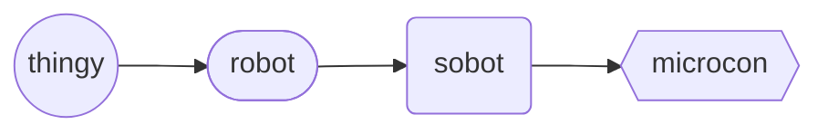

# Microcontroller (object)
The `microcon` *object* (also lengthened syntax of `microcontroller`) is a derived `sobot`, representing is a multi-purpose microcomputer whose size, capabilities, and price make it feasible for internal robot use.

Microcontroller Hierarchy
