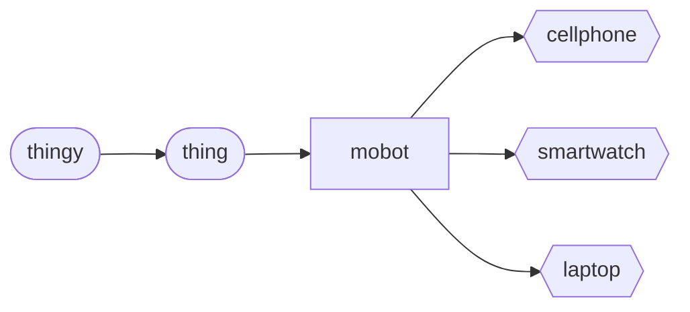

# Mobot (object)
A `mobot` is a conveyed `thing`, that is not self-propelled, but interacts physically in the physical world, such as a [cell phone](./cellphone.md).

The `mobot` is derived from a `thing`, and a `thing` is derived from `thingy`. This is depicted in the 'Mobot Hierarchy'.

Mobot Hierarchy

## Declaration
The default declaration of the `mobot` *object* is to at least provide a *moniker*. A type can be provided at declaration using curly brackets (`{}`). The derived *objects* can be declared by name.

&nbsp;&nbsp;&nbsp;&nbsp;&nbsp;&nbsp; `add_mobot(`*`moniker`*`);` 
&nbsp;&nbsp;&nbsp;&nbsp;&nbsp;&nbsp; `add_mobot({`*`type`*`},`*`moniker`*`);` 
&nbsp;&nbsp;&nbsp;&nbsp;&nbsp;&nbsp; `add_cellphone(`*`moniker`*`);` 
&nbsp;&nbsp;&nbsp;&nbsp;&nbsp;&nbsp; `add_watch(`*`moniker`*`);` 
&nbsp;&nbsp;&nbsp;&nbsp;&nbsp;&nbsp; `add_laptop(`*`moniker`*`);`

## Referencing
To reference the `mobot`, use, either the `with` verb or the shortened syntax using brackets (`()`).  The type is implied from the declaration, or can be cast when referenced.

&nbsp;&nbsp;&nbsp;&nbsp;&nbsp;&nbsp; `with_mobot(`*`moniker`*`);` 
&nbsp;&nbsp;&nbsp;&nbsp;&nbsp;&nbsp; `with_mobot({`*`type`*`,`*`moniker`*`);` 
&nbsp;&nbsp;&nbsp;&nbsp;&nbsp;&nbsp; `with_cellphone(`*`moniker`*`);` 
&nbsp;&nbsp;&nbsp;&nbsp;&nbsp;&nbsp; `with_watch(`*`moniker`*`);` 
&nbsp;&nbsp;&nbsp;&nbsp;&nbsp;&nbsp; `with_laptop(`*`moniker`*`);` 
&nbsp;&nbsp;&nbsp;&nbsp;&nbsp;&nbsp; `(`*`sobot_moniker`*`);` 
&nbsp;&nbsp;&nbsp;&nbsp;&nbsp;&nbsp; `(`*`cellphone_moniker`*`);` 
&nbsp;&nbsp;&nbsp;&nbsp;&nbsp;&nbsp; `(`*`watch_moniker`*`);` 
&nbsp;&nbsp;&nbsp;&nbsp;&nbsp;&nbsp; `(`*`laptop_moniker`*`);`

## Posits

| method | description | API |
| --- | -------- | --- |
|  `_ident()` | Provides or sets identity information. | [ident](#ident) |

### Ident