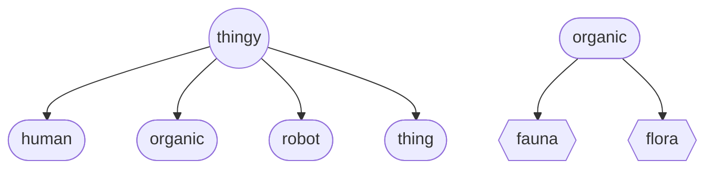

# Organic (object)
The `organic` *object* is a derivative of `thingy` and one of the four main hierarchical thingy types.  The `organic` *object* is a representation of a non-human being, present and alive in the physical 'real' world.

Genera of Thingies
 

## Declaration
The default declaration of the `organic` *object* is to at least provide a *moniker*. A type can be provided at declaration using curly brackets (`{}`). All *types* of `organic` are not available to be declared by name.

&nbsp;&nbsp;&nbsp;&nbsp;&nbsp;&nbsp; `add_organic(`*`moniker`*`);` 
&nbsp;&nbsp;&nbsp;&nbsp;&nbsp;&nbsp; `add_organic({`*`type`*`},`*`moniker`*`);`

## Referencing
To reference the `organic`, use, either the `with` verb or the shortened syntax using brackets (`()`).  The type is implied from the declaration, or can be cast when referenced. All *types* of `organic` are not available to be referenced by name.

&nbsp;&nbsp;&nbsp;&nbsp;&nbsp;&nbsp; `with_organic(`*`moniker`*`);` 
&nbsp;&nbsp;&nbsp;&nbsp;&nbsp;&nbsp; `with_organic({`*`type`*`,`*`moniker`*`);` 
&nbsp;&nbsp;&nbsp;&nbsp;&nbsp;&nbsp; `(`*`organic_moniker`*`);`

## Typing
The [*types*](../../metaphysic/prop/type.md#organic) of the `organic` *object* are those objects derived from common objects used in machine-learning visacuity.

| `type` &nbsp; `operator` | coco identifier |description | API |
| --- | --- | --- | -- |
|  `{bear}` &nbsp; `{🐻}` |  | bear | [bear](#bear) |
|  `{bird}` &nbsp; `{🐦}` |  | bird | [bird](#bird) |
|  `{cat}` &nbsp; `{🐈}` |  | cat | [cat](./cat.md) |
|  `{cow}` &nbsp; `{🐄}` &nbsp; `{🐮}` |  | cow | [cow](#cow) |
|  `{dog}` &nbsp; `{🐕}` |  | dog | [dog](#dog) |
|  `{elephant}` &nbsp; `{🐘}` |  | elephant | [elephant](#elephant) |
|  `{giraffe}` &nbsp; 🦒 |  | giraffe | [giraffe](#giraffe) |
|  `{horse}` &nbsp; ğŸ &nbsp; 🴠|  | horse | [horse](#horse) |
|  `{sheep}` &nbsp; 👠|  | sheep | [sheep](#sheep) |
|  `{zebra}` &nbsp; 🦓 |  | zebra | [zebra](#zebra) |

## Bear (type)
`bear` is a *type* of the `organic` *object*, representing a physical living animal (bear).

### Declaration & Assignment
The `bear` *type* can only be declared, assigned and referenced through the `organic` *object*, defining the *type* by using curly brackets (`{}`), as such: `{bear}`.  

&nbsp;&nbsp;&nbsp;&nbsp;&nbsp;&nbsp; `add_organic({bear},`*`moniker`*`);` 
&nbsp;&nbsp;&nbsp;&nbsp;&nbsp;&nbsp; `add_organic(`*`moniker`*`)_type(bear);`

### Referencing
To reference the `bear` *type*, use, either `with_organic` or shortened referencing using brackets (`()`).  The type is implied from the declaration, or can be cast when referenced.

&nbsp;&nbsp;&nbsp;&nbsp;&nbsp;&nbsp; `with_organic(`*`moniker`*`);` 
&nbsp;&nbsp;&nbsp;&nbsp;&nbsp;&nbsp; `with_organic({bear},`*`moniker`*`);` 
&nbsp;&nbsp;&nbsp;&nbsp;&nbsp;&nbsp; `(`*`bear_moniker`*`);` 
&nbsp;&nbsp;&nbsp;&nbsp;&nbsp;&nbsp; `({bear},`*`organic_moniker`*`);` 

### Expressions
There is an bear operator (🐻), to be used in expressions.

&nbsp;&nbsp;&nbsp;&nbsp;&nbsp;&nbsp; *`<...>`*`_`*`<expression_posit>`*`(`*`...`*`🐻`*`...`*`);`

### Visacuity

 Source: [#212688 Coco Explorer](https://cocodataset.org/#explore?id=212688)

#### Bird (type)

## Cow (type)

## Dog (type)

## Elephant (type)

## Giraffe (type)

## Horse (type)

## Sheep (type)

## Zebra (type)