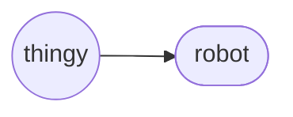

# Robot (object)
The `robot` *object* is a derived [`thingy`](./thingy.md), representing a self-propelled thingy in the physical 'real' world.

Robot Hierarchy

## Declaration
The default declaration of the `robot` *object* is to at least provide a *moniker*. There are no *types* of the `robot` *object*. The `robot` object can also be declared by casting `thingy`.

&nbsp;&nbsp;&nbsp;&nbsp;&nbsp;&nbsp; `add_robot(`*`moniker`*`);` 
&nbsp;&nbsp;&nbsp;&nbsp;&nbsp;&nbsp; `add_thingy({robot},`*`moniker`*`);`

## Referencing
To reference `robot`, use, either the `with` verb or the shortened syntax using brackets (`()`).  The type is implied from the declaration, or can be cast when referenced.

&nbsp;&nbsp;&nbsp;&nbsp;&nbsp;&nbsp; `with_robot(`*`moniker`*`);` 
&nbsp;&nbsp;&nbsp;&nbsp;&nbsp;&nbsp; `(`*`robot_moniker`*`);`

## Posits

| `posit` | description | API |
| --- | --- | ---- |
|  `_opsys()` `_opsys(`*`operating_system`*`)` | Provide / declares the operating system(s) of the robot. | [opsys](../../metaphysic/prop/opsys.md#robot) |
|  `_opframe()` `_opframe(`*`operating_framework`*`)` | Provide / declare the operating framework of the robot. | [opframe](../../metaphysic/prop/opframe.md#robot) |
|  `_()` `_(`*` `*`)` | Provide / declare the . |  |
|  `_()` `_(`*` `*`)` | Provide / declare the . |  |