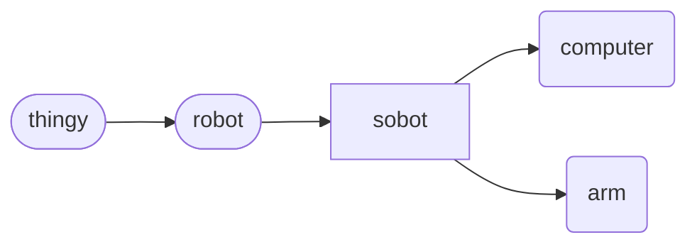

# Sobot (object)
A `sobot` is a stationary `robot`, that although can be self-propelled, does not necessarily interact physically in the physical world outside its own environment, such as a *robot arm*. The computer has also been included as a derived `sobot`.

The `sobot` is derived from a `robot`, and a `robot` is derived from `thingy`. This is depicted in the 'Sobot Hierarchy'.

Sobot Hierarchy

## Declaration
The default declaration of the `sobot` *object* is to at least provide a *moniker*. A type can be provided at declaration using curly brackets (`{}`).  The two derived *objects* can be declared by name.

&nbsp;&nbsp;&nbsp;&nbsp;&nbsp;&nbsp; `add_sobot(`*`moniker`*`);` 
&nbsp;&nbsp;&nbsp;&nbsp;&nbsp;&nbsp; `add_sobot({`*`type`*`},`*`moniker`*`);` 
&nbsp;&nbsp;&nbsp;&nbsp;&nbsp;&nbsp; `add_computer(`*`moniker`*`);` 
&nbsp;&nbsp;&nbsp;&nbsp;&nbsp;&nbsp; `add_arm(`*`moniker`*`);`

## Referencing
To reference the `sobot`, use, either the `with` verb or the shortened syntax using brackets (`()`).  The type is implied from the declaration, or can be cast when referenced.

&nbsp;&nbsp;&nbsp;&nbsp;&nbsp;&nbsp; `with_sobot(`*`moniker`*`);` 
&nbsp;&nbsp;&nbsp;&nbsp;&nbsp;&nbsp; `with_sobot({`*`type`*`,`*`moniker`*`);` 
&nbsp;&nbsp;&nbsp;&nbsp;&nbsp;&nbsp; `with_computer(`*`moniker`*`);` 
&nbsp;&nbsp;&nbsp;&nbsp;&nbsp;&nbsp; `with_arm(`*`moniker`*`);` 
&nbsp;&nbsp;&nbsp;&nbsp;&nbsp;&nbsp; `(`*`sobot_moniker`*`);` 
&nbsp;&nbsp;&nbsp;&nbsp;&nbsp;&nbsp; `(`*`computer_moniker`*`);` 
&nbsp;&nbsp;&nbsp;&nbsp;&nbsp;&nbsp; `(`*`arm_moniker`*`);`

## Posits

| method | description | API |
| --- | -------- | --- |
|  `_ident()` | Provides or sets identity information. | [ident](#ident) |

### Ident
