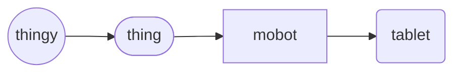

# Tablet (object)
The `tablet` *object* is a derived `mobot`, representing a tablet computer, a mobile device, typically with a mobile operating system and touchscreen display processing circuitry, and a rechargeable battery in a single, thin and flat package. 

Tablet Hierarchy

## Declaration
The default declaration of the `tablet` *object* is to at least provide a *moniker*. There are no *types* of the `computer` *object*. The `tablet` object can also be declared by casting `mobot`.

&nbsp;&nbsp;&nbsp;&nbsp;&nbsp;&nbsp; `add_tablet(`*`moniker`*`);` 
&nbsp;&nbsp;&nbsp;&nbsp;&nbsp;&nbsp; `add_mobot({tablet},`*`moniker`*`);`

## Referencing
To reference `tablet`, use, either the `with` verb or the shortened syntax using brackets (`()`).  The type is implied from the declaration, or can be cast when referenced.

&nbsp;&nbsp;&nbsp;&nbsp;&nbsp;&nbsp; `with_tablet(`*`moniker`*`);` 
&nbsp;&nbsp;&nbsp;&nbsp;&nbsp;&nbsp; `(`*`tablet_moniker`*`);`

## Posits

| `posit` | description | API |
| --- | --- | ---- |