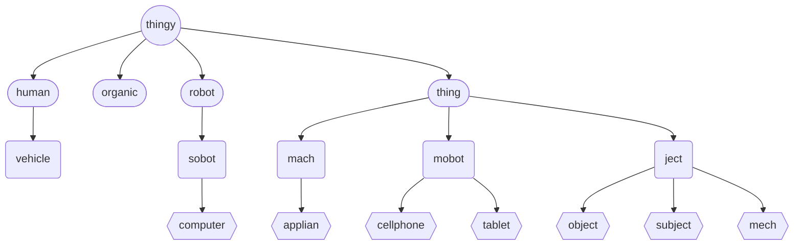

# Thingy (object)
In the 'Genera of Thingies' the `thingy` *object* is the top most representation of all physical objects.

Genera of Thingy Sub-Types | Organic Types

## Declaration
The default declaration of the `thingy` *object* is to at least provide a *moniker*. A type can be provided at declaration using curly brackets (`{}`).  The four derived *objects* can be declared by name.

&nbsp;&nbsp;&nbsp;&nbsp;&nbsp;&nbsp; `add_thingy(`*`moniker`*`);` 
&nbsp;&nbsp;&nbsp;&nbsp;&nbsp;&nbsp; `add_thingy({`*`type`*`},`*`moniker`*`);` 
&nbsp;&nbsp;&nbsp;&nbsp;&nbsp;&nbsp; `add_human(`*`moniker`*`);` 
&nbsp;&nbsp;&nbsp;&nbsp;&nbsp;&nbsp; `add_organic(`*`moniker`*`);` 
&nbsp;&nbsp;&nbsp;&nbsp;&nbsp;&nbsp; `add_robot(`*`moniker`*`);` 
&nbsp;&nbsp;&nbsp;&nbsp;&nbsp;&nbsp; `add_thing(`*`moniker`*`);`

## Referencing
To reference the `thingy`, use, either the `with` verb or the shortened syntax using brackets (`()`).  The type is implied from the declaration, or can be cast when referenced.

&nbsp;&nbsp;&nbsp;&nbsp;&nbsp;&nbsp; `with_thingy(`*`moniker`*`);` 
&nbsp;&nbsp;&nbsp;&nbsp;&nbsp;&nbsp; `with_thingy({`*`type`*`,`*`moniker`*`);` 
&nbsp;&nbsp;&nbsp;&nbsp;&nbsp;&nbsp; `with_human(`*`moniker`*`);` 
&nbsp;&nbsp;&nbsp;&nbsp;&nbsp;&nbsp; `with_organic(`*`moniker`*`);` 
&nbsp;&nbsp;&nbsp;&nbsp;&nbsp;&nbsp; `(`*`robot_moniker`*`);` 
&nbsp;&nbsp;&nbsp;&nbsp;&nbsp;&nbsp; `(`*`thing_moniker`*`);`

## Typing
The [*types*](../../metaphysic/prop/type.md#thingy) of `thingy` are those *objects* `thingy` derives into: `{human}`; `{organic}`; `{robot}`; and, `thing`.

| `{type}` | operator | description | API |
| --- | --- | --- | ---|
|  `{human}` | :: | A representation of a human being, present and alive in the physical 'real' world.  | [human](./human.md#thingy) |
|  `{organic}` &nbsp; `{org}` &nbsp; `{organism}` | :: | Representation of a non-human being, present and alive in the physical 'real' world. | [organic](./organic.md#thingy) |
|  `{robot}` | :: | Representation of a self-propelled thingy in the physical 'real' world. | [robot](./robot.md#thingy) |
|  `{thing}` | :: | An immobile thingy in the physical 'real' world, such as a thing in IoT. | [thing](./thing.md#thingy) |

## Posits

| method | description | API |
| --- | -------- | --- |
|  `_ident()` | Provides or sets identity information. | [ident](#ident) |

### Ident