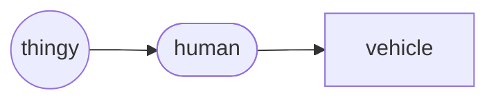

# Vehicle (object)
The `vehicle` *object* is a derived `human`, representing a propelled thingy that transports the human who is controlling it.  Similarly a thingy that was originally designed to transport the human who is controlling it, but then later modified to be self-controlled and not carry the human who is controlling it, is still a `vehicle` but an unmanned one.

Vehicle Hierarchy

## Declaration
The default declaration of the `vehicle` *object* is to at least provide a *moniker*. A type can be provided at declaration using curly brackets (`{}`). The derived *objects* can be declared by name. The `vehicle` object can also be declared by casting `robot`. However, this will imply that the `vehicle` is a child of the `human`.

&nbsp;&nbsp;&nbsp;&nbsp;&nbsp;&nbsp; `add_vehicle(`*`moniker`*`);` 
&nbsp;&nbsp;&nbsp;&nbsp;&nbsp;&nbsp; `add_vehicle({`*`type`*`},`*`moniker`*`);` 
&nbsp;&nbsp;&nbsp;&nbsp;&nbsp;&nbsp; `add_`*`<type>`*`(`*`moniker`*`);` 
&nbsp;&nbsp;&nbsp;&nbsp;&nbsp;&nbsp; `add_human({vehicle},`*`moniker`*`);`

## Referencing
To reference `vehicle`, use, either the `with` verb or the shortened syntax using brackets (`()`).  The type is implied from the declaration, or can be cast when referenced.

&nbsp;&nbsp;&nbsp;&nbsp;&nbsp;&nbsp; `with_vehicle(`*`moniker`*`);` 
&nbsp;&nbsp;&nbsp;&nbsp;&nbsp;&nbsp; `with_vehicle({`*`type`*`,`*`moniker`*`);` 
&nbsp;&nbsp;&nbsp;&nbsp;&nbsp;&nbsp; `(`*`vehicle_moniker`*`);`
&nbsp;&nbsp;&nbsp;&nbsp;&nbsp;&nbsp; `(`*`vehicle_type_moniker`*`);`

## Posits

| `posit` | operator | description | API |
| --- | --- | --- | --- |
|  `_car()` `_car(`*`moniker`*`)` &nbsp; `_vehicle({`*`car`*`},`*`moniker`*`)` | 🚗 |  A wheeled motor vehicle that is used for transportation of mainly people instead of goods. | [car](#car) |
|   `_truck()` &nbsp; `_lorry()` &nbsp; `_van()` `_truck(`*`moniker`*`)` &nbsp; `_lorry(`*`moniker`*`)` &nbsp; `_van(`*`moniker`*`)` `_vehicle({`*`truck`*`},`*`moniker`*`)` | 🚚 | A motor vehicle designed to transport cargo, carry specialized payloads, or perform other utilitarian work. | [truck](#truck) |
|  `_airplane()`   `_airplane(`*`moniker`*`)` &nbsp; `_vehicle({`*`airplane`*`},`*`moniker`*`)` | ✈ &nbsp; 🛩 | A fixed-wing aircraft that is propelled forward by thrust from a jet engine, propeller, or rocket engine.  | [airplane](#airplane) |
|  `_bus()`   `_bus(`*`moniker`*`)` &nbsp; `_bus({`*`airplane`*`},`*`moniker`*`)` | 🚌 | A road vehicle that carries significantly more passengers than an average car or van.  | [bus](#bus) |
|  `_plane()`   `_(`*`moniker`*`)` &nbsp; `_({`*`unit`*`},`*`moniker`*`)` | |  |  |
|  `_hovercraft()`   `_hovercraft(`*`moniker`*`)` &nbsp; `_({`*`unit`*`},`*`moniker`*`)` | |  |  |
|  `_spacecraft()`   `_spacecraft(`*`moniker`*`)` &nbsp; `_({`*`unit`*`},`*`moniker`*`)` | |  |  |
|  `_ship()`   `_boat(`*`moniker`*`)` &nbsp; `_vehicle({`*`ship`*`},`*`moniker`*`)` | ⛵ &nbsp; 🛥 |  |  |
|  `_submarine()`   `_submarine(`*`moniker`*`)` &nbsp; `_vehicle({`*`submarine`*`},`*`moniker`*`)` | |  |  |
|  `_blimp()`   `_blimp(`*`moniker`*`)` &nbsp; `_({`*`unit`*`},`*`moniker`*`)`  | | . |  |
|  `_cycle()` &nbsp; `_bicycle()` `_cycle(`*`moniker`*`)` &nbsp; `_vehicle({`*`cycle`*`},`*`moniker`*`)`  `_bicycle(`*`moniker`*`)` | 🚲 |A representation of a human-powered or motor-powered assisted, pedal-driven, single-track vehicle, wheels attached to a frame. | [cycle](#cycle) |
|  `_mcycle()` &nbsp; `_motorcycle()` &nbsp; `_motorbike()` `(`*`moniker`*`)` &nbsp; `_({`*`unit`*`},`*`moniker`*`)` | 🏍 |  |  |
|  `_train()`   `_train(`*`moniker`*`)` &nbsp; `_vehicle({`*`train`*`},`*`moniker`*`)` | 🚆 |  |  |
|  `_tram()`   `_(`*`moniker`*`)` &nbsp; `_({`*`unit`*`},`*`moniker`*`)` | |  |  |

aircraft - airplane, seaplane, airboat, blimp
watercraft - ship, boat, submarine
cycle - bicycle, unicycle, tandem
https://cocodataset.org/#home

### Cars

