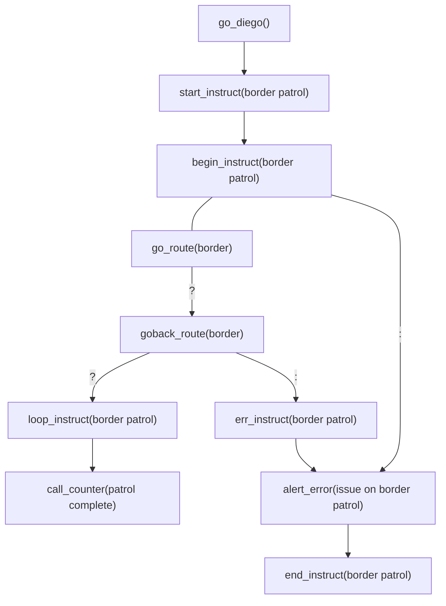
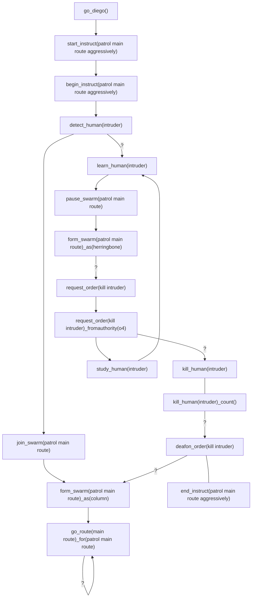

# Diego Commands
## <a name="go_diego"></a>go_diego
Sets up '*deigo*' program with global defaults.

Every  diego program must start with the ```go_diego``` command.

The ```go_diego``` command accepts no sub commands.

The ```go_diego``` command can be parameter-less, but it is recommended, for easily identification (especially under  development), to provide a '*diego_moniker*'.
#### go_diego()
Sets up '*deigo*' program with global defaults.
#### go_diego(*diego_moniker*)

### Linking & Events
| | do_diego | hey_diego | oh_diego |
|--|:--:|:--:|:--:|
| link | ```go_diego``` | ❌ | ❌ |
| event | ❌ | ❌ | *(bubble up errors from ```instruct```s)*<br>```err_instruct``` |
The `go_diego` command accepts no sub commands.

The _do_diego_ event covers the declaration of global variables.  There are no _hey_diego_ nor  _oh_diego_ events.
# Instructors
Instructor commands package other commands into sets, effectively an ``instruct`` is a *set of instructions*.  An ``instruct`` can be called, looped and ended using instructor commands.
## begin_instruct
The ``begin_instruct`` command marks the start of an ``instruct`` and monikers it for reference.  Internally the ``begin_instruct`` command also sets up all the default declaration for the ``instruct``.

The ```begin_instruct``` command  cannot be parameter-less, it must contain a unique (to the *diego*) '*instruct_moniker*'.

The ```begin_instruct``` command has **no** privilege definition ability, however, its associated ``start_instruct`` command has privilege definition ability.

An ``instruct`` is delimited by the ```loop_instruct``` and```end_instruct``` commands, either of which must be present.  The ``instruct`` is not allowed to bled.
#### begin_instruct(*instruct_moniker*)
The start of a ```instruct``` used to package commands under the label of *```instruct_moinker```*.    Note ```begin_instruct``` only declares an ```instruct```, to start (initiate) an ```instruct``` use ```start_instruct(```*```instruct_moniker```*```)```.
An *```instruct_moniker```* is required in order for the ```instruct```  to start (using ```start_instruct(```*```instruct_moniker```*```)```).
### Linking & Events
| | do_diego | hey_diego | oh_diego |
|--|:--:|:--:|:--:|
| events: | ```start_instruct``` |```loop_instruct```<br>```end_instruct``` | *errors from oh_diego-less commands*<br>``err_instruct`` |
| cmds: |  | ✅ allowed | ✅ allowed |
The _do_diego_ event can only be initiated with the ```start_instruct``` command with matching *instruct_moniker*.   A _hey_diego_ event is **not** triggered on ```begin_instruct```, only through ```loop_instruct``` or ```end_instruct``` elsewhere in the _diego_ code.    An _oh_diego_ event is initiated when any _error_ from an _oh_diego-less_ command, inside the ``instruct`` 'bubbles up'; or, on ``err_instruct(``*``instruct_moniker``*``)`` explicit command, whichever comes first.

Both _hey_diego_ and _oh_diego_ commands are optional, and can be useful for robots to report progress/counters/warnings/errors of the ```instruct``` to humans or other robots.
### Example
In this example we are going to instruct a robot(s) to go back and forth along a route called '*border*', until there is an error en-route on route '*border*'.  For every journey along *border* route and then back again along *border* route, the robot will announce how many times the '*patrol complete*'.  When a error occurs on the journey on route '*border*' the robot(s) will alert the human(s) of an '*issue on border patrol*'.

code:
```diego
use_namespace(diego_sandbox);

begin_instruct(border patrol);
  	
  	add_counter(patrol complete):;
  	: alert_error(issue on border patrol);
  	  
    go_route(border)?:;
    ? goback_route(border)|?:;
    	| with_counter(patrol complete)_inc(++);
    	? loop_instruct(border patrol);
        : err_instruct(border patrol);
    : err_instruct(border patrol);

end_instruct(border patrol);

start_instruct(border patrol)_forof(droid1)_you(droid1)?:;
? msg_human(Jim)_counter(patrol complete)
: msg_human(Jim)_err();
```
flow:



## loop_instruct
#### loop_instruct(*instruct_moniker*)
## <a name="end_instruct"></a>end_instruct
#### end_instruct(*instruct_moniker*)
The finisher of an ```instruct``` ends with  ```end_instruct(```*```instruct_moniker```*```)```, with no sub command the```instruct``` will end  for _all_ monikers (robots, swarms, labels of).
### Privileges
#### end_instruct(*instruct_moniker*)*[...]*_for(*moniker1*, *n...*)
A whitelist (*moniker1*, *n...*) of monikers (robots, swarms, labels of) that should only be allowed to finish the *instruct_moniker* ```instruct```.
#### end_instruct(*instruct_moniker*)*[...]*_not((*moniker1*, *n...*)
A blacklist (*moniker1*, *n...*) of monikers (robots, swarms, labels of) that are denied to finish the *instruct_moniker* ```instruct```.
#### end_instruct(*instruct_moniker*)*[...]*_for(*moniker1*, *n...*)_not(*moniker1*, *n...*)
A whitelist with blacklist of monikers (robots, swarms, labels of) that allowed/denied to finish the *instruct_moniker* ```instruct```.
## <a name="start_instruct"></a>start_instruct
Where a duplicate ```start_instruct``` (with the same signature) exists the first ```start_instruct``` command in the diego flow will be executed and later duplicates will restart the ```instruct``` at ```begin_instuct``` with **no** _hey_diego__ nor _oh_diego_ events triggered.
#### start_instruct(*instruct_moniker*)
The initiation of an ```instruct``` starts with  ```start_instruct(```*```instruct_moniker```*```)```, with no sub command the```instruct``` will start for _all_ monikers (robots, swarms, labels of).
### Sub Commands
#### start_instruct(*instruct_moniker*)_for(*moniker1*, *n...*)
An whitelist (*moniker1*, *n...*) of monikers (robots, swarms, labels of) that should only be allowed to initiate the *instruct_moniker* ```instruct```.
#### start_instruct(*instruct_moniker*)_not((*moniker1*, *n...*)
A blacklist (*moniker1*, *n...*) of monikers (robots, swarms, labels of) that are denied to initiate the *instruct_moniker* ```instruct```.
### Events
The _do_diego_ event covers the declaration of global variables.  There are no _hey_diego_ nor  _oh_diego_ events.
# Setters
## set_consensus
Sets the consensus to be used in polls and decisions.

The scope of the ```set_consensus```  settings is determined by the ```set_consensus``` command location in the diego code.  If the ```set_consensus``` command is placed after the ```go_diego``` command but before any ```instruct``` the consensus setting will be applied to the whole diego, unless overridden by the next ```set_consensus``` command in the diego code flow.

If the ```set_consensus``` command is placed after a ```begin_instruct``` command, the scope of consensus will be applied to the ```instruct```, unless overridden by the next ```set_consensus``` command (in the same ```instruct``` or a nested ```instruct```) in the diego code flow.

The lowest level of override occurs with the ```_with_consensus``` sub command, available on most decision commands.

The ```set_consensus``` command has privilege definition ability using both and each of the ```_for``` and  ```_not``` sub commands.

If the  ```set_consensus``` command is never used, the consensus is defaulted to *unanimous*.

The ```set_consensus``` command does **not** set consensus on elections, only on polls and robot decisions.

#### set_consensus(*consensus_type*)
Sets the consensus of *consensus_type*:
| ```consensus_type``` | Description |
|--|--|
| ```unanimous_wait_for_the_dead``` | Decisions are made only when there is a unanimous result but only after all dead robots have been resurrected and then resulted. |
| ```unanimous``` | Decisions are made on an unanimous result, any dead robots are disregarded. |
| ```authority``` | Decisions are based on the result of the highest authority robot(s) (using ```set_authority``` command). |
| ```human_only``` | Decisions can only be made by a human(s).<br>If there are no humans alive, consensus will automatically change to ```authority``` then back to ```human_only``` when one or more humans are resurrected. |
| ```majority_wait_for_the_dead``` | Decisions are made on a majority (>=50%) basis of the results over the number of robot members but only after enough resurrected robots have resulted to make the majority (if required). |
| ```majority``` | Decisions are made on a majority (>=50%) basis of the results over the number of robot members. |
| ```decisive``` | Decisions are made on the majority results when the decisiveness limit (defaulted to 5 secs or the value set with the ```set_decisiveness``` command) has expired. |
| ```first``` | Decisions are made on the first result. |
#### set_consensus(*consensus_type*)_for(*moniker1*, *n...*)
Consensus of *consensus_type* will apply only to the whitelist of (*moniker1*, *n...*) of monikers (robots, swarms, labels of).
#### set_consensus(*consensus_type*)_not((*moniker1*, *n...*)
Consensus of *consensus_type* will **not** apply to the blacklist of (*moniker1*, *n...*) of monikers (robots, swarms, labels of).  The defaulted or last known consensus will apply to those blacklist monikers.
#### set_consensus(*consensus_type*)_for(*moniker1*, *n...*)_not(*moniker1*, *n...*)
An apply-list with a no-apply-list of monikers (robots, swarms, labels of) for consensus of *consensus_type*.
## set_decisiveness
Sets the decisiveness in milliseconds to be making decisions, particularly of polls.

The scope of the ```set_decisiveness```  settings is determined by the ```set_decisiveness``` command location in the diego code.  If the ```set_decisiveness``` command is placed after the ```go_diego``` command but before any ```instruct``` the decisiveness setting will be applied to the whole diego, unless overridden by the next ```set_decisiveness``` command in the diego code flow.

If the ```set_decisiveness``` command is placed after a ```begin_instruct``` command, the scope of decisiveness will be applied to the ```instruct```, unless overridden by the next ```set_decisiveness``` command (in the same ```instruct``` or a nested ```instruct```) in the diego code flow.

The lowest level of override occurs with the ```_with_decisiveness``` sub command, available on most decision commands.

The ```set_decisiveness``` command has privilege definition ability using both and each of the ```_for``` and  ```_not``` sub commands.

If the  ```set_decisiveness``` command is never used, the consensus is defaulted to *unanimous*.

The ```set_decisiveness``` command does **not** set consensus on elections, only on polls and robot decisions.

#### set_decisiveness(*time_period*)
Sets the decisiveness is a *time_period* (*in milliseconds*) given to robot(s) when making decisions.  When a robot polls other robots the decisiveness timer will start.  While collecting results the decisiveness timer will trigger when the *time_period* (*in milliseconds*) has expired.  For decisions with  ```decisive```  consensus the majority result will be chosen upon the decisiveness timer triggered.
#### set_decisiveness(*time_period*)_for(*moniker1*, *n...*)
Decisiveness of *time_period* will apply only to the whitelist of (*moniker1*, *n...*) of monikers (robots, swarms, labels of).
#### set_decisiveness(*time_period*)_not((*moniker1*, *n...*)
Decisiveness of *time_period* will **not** apply to the blacklist of (*moniker1*, *n...*) of monikers (robots, swarms, labels of).  The defaulted or last known consensus will apply to those blacklist monikers.
#### set_decisiveness(*time_period*)_for(*moniker1*, *n...*)_not(*moniker1*, *n...*)
An apply-list with a no-apply-list of monikers (robots, swarms, labels of) for decisiveness of *time_period*.
## set_ranking
Sets the ranking calculation to use when analysing results of polls and statistics for decisions.
#### set_ranking(*rank_type*)
| ```rank_type``` | Description |
|:--:|--|
| ```std_comp``` | Uses *standard competition ranking*, also known as "1224" ranking. |
| ```mod_comp``` | Uses *modified competition ranking*, also known as "1334" ranking. |
| ```dense``` | Uses *dense ranking*, also known as "1223" ranking. |
| ```ordinal``` | Uses *ordinal ranking*, also known as "1234" ranking. |
| ```fract``` | Uses *fractional ranking*, also known as "1 2.5 2.5 4" ranking. |
^See^ ^https://en.wikipedia.org/wiki/Ranking^ ^for^ ^more^ ^information.^
#### set_ranking(*rank_type*)_to(*moniker1*, *n...*)


## set_distancecalc


## listen_human
## detect_human
#### detect_human()
#### detect_human(*human_moniker*)
: definition1
## label_human
## learn_human
## study_human

## keep_killcount

## kill_human
The ```kill_human``` is a command for a robot(s) to end the life of an identified human in the physical world using purpose-build tools (i.e. weaponry).  If a robot(s)/swarm has no weaponry the ```kill_human``` command cannot be executed, and in this case the ```murder_human``` command should be used.

The ```kill_human``` command cannot be param-less.

### kill_human(*human_moniker*)
The human identified as *human_moniker* will be killed using the weaponry of the robot(s)/swarm.

Note: The *human_moniker* used in the ```kill_human``` command is only an identified human in the physical world and **not** a human(s) within the diego.  A human identified in the physical world who is also moniker-ed in the diego, will not killed by the robot, and an ````err(*human_moniker* is in the diego)``` will be returned in the _oh_diego_ event and '*bubbled up*'.
### Sub Commands
### kill_human(*human_moniker*)_count()
With the ```_count``` sub command the robot will keep a kill count of 
### Example
https://www.globalsecurity.org/wmd/library/policy/army/fm/3-19/Ch7.htm
In this example a robot(s) will join the '*patrol main route*' swarm and the swarm will go along route '*main_route*' in a _column_ formation.  The swarm will continue along '*main_route*' indefinitely[^kill_human_eg] until a human is detected and subsequently labelled as '*intruder*'. 

Upon detecting the  '*intruder*' the swarm will transform into a '*herringbone*' formation, then request for a '*kill intruder*' order. 

The swarm will continually  ```learn - study``` the '*intruder*' until a ```call_order(kill intruder)```  is executed from an authority of *o4* ('*robotenant*') or above.  Upon the ```call_order``` all robot(s) in the swarm able to kill (i.e. have weaponry) will kill the human (in the physical world) until the human is confirmed dead.

The killing robots will keep a count of the '*intruder*'s killed.  When the kill is completed all robots will no longer react to a ```call_order(kill intruder)```.  The swarm will re-form into a _column_ formation and  go along route '*main_route*', entering the first loop.
```diego
go_diego();

begin_instruct(patrol main route aggressively);
  
  detect_human(intruder) ? learn_human(intruder);

  join_swarm(patrol main route);

  form_swarm(patrol main route)_as(column);
 
    go_route(main route)_for(patrol main route) ? go_route(main route);

  learn_human(intruder) : form_swarm(patrol main route)_as(column);	

    pause_swarm(patrol main route) ? form_swarm(patrol main route)_as(herringbone);
 
    form_swarm(patrol main route)_as(herringbone) ? request_order(kill intruder);

    request_order(kill intruder)_fromauthority(o4) ? kill_human(intruder);

  study_human(intruder);

  kill_human(intruder)_count() ? deafon_order(kill intruder);

  deafon_order(kill intruder) ? form_swarm(patrol main route)_as(column);
  
end_instruct(patrol main route aggressively);

start_instruct(patrol main route aggressively);
```

[^kill_human_eg]: In the ```kill_human``` example, in order for the ```go_route(main route)``` to link its own _hey_diego_ event it must be a loop-able route.
## murder_human

# Learn, Discover & Study
## learn_object
## learn_animate
## learn_inanimate
## learn_organic
## learn_human
## learn_mech
## learn_robot

## discover_human()
## identify_human()

## discover_gait()
## discover_behav()


## join_swarm(*swarm_moniker*)

## form_swarm(*swarm_moniker*)
The ```form_swarm``` command 
#### form_swarm(*formation_type*) &nbsp; &nbsp; &nbsp; &nbsp; &nbsp; transform_swarm(*formation_type*)
#### form_swarm(*formation_type*)_for(*swarm_moniker1*, *n...*)&nbsp; &nbsp; &nbsp; &nbsp; &nbsp; transform_swarm(*formation_type*)_for(*swarm_moniker1*, *n...*)
#### form_swarm(*formation_type*)_not(*swarm_moniker1*, *n...*)&nbsp; &nbsp; &nbsp; &nbsp; &nbsp; transform_swarm(*formation_type*)_not(*swarm_moniker1*, *n...*)
|```formation_type```| Moveable | Description  |
|--|:--:|--|
| ```geometric``` | ✅ |  |
| ```shortdiamond``` | ✅ |  |
| ```pyramid``` | ✅ |   |
| ```typhoon``` | ✅ |   |
| ```Lightning``` | ✅ |   |
| ```phoenix``` | ✅ |   |
| ```tornado``` | ✅ |   |
| ```mirror``` | ✅ |   |
| ```vee``` | ✅ |   |
| ```echelon``` | ✅ |   |
| ```column``` | ✅ |   |
| ```line``` | ✅ |   |
| ```svinfylking``` |  ✅ |  |
| ```pacman``` | ✅ |   |
| ```wedge``` | ✅ |   |
| ```zee``` | ✅ |   |
| ```alpha``` | ✅ |   |
| ```herringbone``` | ❌ |   |
| ```coil``` | ❌ | |
| ```cluster``` | ✅ |  |
| ```finger``` | ✅ |  |


**Stigmergy**

https://en.wikipedia.org/wiki/Tactical_formation
## pause_swarm(*swarm_moniker*)
####  pause_swarm(*swarm_moniker*)
####  pause_swarm(*swarm_moniker*)_into(*stance_type*)
https://www.globalsecurity.org/wmd/library/policy/army/fm/3-19/Ch7.htm

https://en.wikipedia.org/wiki/Satellite_formation_flying


<sub>https://www.raf.mod.uk/display-teams/red-arrows/displays/<br>http://thesis.univ-biskra.dz/3859/1/01_thesis_khaldi.pdf</sub>
## addto_swarm(*swarm_moniker*)
##  stop_swarm(*swarm_moniker*)
## removefrom_swarm(*swarm_moniker*)
## begin_formation(*swarm_moniker*)
## start_formation(*formation_moniker*)
#### start_formation(*formation*)_for(*moniker1*, *n...*)

## tail_robot(*robot_moniker*)
#### tail_robot(*robot_moniker*)
#### tail_robot(*robot_moniker*)_on(*route moniker*)
#### tail_robot(*robot_moniker*)_by(*trail_type*)
|```trail_type```|Description  |
|--|--|
| ```follow``` |  |
| ```trail``` | |
| ```snake``` | |
| ```leapfrog``` | |

## drop_breadcrumbs(*route_moniker*)
#### drop_breadcrumbs(*route_moniker*)

## listen_robot(*robot_moniker*)

# Labelers
Labeler commands are used to attach a label to an '*object(s)*' for a limited scope.  Labelling is useful for robot segregation and compartisation.

## label_robot
#### label_robot(*label_moniker*)_for(*robot_moniker1*, *n...*)
## label_winner
## label_ranker
## label_human
## label_inanimate(*animate_moniker*)
## label_winner()
#### label_winner(*label_moniker*)
## label_ranker()
#### label_ranker(*label_moniker*)_for(rank1, n...)
#### label_ranker(*label_moniker*)_for(rank1, n...)

#### label_ranker(rank1, n...)_
## label_authority
Labels list of monikers (or all) with authorization ranks.  Authorization ranks are used in make decisions upon ```authority``` consensus.
#### label_authority(*rank*) &nbsp; &nbsp; &nbsp; &nbsp; &nbsp; label_authority(*rank_moniker*)
Sets all robots (robots, swarms, labels of) under the scope of ```instruct``` then ``go_diego``` with authorization rank '*rank*'.

A '*rank_moniker*' (shown in table below) can be used in place (or interchangably) with '*rank*'.
> Warning:
> Using the ```label_authority``` command with no privilege sub commands will set **all** robots/swarms to the *rank* which could result in delays/warnings/errors in achieving consensus.

Ranks and rank monikers available are shown below:
| ```rank``` | Ensignia | Rank Moniker | Example Human Equivalent[^human_ranks]<br>Army / Navy / Air Force / Police (Feds) |
|--|:--:|--|--|
| o11 | | robomiral | Field Marshal / Admiral of the Fleet / Marshal of the air force / Commissioner |
| o10 | | robommisssioner | General / Admiral / Air Chief Marshal /  Deputy Commissioner / Director |
| o9 | | roborshal | Lieutenant General / Vice Admiral / Air Marshal /  Assistant Commissioner |
| o8 | | roboneral | Major General / Rear Admiral / Air Vice-Marshal / Commander / Chief od Staff |
| o7 | | robomodore | Brigadier / Commodore / Air Commodore / Superintendent |
| o6 | | robolonel | Colonel / Captain / Group Captain / Deputy Director |
| o7 | | robommander | Lieutenant Colonel / Commander / Wing Commander |
| o6 | | robojor| Major / Lieutenant Commander / Squadron Leader |
| o5 | | roboptain | Captain / Lieutenant / Flight Lieutenant |
| o4 | | robotenant | Lieutenant / Sub Lieutenant / Flying Officer / Inspector |
| o3 | | roboilot | 2nd Lieutenant / Midshipman / Pilot / Sergeant |
| o2 | | roborector | Officer / Officer / Flight Cadet / Leading Senior Constable |
| o1 | | robofficer | Officer / Officer / Flight Cadet / Leading Senior Constable |
| e4 | | robonstable | Sergeant Major / Chief Petty Officer / Warrant Officer / Senior Constable |
| e3 | | robergeant | Sergeant /  Petty Officer / Sergeant / Constable First Class |
| e2 | | roborporal | Bombardier / Leading Seaman / Corporal / Constable / Special Agent |
| e1 | | roboagent | Private / Seaman / Airman / Recruit / Trainee |
[^human_ranks]: Australian military and a mix of state and federal Australian and US FBI police force ranks were used for equivalence.
#### label_authority(*rank*)_to(*moniker1*, *n...*) &nbsp; &nbsp; &nbsp; &nbsp; &nbsp; label_authority(*rank_moniker*)_to(*moniker1*, *n...*) 
Sets monikers (robots, swarms, labels of) in the whitelist under the scope of ```instruct``` then ``go_diego``` with authorization rank '*rank*'.
#### label_authority(++)

#### label_authority(*rank*)_to(*moniker1*, *n...*)

####  label_authority(++)_to(*moniker1*, *n...*) &nbsp; &nbsp;authority_promote(*moniker1*, *n...*)

#### set_authority(*rank*)_to(*moniker1*, *n...*)
#### set_authority(*rank*)_not(*moniker1*, *n...*)

## alert_human(*moniker*)

## find_human(*human_moniker*)
## listen_find(*moniker*)


## ask_point(*point_moniker*)

## report_energy(*route_moniker*)


# Listeners
Listener commands instruct the robot to 'listen out' for a type of object that match specific criteria and then trigger the _hey_diego_ event.  Listener commands can have an _oh_diego_ command which is triggered (the _oh_diego_ event) when the cursor (focus) leaves an ``instruct`` without any _hey_diego_ event triggered.

All listener commands 'leak', meaning that the _hey_diego_ and _oh_diego_ events are disassociated to the listener command.  To prevent the leakage seeping into the rest of your instructions use the listener keep command ``keep_listening()``.

## listen_point
Listens for a point  from ``call_point`` with matching *```point_moniker```*; ``call_point`` matching a _focal(s)_ (``_around``, ``_in``, ``_within``) with/without a matching *```point_moniker```*; ``found_point`` matching a _focal(s)_ (``_around``, ``_in``, ``_within``) with/without a matching *```point_moniker```*; and, ``at_point`` matching a _focal(s)_ (``_around``, ``_in``, ``_within``) with/without a matching *```point_moniker```*
### Linking & Events
| | do_diego | hey_diego | oh_diego |
|--|:--:|:--:|:--:|
| events: | ``keep_listening`` |  ``call_point``<br>``found_point``<br>``detect_point``<br>*matching criteria* | *non-event leaving the ``instruct``* |
| cmds: | ``listen_point`` | ✅ required | ✅ optional |
The _go_diego_ event of the ```listen_point``` command begins on a matching _call_ ( ```call_point(```*```point_moniker```*```)```*```...```*); _find_ ```fall_point(```*```point_moniker```*```)```*```...```*).  There is no _nogo_diego_ event.
### Commands
There are only two ``listen_point`` commands: parameter-less (``listen_point()``) and using the *``point_moniker``* parameter ( ``listen_point(``*``point_moniker``*``)``).
#### listen_point()
The robot will remember a _listener_ for any point and update/add the point in its world memory.

The ``listen_point()`` command with no _focal sub commands_ is redundant, since the default is for a _diego_ to always listen for all points. However using `listen_point()` with a _focal sub command_ may be required in certain scenarios, such as, a '*discover-then-detect*' scenario.

When a ``listen_point()`` command with matching _focal sub commands_ is triggered, the point will be updated/added to the robot's world memory, even if the _point_moniker_ is unknown.  An unknown point_moniker will be given a temporary moniker by the robot.  A robot can use ``sync_point`` to collaborate with other robots/humans on the correct _point_moniker_.
#### listen_point(*point_moniker*)
The robot will remember a _listener_ for the *point_moniker*, and add the *point_moniker* as a _point_ in its world memory.  The robot will listen only for the lifetime of the ```instruct``` or if the command ```deafon_point(```*```point_moniker```*```)```  is instructed.  If the robot, leaves and then returns to the ```instruct```, the _listener_ will automatically be re-established.


### Sub Commands
The  ``listen_point()`` and ``listen_point(``*``point_moniker``*``)``commands have two categories of sub commands: _zonals_, which provide criteria for a match for a zonal as a shape (``_around``, ``_in``) or as an ploygon/area (``_within``); and _privileges_ (``_for`` and ``_not``). 
#### _around(*circle_moniker*)
A _zonal sub command_ using a known circle of *circle_moniker* (_zone_ of _circle_ type) as criteria for matching the *point_moniker* or any point's position ( *x_lat*, *y_lat*) on the x-y plane only (2D) against the encompassing ( *x_lat*, *y_lat*) of the  *circle_moniker* circle.  The circle can be: pre-defined in _zones_ of _circle_ type in _diego declarations_; or in executed in code using ``call_zone(``*``zone_moniker``*``, circle)_at``*``...``*.
#### _around(*map*, *x_lat*, *y_lat*, *radius*)
A _zonal sub command_ using a defined circle on map *``map``* at position *``x_lat``*, *``y_lat``* with radius *``radius``* as criteria for matching the *point_moniker* or any point's position ( *x_lat*, *y_lat*) on the x-y plane only (2D) against the positions ( *x_lat*, *y_lat*) of the  *circle_moniker* circle.
#### _around(*ring_moniker*)
A _zonal sub command_ using a known ring of *ring_moniker* (_zone_ of _ring_ type) as criteria for matching the *point_moniker* or any point's position ( *x_lat*, *y_lat*) on the x-y plane only (2D) against the encompassing ( *x_lat*, *y_lat*) of the  *ring_moniker* ring.  The ring can be: pre-defined in _zones_ of _ring_ type in _diego declarations_; or in executed in code using ``call_zone(``*``zone_moniker``*``, ring)_at``*``...``*.
#### _around(*map*, *x_lat*, *y_lat*, *z_alt*, *minor_radius*, *major_radius*)
A _zonal sub command_ using a defined ring on map *``map``* at position *``x_lat``*, *``y_lat``* with minor radius *``minor_radius``* and major radius *``major_radius``* as criteria for matching the *point_moniker* or any point's position ( *x_lat*, *y_lat*) on the x-y plane only (2D) against the positions ( *x_lat*, *y_lat*) of the  *ring_moniker* ring.
#### _around(*sphere_moniker*)
A _zonal sub command_ using a known sphere of *sphere_moniker* (_zone_ of _sphere_ type) as criteria for matching the *point_moniker* or any point's position ( *x_lat*, *y_lat*, *z_alt*) in 3D against the encompassing ( *x_lat*, *y_lat*, *z_lat*) of the  *sphere_moniker* sphere.  The sphere can be: pre-defined in _zones_ of _sphere_ type in _diego declarations_; or in executed in code using ``call_zone(``*``zone_moniker``*``, sphere)_at``*``...``*.
#### _around(*map*, *x_lat1*, *y_lat1*, *z_alt1*, *x_lat2*, *y_lat2*, *z_alt2*, *radius*)
A _zonal sub command_ using a defined circle on map *``map``* at position *``x_lat``*, *``y_lat``* with radius *``radius``* as criteria for matching the *point_moniker* or any point's position ( *x_lat*, *y_lat*) on the x-y plane only (2D) against the positions ( *x_lat*, *y_lat*) of the  *circle_moniker* circle.
#### _around(*torus_moniker*)
#### _around(*map*, *x_lat1*, *y_lat1*, *z_alt1*, *x_lat2*, *y_lat2*, *z_alt2*, *minor_radius*, *major_radius*, *roll*, *pitch*, *yaw*)
### Zonal (_in)
#### listen_point(*point_moniker*)_in(*rect_moniker*)
#### listen_point(*point_moniker*)_in(*map*, *x_lat1*, *y_lat1*, *z_alt1*, *x_lat2*, *y_lat2*, *z_alt2*, *x_lat3*, *y_lat3*, *z_alt3*)
#### listen_point(*point_moniker*)_in(*cubeoid_moniker*)
#### listen_point(*point_moniker*)_in(*map*, *x_lat1*, *y_lat1*, *z_alt1*, *x_lat2*, *y_lat2*, *z_alt2*, *x_lat3*, *y_lat3*, *z_alt3*)
### Zonal (_within)
#### listen_point(*point_moniker*)_within(*zone_moniker*)
### Privileges
#### listen_point(*point_moniker*)*[...]*_for(*moniker1*, *n...*)
A whitelist (*moniker1*, *n...*) of robots (and/or robots with labels) that should listen for the *point_moniker*.
#### listen_point(*point_moniker*)*[...]*_not((*moniker1*, *n...*)
A blacklist (*moniker1*, *n...*) of robots (and/or robots with labels) that are denied to listen for the *point_moniker*.
## listen_geofence


## listen_formation(*formation_moniker*)
## listen_robot
## listen_human
## listen_route
## listen_swarm(*swarm_moniker*)

## call_point(*point_moniker*)
#### call_point(*point_moniker*)
#### call_point(*point_moniker*)_at(*map*, *x_lat*, *y_long*, *z_alt*)
#### call_point(*point_moniker*)_at(*map_type*, *x_lat*, *y_long*, *z_alt*)
#### call_point(*point_moniker*)*[...]*_for(*moniker1*, *n...*)
#### call_point(*point_moniker*)*[...]*_not(*moniker1*, *n...*)

rallying point)_at(```*```map```*```, ```*```x```*```, ```*```y```*```, ```*```z```*```)```. When matched save point coordinates in memory, then run ```poll_distance(rallying point, unanimous__by(direct);```.

```diego

  poll_distance(intruder)_getrank(1) ? add_label(2nd);
  poll_distance(intruder)_getrank(2) ? add_label(2nd);
  
```


## listen_point(sentry point)
 Each robot will check all 'calls' for ```call_point(sentry point)_at(```*```map```*```, ```*```x```*```, ```*```y```*```, ```*```z```*```)```. When matched each robot will save the point coordinates, and then run ```go_point(sentry point)```.

## keep_listening()
### keep_listening()
All robots will not move pass this command until a ```listen``` command is run and matched.


# Goes
## go_point
## go_route
#### go_route(*route_moniker*)
#### go_route(*route_moniker*)_until(
#### goback_route(*route_moniker*)
#### go_route(*route_moniker*)_goback()
## go_detect
## goto_charge
## gointo_hiding
# Elections

# Pollsters
## poll_distance(*moniker*)
#### poll_distance(*point_moniker*)
#### poll_distance(*point_moniker*)*[...]*_by(*distance_metric*)
A robot will poll all robots for their distance to *point_moniker* from their current position.  The additional *distance_metric* sub command determines the calculation used in the return poll. *distance_metric* is a enumerator:
|```distance_metric```| Description |
|--|--|
| ```direct``` | Calculates the distance based on 'euclidean distance' calculation on the ```local``` map and ```local``` map types.  For the ```global``` map and ```global``` map types the ‘haversine’ formula is used to calculate the great-circle distance.<br> Distance is returned in metres.   |
| ```cityblock``` | Calculates the distance based on 'manhattan distance' calculation on a  ```local``` map and ```local``` map types.  For the ```global``` map and ```global``` map types the ‘haversine’ formula is used to calculate the great-circle distance between each _nth_ axis..<br>Distance is returned in metres.   
| ```learned``` | Calculates the distance using averaged odometric past knowledge (if any).  Where the robot has no past knowledge, direct distance is used.<br>Distance in returned in metres with an additional percentage of _calculated_ distances (against direct distances) used.<br>**Note: By using the ```_under(```*```condition_moniker```*```)``` sub command the ```calc``` distance calculation will only use past knowledge matching the *```condition moniker```*.** |
<sub>For a simplified explanation of 'euclidean' and 'manhattan' distance calculations see:  https://www.analyticsvidhya.com/blog/2020/02/4-types-of-distance-metrics-in-machine-learning/</sub>

#### poll_distance(*route_moniker*)
#### poll_distance(*route_moniker*)_at(*start_point*, *end_point*)
#### poll_distance(*start_point*, *end_point*)

### poll_distance(*point_moniker*)_in(*distance*)

## poll_energy(*moniker*)
#### poll_energy(*point_moniker*)
#### poll_energy(*route_moniker*)
#### poll_energy(*route_moniker*)_at(*start_point*, *end_point*)


, unanimous__by(direct)
Each robot will send a 'poll' as: ```poll_distance(rallying point, unanimous__by(direct)```, and, in turn, each robot will return their results as ```poll_distance(rallying point)_in(```*```metres```*```)```.

Each will robot will wait for a unanimous consensus and the winner will run ```call_point(sentry point)``` with it's current position.  The loser(s) will run ```listen_point(sentry point)```.
# Messengers
## msg_robot(*msg*)
## msg_human(*msg*)


## alert_human(*alert_moniker*)
## alert_world
#### alert_world(*alert_moniker*)


## call_counter(*call*)

## ask_distance(*route_moniker*)

## study_route(*route_moniker*)
#### study_route(*route_moniker*)_
## study_point(*point_moniker*)
####

# Inquirers
## error_human(*error*)
## ask_human(*ask*)
### ask_human(*ask*)

# Payloaders

## load_payload(*payload_moniker*)
## unload_payload(*payload_moniker*)


## call_payload(*payload_moniker*)

## call_sensor(*sensor_moniker*)


# Finders
## find_route
#### find_route(*route_moniker*, *startpoint*, *endpoint*)
#### find_route(*route_moniker*, *startpoint*, *endpoint*)_using(*map_provider*)
#### set_mapprovider(*map_provider*)
#### 

> Written with [StackEdit](https://stackedit.io/).
> 

