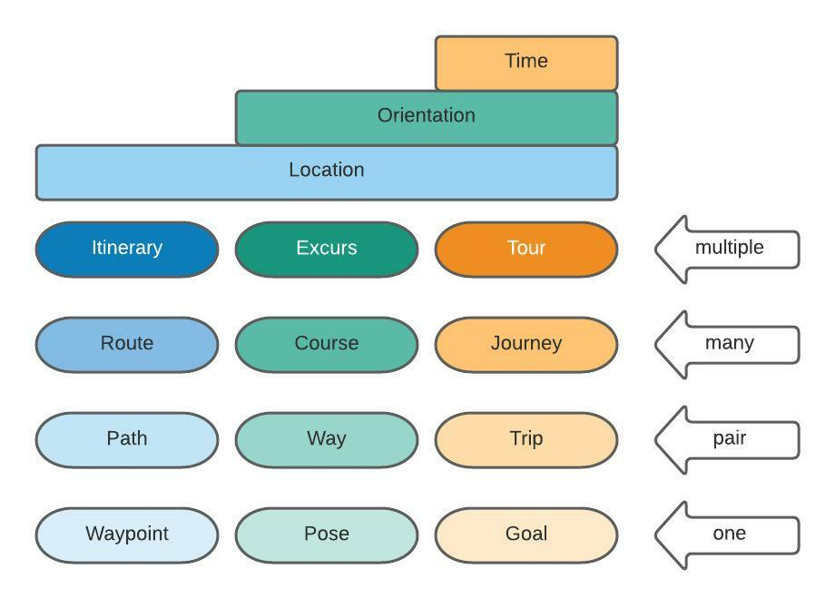

# waypoint

The `waypoint` object is representation of an intermediate physical point or place on a path, or route, or line of travel, or simply, a stopping point. `Waypoint`s contain, at least, coordinates corresponding to a `map` object, whether in the form `x, y`, or form `latitude, longitude` for two dimensional coordinates, or an addition `z, altitude` value for three dimensional coordinates.

A `waypoint` is at the lowest hierarchical level of the 'Route Matrix', being similar to a `pose` (sometimes called `posepoint`) and a `goal`. Where a `waypoint` is a point with location, `pose` is a point with location and orientation, then a `goal` is a point with location, orientation, and, timed elements.

|  |
| :---: |
| *Route Matrix* |

In the family of 'location-only' based navigation objects, one `itinerary` has many `route`s, one `route` has many `path`s, and, one `path` has many `waypoint`s.

## Declaration & Assignment

The common syntax for `waypoint` declaration (creation) is...

&nbsp;&nbsp;&nbsp;&nbsp;&nbsp;&nbsp;`add_waypoint(`*`moniker`*`)_coords(`*`x_lat`*`, `*`y_long`*`);`

...for a single 2-dimensional `waypoint`., and...

&nbsp;&nbsp;&nbsp;&nbsp;&nbsp;&nbsp;`add_waypoint(`*`moniker`*`)_coords(`*`x_lat`*`, `*`y_long`*`, `*`z_alt`*`);`

...for a single 3-dimensional `waypoint`.

`wp` is the shortened version of `waypoint`, so 

&nbsp;&nbsp;&nbsp;&nbsp;&nbsp;&nbsp;`add_waypoint(`*`moniker`*`)_coords(`*`x_lat`*`, `*`y_long`*`, `*`z_alt`*`);`<br>&nbsp;&nbsp;&nbsp;&nbsp;&nbsp;&nbsp;`add_wp(`*`moniker`*`)_coords(`*`x_lat`*`, `*`y_long`*`, `*`z_alt`*`);`

.. are syntactically the same.

This command can be expanded to create multiple `waypoint`s using a coma-spearated list of *`moniker`* s and mutliple `_coords` postposits, following the syntax...

&nbsp;&nbsp;&nbsp;&nbsp;&nbsp;&nbsp;`add_waypoint(`*`moniker11`*`, `*`moniker22`*`,...)_coords(`*`x_lat`*`, `*`y_long`*`)_coords(`*`x_lat`*`, `*`y_long`*`)...`

The position in the *`moniker`* list correcsponds to the same order of appended `_coords` postposits.

Note, the verbs `begin_`, `end_` are compatible with the `waypoint` object, to provide embedded functionality

***Diego*** allows for other apporaches for creating/loading mutilple `waypoint`s, such as...

&nbsp;&nbsp;&nbsp;&nbsp;&nbsp;&nbsp;`add_waypoint(`*`[moniker]`*`)_format(`*`format`*`)_json([{`*`x_lat`*`, `*`y_long`*`)}, {`*`x_lat`*`, `*`y_long`*`)}, ...])`

...creates miltilple `waypoints` from a literal json string.  The waypoint monikers are created in seqence using a combination of a _(base)-_*`moniker`* and a specified `format`.  To load `waypoints`, either from a file...

&nbsp;&nbsp;&nbsp;&nbsp;&nbsp;&nbsp;`add_waypoint()_load(`*`file_url`*`, `*`file_format`*`, `*`protocol`*`)`

...or using programming logic from an array (for instance)...

&nbsp;&nbsp;&nbsp;&nbsp;&nbsp;&nbsp;`add_waypoint()_load()_array(`*`moniker`*`);`

...or from a json string...

&nbsp;&nbsp;&nbsp;&nbsp;&nbsp;&nbsp;`add_waypoint()_load()_json(`*`moniker`*`);`

## Referencing

Referencing the `waypoint` obejct can be achieved in the usual way with the `with_` verb...

&nbsp;&nbsp;&nbsp;&nbsp;&nbsp;&nbsp;`with_waypoint(`*`moniker`*`)_...`<br>
&nbsp;&nbsp;&nbsp;&nbsp;&nbsp;&nbsp;`with_wp(`*`moniker`*`)_...`

## Similar Objects

The objects `pose` and `goal` are sibling objects in the route matrix, and behave in a similar way to the `waypoint`.  The only difference is `pose` also includes orientation, whereas `waypoint` does not, and `goal` includes orientetion and time which `waypoint` does not.

Two other objects, `landmark` and `poi` are use in the same manner as `waypoint` but are used in a specific way.

## Valid Verbs

### `_goto`

```Diego
go_
nav_
```

## Valid Children

```Diego
_goal
_waypoint
_poi
```

## Valid Postposits

### Attributes
```Diego
_valid({valid_from_datetime}[, {valid_to_datetime}])
_at()
_around()
_abstract()
_aviat()
_aviat({aviat_moniker})
_type({2d|3d)
_coords({x_lat}, {y_long})
_coords({x_lat}, {y_long}, {z_alt})
_x({x})
_y({y})
_z({z})
_lat({lat})
_long({long})
_alt({alt})
_elevation({elevation})
_swapfrom({variable_list})_swapto({variable_list})
```

### Postverbs

```Diego
_waitat()
_waitat({waypoint_moniker|waypoint_uuid})
```

### Results

```Diego
_log()
_log()_forwho({moniker})
_log()_forwhen({valid_from_datetime}[, {valid_to_datetime}])
_log()_foraround({datetime})

```


---------------------
goal

```Diego
_navresult({0|1|2|3})
_navresult({unknown|succeeded|canceled|failed})
```