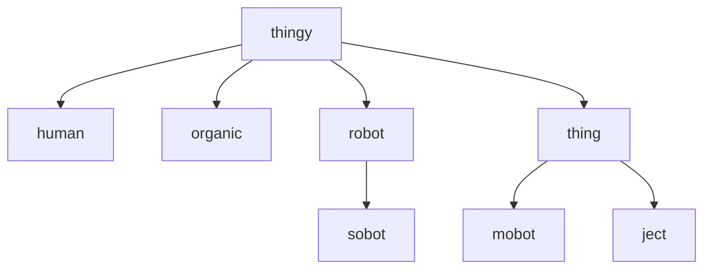
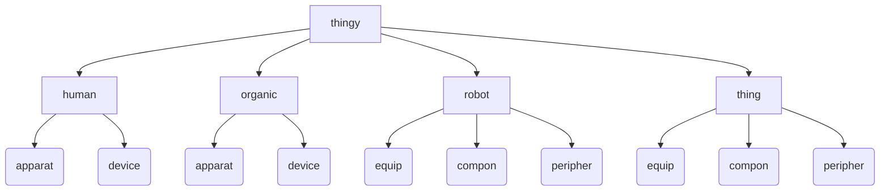

# Physic
The term **physic** is used to define statements in ***diego*** that represent physical, tangible objects, such as robot wheels, actuators in a frige, power supply switches in televisions, etc.

## Physic Type Hierarchy
All physic reprentations in ***diego*** follow a structured hierarchy as can be dipicted as such:

Physic Hierarchy (by thingy type)
 

All *physic*al objects in ***diego*** are detrived from the `thingy` object, which represents all *physic*al objects.  There are only four[^morethingies] types of `thingies`: `human`, human beings interacting with ***diego*** through a `console`; `organic`, organic non-human beings, such as a dog, a cat, a flower, a bush, etc.; `robot`, a self-propelled thingy in the physical world; and a, `thing`, an object in the physical world represented in **diego**.

There are other sub-types of thingies. A `sobot` is a stationary `robot`, that although can be self-propelled, does not neccesarily interact physically in the physical world outside its own environment, such as a *robot arm*. A `thing` can be sub-typed as: `mobot`, a conveyed smart device, such as a smart watch, smart doorbel, etc.; and a, `ject`, a traditional physical object that is not smart enough to think.  There are two variants of a `ject`: an `object` (ob ject), an immoveable ject such as a rock, a chair; and, a `subject` (sub ject), a self-propelled or moveable ject such as a trolley, wheeled tool cabinet, etc.

## Physic Composition Hierarchy (Organs / Components / Devices)
Each of the four `thingies` has associated *components* that are further categorised, as such:

Physic Hierarchy (by component)
 

There are effectively three *components* that come with each `thingy`.  The `apparat`us/`equip`ment are non-smart *components* that are carried or attached to the thingy, so, for `human`s this could be a traditional watch or a jacket. For `organic`s this could be a collar on a dog or cat.  For `robot`s this is a *component* like wheels, or the chassis.  For a `thing` this could be the door of a fridge, or a cushion on a chair.

Each of the four `thingies` also have a `compon`ent. A `compon` is a *component* that moves in the physical world, so for `human`s and `organic`s this would be a limb or an organ.  Since **diego** is not, yet, concerned with controlling human and organic anotomy, they are not represented here.  However, `compon`s for `robots` and `things` include actuators, projectile launchers, encoders, motors, switches, etc.

Then there are `device`s and `peripher`als, which are smart components that are carried or attached to the thingy, so for `human`s this could be a smart watch or a cellphone[^devicesobot].  For `organic`s this could be a microchip implanted in a dog.  For `robot`s and `thing`s this is termed a `peripher` and includes hygrometers, proximity sensors, sensors, cameras, etc. 

## See Also
----

[Topological Index of Physic Objects](_topicindex.md)

[A to Z Index of Phyic Objects](_atozindex.md)

### Thingies
[thingy](thingy.md) 
[human](human.md) 
[organic](organic.md) 
[robot](robot.md) ([sobot](sobot.md)) 
[thing](thing.md)  ([mobot](mobot.md); [object](object.md); [IoT](iot.md))

### Components
[apparat](apparat.md); [equip](equip.md) 
[jigger](jigger.md) 
[jagger](jagger.md) ([device](device.md); [sensor](sensor.md))

## Notes
[^morethingies]: There are some *fringe* `thingy` types such as `mech`, `applian`, `mach`, and, `vehicle`.
[^devicesobot]: Smart devices are can also be treated a `sobot`s.

